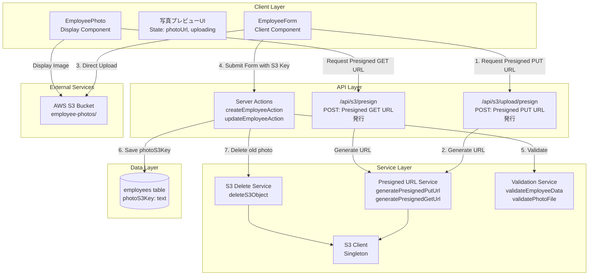
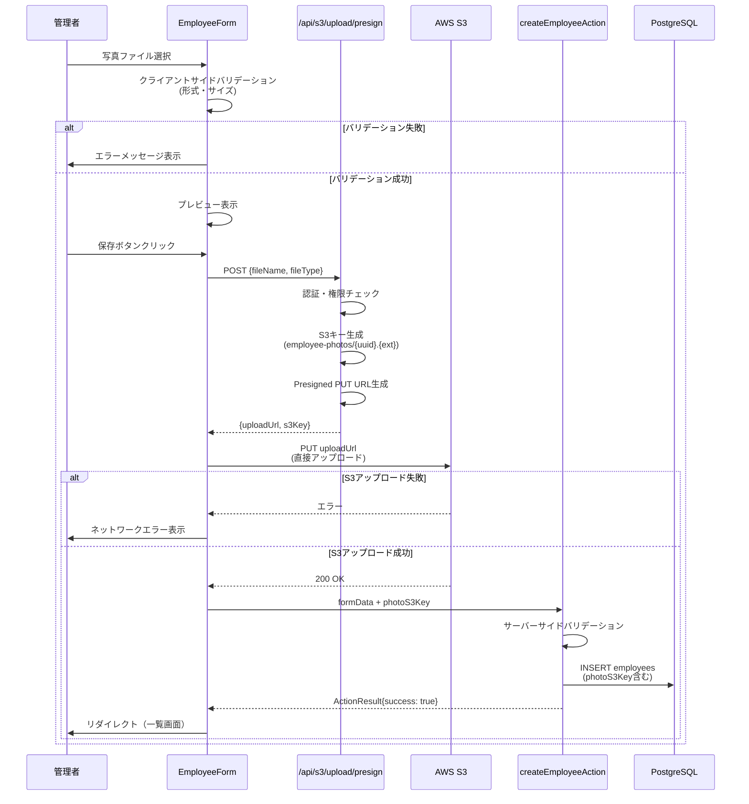
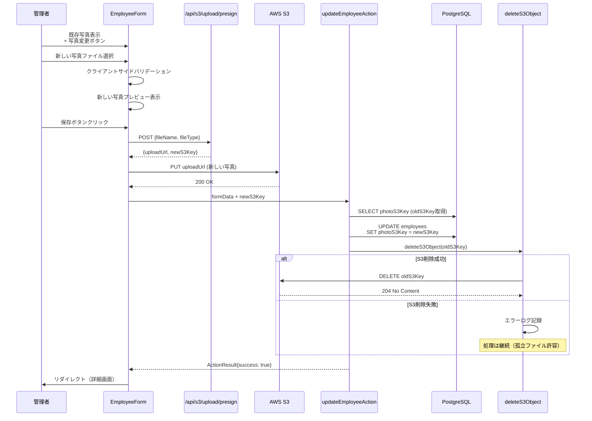
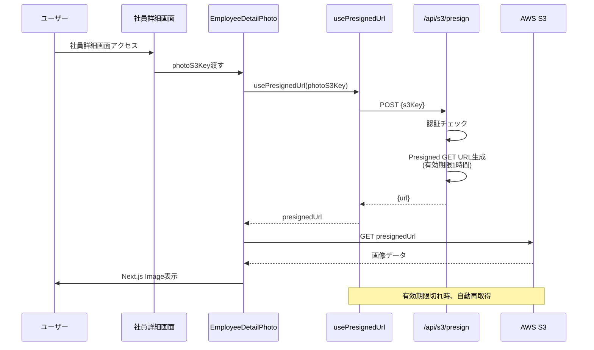
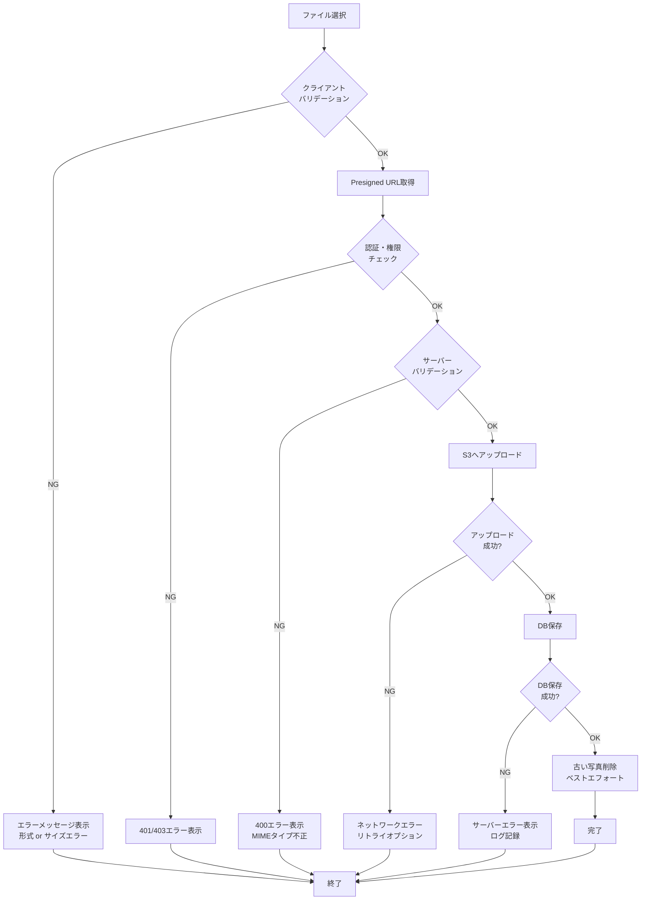

# Technical Design Document

## Overview

本機能は、既存の社員管理システムに社員写真のアップロード・表示・更新・削除機能を追加します。AWS S3を使用したPresigned URL方式での直接アップロードパターンを採用し、管理者が社員情報を視覚的に管理できるようにします。認証されたユーザーのみがアクセス可能なプライベートファイルとして管理し、適切な権限制御とバリデーションを実装します。

**Purpose**: 管理者が社員の写真を登録・更新することで、社員情報の視覚的な管理を実現し、社員の識別を容易にします。

**Users**: 管理者（admin role）は社員追加・編集画面から写真をアップロード・更新・削除し、全ユーザーは社員一覧・詳細画面で写真を閲覧できます。

**Impact**: 既存の`EmployeeForm`コンポーネント、`createEmployeeAction`/`updateEmployeeAction` Server Actions、および社員表示コンポーネントを拡張します。新規にPUT用Presigned URL発行APIエンドポイントとS3削除ユーティリティを追加します。

### Goals

- 社員追加・編集画面から写真をアップロード・更新・削除できる
- 社員一覧・詳細画面で写真を表示できる（Presigned URL経由）
- クライアントから直接S3へアップロードし、サーバー負荷を軽減する
- ファイル形式（JPEG, PNG, GIF, WebP）とサイズ（10MB上限）をバリデーションする
- 認証済みユーザーのみがPresigned URLを取得できる権限制御を実装する
- 古いS3オブジェクトを削除し、ストレージコストを最適化する

### Non-Goals

- 画像編集機能（トリミング、回転、フィルタ等）は含まない
- 複数写真のアップロードは含まない（1社員につき1枚のみ）
- 写真の履歴管理・バージョニング機能は含まない
- 顔認識やOCR機能は含まない
- 写真メタデータカラム（`photo_file_name`, `photo_file_size`, `photo_content_type`, `photo_uploaded_at`）の追加は行わない（`photoS3Key`のみで管理）

## Architecture

### Existing Architecture Analysis

本機能は既存の社員管理システムを拡張します。以下の既存資産を活用し、整合性を維持します。

**既存パターン**:
- Server Components（デフォルト）とClient Components（`"use client"`明示）の分離
- Server Actions（`"use server"`）でデータ変更操作
- `useActionState`フックで状態管理、`ActionResult<T>`型でエラーハンドリング
- Presigned URL方式でのS3統合（GET用実装済み）
- `usePresignedUrl`カスタムフックでPresigned URL取得と自動リフレッシュ

**既存コンポーネント**:
- `EmployeeForm`: 社員追加・編集フォーム（拡張対象）
- `EmployeePhoto`, `EmployeeDetailPhoto`: 写真表示コンポーネント（既存活用）
- `createEmployeeAction`, `updateEmployeeAction`: Server Actions（拡張対象）
- `validateEmployeeData`: バリデーション関数（拡張対象）

**既存S3インフラ**:
- `lib/s3/client.ts`: S3クライアントシングルトン
- `lib/s3/presigned-url.ts`: Presigned URL生成関数（GET/PUT）
- `lib/s3/use-presigned-url.ts`: カスタムフック
- `app/api/s3/presign/route.ts`: GET用Presigned URL発行API

**既存認証・権限管理**:
- `checkAdminPermission()`: 管理者権限チェック関数（Server Actions内で使用）
- `getUser()`: 認証ヘルパー関数

### Architecture Pattern & Boundary Map

**選択されたパターン**: Hybrid Approach（段階的実装）

- **Phase 1（MVP）**: 既存コンポーネント拡張
  - `EmployeeForm`に写真アップロードUI統合
  - Server Actionsに写真処理ロジック追加
  - 最小限の新規ファイル（PUT用API、S3削除ユーティリティ）作成

- **Phase 2（Optional）**: コンポーネント分離リファクタリング
  - `EmployeePhotoUpload`コンポーネント抽出
  - フォームが350行を超えた場合に実施



**Domain/Feature Boundaries**:
- **UI層**: フォーム入力、プレビュー表示、エラー表示（Client Components）
- **API層**: Presigned URL発行、認証・権限チェック（API Routes, Server Actions）
- **Service層**: S3操作、バリデーション、ビジネスロジック（純粋関数）
- **Data層**: `photoS3Key`の永続化（Database）

**Existing Patterns Preserved**:
- Server Components優先、必要最小限のClient Components
- Server Actionsでデータ変更操作
- `ActionResult<T>`型でエラーハンドリング統一
- Presigned URL方式でのS3統合（GET用既存パターン踏襲）

**New Components Rationale**:
- **PUT用Presigned URL発行API**: アップロード用URL生成（GET用と分離）
- **S3削除ユーティリティ**: 古い写真削除（新規機能）
- **写真バリデーション関数**: ファイル形式・サイズチェック（新規機能）

**Steering Compliance**:
- ファイル配置: `/app/api/`, `/components/employee/`, `/lib/employees/`, `/lib/s3/`
- S3キーのみをDBに保存（`.kiro/steering/static-files.md`推奨パターン）
- TypeScript strict mode、`any`禁止
- Biomeでリント・フォーマット

### Technology Stack

| Layer | Choice / Version | Role in Feature | Notes |
|-------|------------------|-----------------|-------|
| Frontend | React 19.2 | 写真選択UI、プレビュー表示 | Client Component |
| Frontend | Next.js 16.0.1 | Server Components、API Routes | App Router |
| Frontend | Next.js Image | 写真最適化表示 | S3 remotePatterns設定済み |
| Backend | Next.js Server Actions | 社員データCRUD、写真処理 | `"use server"` |
| Backend | AWS SDK v3 (`@aws-sdk/client-s3`) | S3操作（PutObject, GetObject, DeleteObject） | 既存インフラ活用 |
| Backend | AWS SDK v3 (`@aws-sdk/s3-request-presigner`) | Presigned URL生成 | 既存インフラ活用 |
| Data | PostgreSQL (Supabase) | `employees.photoS3Key`保存 | 既存スキーマ活用 |
| Data | Drizzle ORM 0.44.7 | タイプセーフなDB操作 | 既存パターン継続 |
| Storage | AWS S3 | 写真ファイルストレージ | `employee-photos/`プレフィックス |
| Runtime | Node.js 22+ | サーバーサイド実行環境 | 既存環境 |

**Rationale**:
- 既存のS3インフラストラクチャ（Presigned URL、クライアント、カスタムフック）を最大限活用
- Next.js 16のServer Actionsで最新のフォーム処理パターン適用
- AWS SDK v3で最新のS3 API機能活用（既存バージョン継続）
- `photoS3Key`のみで管理し、S3メタデータとPresigned URLでファイル情報取得（YAGNI原則）

## System Flows

### 写真アップロードフロー（新規登録時）



**Key Decisions**:
- クライアントサイドバリデーションはUX向上目的（早期フィードバック）
- サーバーサイドバリデーションは最終防衛線（セキュリティ）
- S3アップロード完了後にDB保存（アトミック性は保証しない、孤立ファイルリスクあり）

### 写真更新フロー



**Key Decisions**:
- 古いS3オブジェクト削除失敗時もDB更新は成功とする（要件3.6に準拠）
- 孤立ファイルはS3ライフサイクルポリシーで30日後自動削除（別途設定）
- エラーログ記録で監視・運用対応可能にする

### 写真表示フロー（既存機能の活用）



**Key Decisions**:
- 既存の`usePresignedUrl`フックを活用（自動リフレッシュ機能あり）
- Next.js Imageコンポーネントで画像最適化（WebP、AVIF変換）
- 写真未登録時はデフォルトアバター表示（`/placeholder-avatar.svg`）

## Requirements Traceability

| Requirement | Summary | Components | Interfaces | Flows |
|-------------|---------|------------|------------|-------|
| 1.1, 1.2, 1.3, 1.4 | 写真選択UI、プレビュー、バリデーション | `EmployeeForm` (Client Component) | `validatePhotoFile()` | 写真アップロードフロー |
| 1.5, 1.6, 1.7 | Presigned URL取得、S3直接アップロード、S3キー保存 | `/api/s3/upload/presign`, `createEmployeeAction` | API Contract, Service Interface | 写真アップロードフロー |
| 1.8 | ネットワークエラーハンドリング | `EmployeeForm` | Error UI | 写真アップロードフロー |
| 2.1, 2.2 | 社員詳細・一覧画面での写真表示 | `EmployeeDetailPhoto`, `EmployeePhoto` | `usePresignedUrl` hook | 写真表示フロー |
| 2.3, 2.4 | デフォルトアバター、スケルトンローディング | `EmployeePhoto` | 既存実装 | 写真表示フロー |
| 2.5 | Next.js Image最適化 | `EmployeePhoto`, `EmployeeDetailPhoto` | Next.js Image API | 写真表示フロー |
| 2.6 | Presigned URL有効期限切れ自動再取得 | `usePresignedUrl` hook | 既存実装拡張 | 写真表示フロー |
| 3.1, 3.2, 3.3 | 写真変更ボタン、新規写真選択、プレビュー | `EmployeeForm` | UI State | 写真更新フロー |
| 3.4, 3.5, 3.6 | 新規写真S3アップロード、DB更新、古い写真削除 | `updateEmployeeAction`, `deleteS3Object()` | Service Interface | 写真更新フロー |
| 4.1, 4.2, 4.3, 4.4, 4.5, 4.6 | 写真削除ボタン、確認ダイアログ、DB削除、S3削除 | `EmployeeForm`, `deleteS3Object()` | UI State, Service Interface | 写真削除フロー（更新フローに統合） |
| 5.1 | `photoS3Key`カラム | `employees` table | Drizzle Schema | 全フロー |
| 6.1, 6.2, 6.3, 6.4, 6.5 | S3プライベート、認証チェック、権限チェック | `/api/s3/upload/presign`, `checkAdminPermission()` | API Contract | 全フロー |
| 6.6, 6.7 | ファイル名サニタイズ、MIMEタイプ検証 | `validatePhotoFile()` | Service Interface | 写真アップロードフロー |
| 7.1, 7.2, 7.3, 7.4, 7.5, 7.6 | S3バケット設定、IAMポリシー、環境変数 | AWS S3, IAM, `.env.local` | Infrastructure | インフラ設定タスク |
| 8.1, 8.2, 8.3, 8.4, 8.5, 8.6, 8.7 | プログレスUI、成功・エラーメッセージ、ログ記録 | `EmployeeForm`, `ActionResult` | Error Handling | 全フロー |

**Notes**:
- 要件5.2-5.5（メタデータカラム）はユーザーフィードバックにより実装対象外
- 要件4（写真削除）は写真更新フローに統合（`photoS3Key`をnullに更新）

## Components and Interfaces

### Summary Table

| Component | Domain/Layer | Intent | Req Coverage | Key Dependencies (P0/P1) | Contracts |
|-----------|--------------|--------|--------------|--------------------------|-----------|
| **EmployeeForm** (拡張) | UI/Client | 社員情報入力、写真アップロードUI | 1, 3, 4, 8 | `/api/s3/upload/presign` (P0), `createEmployeeAction` (P0) | State, API |
| **validatePhotoFile** (新規) | Service | 写真ファイルバリデーション | 1, 6 | なし | Service |
| **/api/s3/upload/presign** (新規) | API | Presigned PUT URL発行 | 1, 6 | `generatePresignedPutUrl` (P0), `getUser` (P0), `checkAdminPermission` (P0) | API |
| **deleteS3Object** (新規) | Service | S3オブジェクト削除 | 3, 4 | S3Client (P0) | Service |
| **createEmployeeAction** (拡張) | Server Action | 社員新規作成、写真S3キー保存 | 1, 5 | `validateEmployeeData` (P0), DB (P0) | Service |
| **updateEmployeeAction** (拡張) | Server Action | 社員情報更新、写真更新、古い写真削除 | 3, 4, 5 | `validateEmployeeData` (P0), `deleteS3Object` (P1), DB (P0) | Service |
| **EmployeePhoto** (既存) | UI/Client | 社員写真表示（一覧用） | 2 | `usePresignedUrl` (P0) | State |
| **EmployeeDetailPhoto** (既存) | UI/Client | 社員写真表示（詳細用） | 2 | `usePresignedUrl` (P0) | State |
| **usePresignedUrl** (既存) | Hook | Presigned GET URL取得 | 2 | `/api/s3/presign` (P0) | API |

### UI Layer

#### EmployeeForm (拡張)

| Field | Detail |
|-------|--------|
| Intent | 社員基本情報入力フォームに写真アップロードUIを統合 |
| Requirements | 1.1, 1.2, 1.3, 1.4, 1.8, 3.1, 3.2, 3.3, 4.1, 4.2, 8.1, 8.2, 8.3, 8.4, 8.5, 8.6 |

**Responsibilities & Constraints**
- 写真ファイル選択UI（`<input type="file" accept="image/*">`）の提供
- 選択された写真のプレビュー表示（`` or Next.js Image）
- クライアントサイドバリデーション（UX向上目的）
- S3直接アップロード実行（Presigned PUT URL使用）
- アップロード進行状況表示（`uploading`状態）
- 写真変更・削除ボタンの表示（編集モード時）
- エラーメッセージの表示（ネットワークエラー、バリデーションエラー）
- 既存の社員基本情報入力機能維持

**Dependencies**
- Outbound: `/api/s3/upload/presign` — Presigned PUT URL取得 (P0)
- Outbound: `createEmployeeAction` / `updateEmployeeAction` — フォーム送信 (P0)
- Outbound: `validatePhotoFile` — クライアントサイドバリデーション (P1)

**Contracts**: State [x]

##### State Management

**State Model**:
```typescript
type PhotoUploadState = {
  /** 選択されたファイル */
  selectedFile: File | null;
  /** プレビュー表示用URL */
  previewUrl: string | null;
  /** アップロード中フラグ */
  uploading: boolean;
  /** アップロードされたS3キー */
  uploadedS3Key: string | null;
  /** エラーメッセージ */
  error: string | null;
};
```

**Persistence & Consistency**:
- ローカルコンポーネント状態（`useState`）
- アップロード完了後に`uploadedS3Key`を`hidden input`経由でServer Actionに渡す

**Concurrency Strategy**:
- アップロード中は保存ボタン無効化（`uploading`フラグ）
- 複数ファイル同時選択不可（`accept="image/*"`単一選択）

**Implementation Notes**
- **Integration**: 既存`EmployeeForm`を拡張、写真関連状態を追加
- **Validation**: クライアント側はUX向上、サーバー側は最終防衛線
- **Risks**: フォーム肥大化（260行→300行超予想）、Phase 2でリファクタリング検討

### API Layer

#### /api/s3/upload/presign (新規)

| Field | Detail |
|-------|--------|
| Intent | クライアントが直接S3へアップロードするためのPresigned PUT URLを発行 |
| Requirements | 1.5, 6.2, 6.4, 6.5, 6.6, 6.7 |

**Responsibilities & Constraints**
- 認証済みユーザーのみアクセス可能（`getUser()`）
- 管理者権限チェック（`checkAdminPermission()`）
- ファイル名サニタイズ（特殊文字除去）
- MIMEタイプ検証（許可形式: image/jpeg, image/png, image/gif, image/webp）
- S3キー生成（`employee-photos/{uuid}.{ext}`形式）
- Presigned PUT URL生成（有効期限1時間）
- エラーレスポンス（401 Unauthorized, 403 Forbidden, 400 Bad Request, 500 Internal Server Error）

**Dependencies**
- Outbound: `getUser()` — 認証チェック (P0)
- Outbound: `checkAdminPermission()` — 権限チェック (P0)
- Outbound: `generatePresignedPutUrl()` — Presigned URL生成 (P0)
- External: AWS S3 — アップロード先 (P0)

**Contracts**: API [x]

##### API Contract

| Method | Endpoint | Request | Response | Errors |
|--------|----------|---------|----------|--------|
| POST | /api/s3/upload/presign | `{fileName: string, fileType: string}` | `{uploadUrl: string, s3Key: string}` | 401, 403, 400, 500 |

**Request Body**:
```typescript
interface PresignUploadRequest {
  /** 元のファイル名（サニタイズ前） */
  fileName: string;
  /** ファイルのMIMEタイプ */
  fileType: string;
}
```

**Response Body (Success)**:
```typescript
interface PresignUploadResponse {
  /** Presigned PUT URL（1時間有効） */
  uploadUrl: string;
  /** 生成されたS3オブジェクトキー */
  s3Key: string;
}
```

**Error Responses**:
- `401 Unauthorized`: `{error: "Unauthorized. Please sign in."}`
- `403 Forbidden`: `{error: "Admin permission required."}`
- `400 Bad Request`: `{error: "Invalid file type. Only JPEG, PNG, GIF, WebP allowed."}`
- `500 Internal Server Error`: `{error: "Failed to generate presigned URL", details: string}`

**Implementation Notes**
- **Integration**: 既存`/api/s3/presign`（GET用）と並列配置
- **Validation**: MIMEタイプホワイトリスト検証、ファイル名サニタイズ
- **Risks**: CORS設定不備でアップロード失敗リスク（インフラタスクで設定）

### Service Layer

#### validatePhotoFile (新規)

| Field | Detail |
|-------|--------|
| Intent | 写真ファイルのバリデーション（形式・サイズ） |
| Requirements | 1.3, 1.4, 6.7 |

**Responsibilities & Constraints**
- ファイル形式検証（JPEG, PNG, GIF, WebP）
- ファイルサイズ検証（10MB上限）
- バリデーション結果返却（`ValidationResult`型）
- クライアント・サーバー両方で使用可能な純粋関数

**Dependencies**
- なし（純粋関数）

**Contracts**: Service [x]

##### Service Interface

```typescript
interface ValidatePhotoFileInput {
  /** ファイルオブジェクト（クライアント側） */
  file?: File;
  /** ファイルサイズ（サーバー側） */
  fileSize?: number;
  /** MIMEタイプ（サーバー側） */
  mimeType?: string;
}

interface ValidationResult {
  success: boolean;
  fieldErrors?: {
    photo?: string[];
  };
}

/**
 * 写真ファイルのバリデーション
 * @param input - バリデーション対象
 * @returns バリデーション結果
 */
function validatePhotoFile(input: ValidatePhotoFileInput): ValidationResult;
```

**Preconditions**:
- `file`（クライアント側）または`fileSize`+`mimeType`（サーバー側）のいずれかが提供される

**Postconditions**:
- `success: true`の場合、ファイルは許可形式かつ10MB以下
- `success: false`の場合、`fieldErrors.photo`に具体的なエラーメッセージ

**Invariants**:
- 許可形式: `image/jpeg`, `image/png`, `image/gif`, `image/webp`
- サイズ上限: 10MB (10,485,760 bytes)

**Implementation Notes**
- **Integration**: `lib/employees/validation.ts`に追加、既存の`validateEmployeeData`と並列配置
- **Validation**: クライアント側（`File.type`, `File.size`）、サーバー側（`mimeType`, `fileSize`）両対応
- **Risks**: なし（純粋関数、既存パターン踏襲）

#### deleteS3Object (新規)

| Field | Detail |
|-------|--------|
| Intent | S3オブジェクトを削除（写真更新時の古い写真削除） |
| Requirements | 3.5, 3.6, 4.4, 4.6 |

**Responsibilities & Constraints**
- S3オブジェクト削除実行（`DeleteObjectCommand`）
- 削除失敗時のエラーログ記録
- 削除失敗を許容（呼び出し元に例外スロー不要）
- 非同期関数（`async`）

**Dependencies**
- Outbound: S3Client — S3操作 (P0)

**Contracts**: Service [x]

##### Service Interface

```typescript
/**
 * S3オブジェクトを削除
 * @param s3Key - 削除対象のS3オブジェクトキー
 * @returns 削除成功フラグ（失敗時もfalseを返し、例外スローしない）
 */
async function deleteS3Object(s3Key: string): Promise<boolean>;
```

**Preconditions**:
- `s3Key`が空文字列でないこと
- 環境変数`S3_BUCKET_NAME`が設定されていること

**Postconditions**:
- 成功時: S3オブジェクトが削除され、`true`を返す
- 失敗時: エラーログ記録し、`false`を返す（例外スローしない）

**Invariants**:
- 失敗時もアプリケーション継続可能（孤立ファイルは許容）

**Implementation Notes**
- **Integration**: `lib/s3/delete.ts`に新規作成、`updateEmployeeAction`から呼び出し
- **Validation**: 要件3.6「エラーをログに記録するが、更新処理は正常完了とする」に準拠
- **Risks**: 孤立ファイル発生、S3ライフサイクルポリシーで30日後自動削除推奨

#### createEmployeeAction (拡張)

| Field | Detail |
|-------|--------|
| Intent | 社員新規作成時に写真S3キーも保存 |
| Requirements | 1.7, 5.1 |

**Responsibilities & Constraints**
- 既存の社員基本情報バリデーション継続
- `photoS3Key`をオプショナルフィールドとして受け取り
- `photoS3Key`をデータベースに保存
- 既存のエラーハンドリングパターン維持（`ActionResult<T>`型）

**Dependencies**
- Outbound: `checkAdminPermission()` — 権限チェック (P0)
- Outbound: `validateEmployeeData()` — バリデーション (P0)
- Outbound: `createEmployee()` — DB操作 (P0)

**Contracts**: Service [x]

##### Service Interface

```typescript
interface CreateEmployeeInput {
  employeeNumber: string;
  nameKanji: string;
  nameKana: string;
  email: string;
  hireDate: string;
  mobilePhone?: string;
  organizationIds?: string[];
  /** 写真S3キー（新規追加） */
  photoS3Key?: string;
}

async function createEmployeeAction(
  prevState: ActionResult<{ employeeId: string }> | undefined,
  formData: FormData
): Promise<ActionResult<{ employeeId: string }>>;
```

**Preconditions**:
- 管理者権限を持つユーザーが認証済み
- `formData`に`photoS3Key`が含まれる場合、S3へのアップロードが完了していること

**Postconditions**:
- 成功時: `employees`テーブルに新規レコード挿入、`photoS3Key`保存
- 失敗時: `ActionResult`のエラーメッセージ返却

**Invariants**:
- `photoS3Key`はNULLABLE（写真なしでも登録可能）

**Implementation Notes**
- **Integration**: `lib/employees/actions.ts`の既存関数を拡張、`photoS3Key`フィールド追加
- **Validation**: 既存バリデーションに影響なし
- **Risks**: なし（既存パターン踏襲）

#### updateEmployeeAction (拡張)

| Field | Detail |
|-------|--------|
| Intent | 社員情報更新時に写真更新・古い写真削除を実行 |
| Requirements | 3.4, 3.5, 3.6, 4.3, 4.4, 4.6 |

**Responsibilities & Constraints**
- 既存の社員情報更新機能継続
- `photoS3Key`更新時に古いS3オブジェクト削除（`deleteS3Object`呼び出し）
- 削除失敗時もDB更新成功（要件3.6準拠）
- `photoS3Key`をnullに設定で写真削除（要件4対応）

**Dependencies**
- Outbound: `checkAdminPermission()` — 権限チェック (P0)
- Outbound: `validateEmployeeData()` — バリデーション (P0)
- Outbound: `updateEmployee()` — DB操作 (P0)
- Outbound: `deleteS3Object()` — S3削除 (P1)

**Contracts**: Service [x]

##### Service Interface

```typescript
interface UpdateEmployeeInput {
  nameKanji?: string;
  nameKana?: string;
  email?: string;
  hireDate?: string;
  mobilePhone?: string | null;
  /** 写真S3キー（新規追加） */
  photoS3Key?: string | null;
}

async function updateEmployeeAction(
  prevState: ActionResult | undefined,
  formData: FormData,
  employeeId: string
): Promise<ActionResult>;
```

**Preconditions**:
- 管理者権限を持つユーザーが認証済み
- `employeeId`が存在するレコード
- `photoS3Key`が更新される場合、S3へのアップロードが完了していること

**Postconditions**:
- 成功時: `employees`テーブル更新、古い`photoS3Key`のS3オブジェクト削除（ベストエフォート）
- 失敗時: `ActionResult`のエラーメッセージ返却

**Invariants**:
- 古いS3オブジェクト削除失敗時もDB更新成功（孤立ファイル許容）
- `photoS3Key`を`null`に設定すると写真削除

**Implementation Notes**
- **Integration**: `lib/employees/actions.ts`の既存関数を拡張、写真削除ロジック追加
- **Validation**: 古い`photoS3Key`をDB取得後、削除実行
- **Risks**: 削除失敗による孤立ファイル（S3ライフサイクルポリシーで軽減）

## Data Models

### Domain Model

**Aggregates**:
- **Employee** (社員) — 集約ルート
  - `photoS3Key`: S3オブジェクトキーへの参照（オプショナル）

**Entities**:
- `Employee`: 社員エンティティ（既存）

**Value Objects**:
- `photoS3Key`: S3オブジェクトキー（文字列、`employee-photos/{uuid}.{ext}`形式）

**Domain Events**:
- なし（本機能では新規イベント発行しない）

**Business Rules & Invariants**:
- 1社員につき1枚の写真のみ（複数写真不可）
- 写真は任意（`photoS3Key`はNULLABLE）
- 写真更新時は古い写真を削除（ベストエフォート）

### Logical Data Model

**Structure Definition**:
- `employees.photoS3Key`: text型、NULLABLE
  - S3オブジェクトキーを保存（`employee-photos/{uuid}.{ext}`形式）
  - 完全なURLではなくキーのみを保存（ステアリング文書推奨パターン）

**Consistency & Integrity**:
- トランザクション境界: 社員情報更新とDB更新は同一トランザクション
- S3オブジェクト削除はトランザクション外（ベストエフォート）
- カスケード削除: 社員レコード削除時、`photoS3Key`も自動削除（既存のON DELETE CASCADE）

**Temporal Aspects**:
- `employees.updated_at`: 写真更新時に自動更新（既存のDrizzle ORMスキーマ）

### Physical Data Model

**Table Definition** (Drizzle ORM):
```typescript
export const employees = pgTable(
  "employees",
  {
    id: uuid("id").primaryKey().defaultRandom(),
    employeeNumber: text("employee_number").notNull().unique(),
    nameKanji: text("name_kanji").notNull(),
    nameKana: text("name_kana").notNull(),
    photoS3Key: text("photo_s3_key"), // NULLABLE（既存カラム、変更なし）
    mobilePhone: text("mobile_phone"),
    email: text("email").notNull().unique(),
    hireDate: date("hire_date").notNull(),
    createdAt: timestamp("created_at").defaultNow().notNull(),
    updatedAt: timestamp("updated_at")
      .defaultNow()
      .notNull()
      .$onUpdate(() => new Date()),
  },
  (table) => [
    index("idx_employees_name_kana").on(table.nameKana),
    index("idx_employees_employee_number").on(table.employeeNumber),
    index("idx_employees_hire_date").on(table.hireDate),
  ],
);
```

**Indexes**:
- 既存インデックス継続（`name_kana`, `employee_number`, `hire_date`）
- `photoS3Key`へのインデックス不要（検索対象外）

**Constraints**:
- `photoS3Key`: NULLABLE、デフォルトNULL
- 既存のUNIQUE制約継続（`employeeNumber`, `email`）

### Data Contracts & Integration

**API Data Transfer**:
```typescript
// Presigned PUT URL発行リクエスト
interface PresignUploadRequest {
  fileName: string;
  fileType: string;
}

// Presigned PUT URL発行レスポンス
interface PresignUploadResponse {
  uploadUrl: string;
  s3Key: string;
}

// 社員作成入力（photoS3Key追加）
interface CreateEmployeeInput {
  // ... 既存フィールド
  photoS3Key?: string;
}

// 社員更新入力（photoS3Key追加）
interface UpdateEmployeeInput {
  // ... 既存フィールド
  photoS3Key?: string | null; // nullで写真削除
}
```

**S3 Object Key Format**:
- パターン: `employee-photos/{uuid}.{ext}`
- 例: `employee-photos/f47ac10b-58cc-4372-a567-0e02b2c3d479.jpg`
- UUID: `crypto.randomUUID()`（Node.js標準API）
- 拡張子: MIMEタイプから自動判定（`image/jpeg` → `jpg`）

## Error Handling

### Error Strategy

本機能では、ユーザー操作エラー（4xx）、システムエラー（5xx）、ネットワークエラー、ビジネスロジックエラーの4つのカテゴリでエラーハンドリングを実装します。

### Error Categories and Responses

**User Errors (4xx)**:
- **Invalid file type**: `"JPEG, PNG, GIF, WebP形式の画像ファイルのみアップロード可能です。"` (クライアント側即座表示)
- **File size exceeded**: `"ファイルサイズが10MBを超えています。"` (クライアント側即座表示)
- **Unauthorized (401)**: `"認証されていません。ログインしてください。"` (API Response)
- **Forbidden (403)**: `"この操作を実行する権限がありません。"` (API Response)

**System Errors (5xx)**:
- **S3 upload failure**: `"ネットワークエラーが発生しました。もう一度お試しください。"` (リトライオプション提供)
- **Presigned URL generation failure**: `"サーバーエラーが発生しました。しばらくしてからもう一度お試しください。"` (ログ記録、ユーザーにはジェネリックメッセージ)
- **Database error**: `"サーバーエラーが発生しました。しばらくしてからもう一度お試しください。"` (ログ記録)

**Business Logic Errors (422)**:
- **Duplicate employee number**: `"この社員番号は既に使用されています。"` (既存パターン継続)
- **Duplicate email**: `"このメールアドレスは既に使用されています。"` (既存パターン継続)

**Network Errors**:
- **S3 upload timeout**: `"ネットワークエラーが発生しました。もう一度お試しください。"` (AbortController使用、タイムアウト30秒)
- **Connection lost**: `"ネットワーク接続が切断されました。接続を確認してください。"` (オフライン検知)

### Error Handling Flow



**Key Decisions**:
- クライアントバリデーションでUX向上（即座フィードバック）
- サーバーバリデーションでセキュリティ担保（最終防衛線）
- S3削除失敗はログ記録のみ（ユーザー体験優先）
- ネットワークエラーはリトライオプション提供

### Monitoring

**Error Tracking**:
- すべてのサーバーサイドエラーを`console.error()`でログ記録
- エラーログ形式: `[Timestamp] [Component] [Error Type] [Details]`
- 例: `[2025-01-01T00:00:00Z] [deleteS3Object] [S3 Delete Failed] Key: employee-photos/abc.jpg, Error: AccessDenied`

**Metrics**:
- アップロード成功率（成功数 / 試行数）
- アップロード失敗理由別カウント（ネットワークエラー、認証エラー、バリデーションエラー）
- S3削除失敗率（孤立ファイル発生頻度）

**Health Monitoring**:
- `/api/s3/upload/presign`のレスポンスタイム監視
- S3アップロードタイムアウト頻度監視

## Testing Strategy

### Unit Tests

**対象コンポーネント**:
1. `validatePhotoFile()` — ファイル形式・サイズバリデーション
   - 許可形式（JPEG, PNG, GIF, WebP）すべてでsuccess: true
   - 不許可形式（BMP, SVG, PDF等）でfieldErrors返却
   - 10MB以下でsuccess: true、10MB超過でfieldErrors返却
   - エッジケース: 空ファイル、ファイルサイズ0、MIMEタイプ未定義

2. `deleteS3Object()` — S3オブジェクト削除
   - 正常削除時にtrue返却
   - S3エラー時にfalse返却（例外スローしない）
   - エラーログ記録確認（モックで検証）

3. `generatePresignedPutUrl()` — Presigned URL生成（既存関数、回帰テスト）
   - 正しいS3キー生成（`employee-photos/{uuid}.{ext}`形式）
   - ContentType設定確認
   - 有効期限1時間確認

### Integration Tests

**対象フロー**:
1. 写真アップロードフロー（新規登録）
   - PresignedURL取得 → S3アップロード → DB保存の一連の流れ
   - 認証・権限チェック統合検証
   - バリデーションエラー統合検証

2. 写真更新フロー
   - 新規写真アップロード → DB更新 → 古い写真削除の一連の流れ
   - 古い写真削除失敗時もDB更新成功を検証

3. 写真削除フロー
   - `photoS3Key`をnullに更新 → S3オブジェクト削除の検証

4. エラーハンドリング統合
   - ネットワークエラー時のリトライロジック検証
   - S3削除失敗時のログ記録検証

### E2E/UI Tests

**対象ユーザーパス**:
1. 社員新規登録 + 写真アップロード
   - ファイル選択 → プレビュー表示 → 保存 → 詳細画面で写真確認

2. 社員情報編集 + 写真変更
   - 既存写真表示 → 写真変更ボタンクリック → 新規写真選択 → プレビュー → 保存 → 詳細画面で新規写真確認

3. 写真削除
   - 既存写真表示 → 写真削除ボタンクリック → 確認ダイアログ → 削除 → デフォルトアバター確認

4. バリデーションエラー表示
   - 不正なファイル形式選択 → エラーメッセージ表示
   - 10MB超過ファイル選択 → エラーメッセージ表示

5. 写真表示
   - 社員一覧画面で写真サムネイル表示
   - 社員詳細画面で写真拡大表示
   - Presigned URL有効期限切れ時の自動再取得

### Performance/Load Tests

**対象シナリオ**:
1. 大容量ファイル（10MB）アップロード
   - アップロード時間測定（目標: 30秒以内）
   - プログレスインジケーター表示確認

2. 一覧画面での複数Presigned URL取得
   - 50件の社員一覧表示時のPresigned URL取得時間測定
   - 並列リクエスト処理確認

3. 同時アップロード負荷
   - 10ユーザー同時アップロード時のPresigned URL発行レート
   - S3バケットスロットリング確認

4. Presigned URL有効期限切れシナリオ
   - 1時間経過後の写真表示時、自動再取得確認
   - ユーザー体験への影響測定

## Security Considerations

### Threat Modeling

**Threat 1: 不正なファイルアップロード**
- **Risk**: マルウェア、スクリプトファイルのアップロード
- **Control**: MIMEタイプホワイトリスト検証（サーバーサイド）、ファイル拡張子検証

**Threat 2: 大容量ファイルによるDoS攻撃**
- **Risk**: 大容量ファイルアップロードでストレージ/帯域消費
- **Control**: ファイルサイズ上限10MB、Presigned URL有効期限1時間

**Threat 3: Presigned URL漏洩**
- **Risk**: URLが第三者に漏洩し、不正アクセス
- **Control**: 短期間有効期限（1時間）、認証済みユーザーのみURL取得可能

**Threat 4: ファイル名インジェクション**
- **Risk**: ファイル名に特殊文字含めてパストラバーサル攻撃
- **Control**: ファイル名サニタイズ、S3キーはUUIDベース（元ファイル名不使用）

### Authentication and Authorization

**Authentication**:
- すべてのAPI（`/api/s3/upload/presign`, `/api/s3/presign`）で`getUser()`による認証チェック
- 未認証ユーザーは401 Unauthorized返却

**Authorization**:
- アップロード操作（POST `/api/s3/upload/presign`）は管理者のみ（`checkAdminPermission()`）
- 表示操作（POST `/api/s3/presign`）は認証済みユーザー全員可能
- Server Actions（`createEmployeeAction`, `updateEmployeeAction`）も管理者のみ

### Data Protection and Privacy

**Data at Rest**:
- S3バケットはプライベート設定（パブリックアクセス禁止）
- S3オブジェクトへのアクセスはPresigned URLのみ（一時的な署名付きURL）

**Data in Transit**:
- 全通信HTTPS強制（Next.js標準設定）
- Presigned URLもHTTPS

**PII Handling**:
- 社員写真は個人情報として扱う
- GDPR対応: 社員削除時に写真も削除（ON DELETE CASCADE）

## Performance & Scalability

### Target Metrics

**Response Time**:
- Presigned URL発行: 500ms以内
- S3アップロード（10MB）: 30秒以内
- 写真表示（Presigned URL取得）: 1秒以内

**Throughput**:
- Presigned URL発行: 100 req/sec（想定ピーク）
- 同時アップロード: 50並行処理

**Availability**:
- S3可用性: 99.99%（AWS SLA）
- API可用性: 99.9%（Vercel標準）

### Scaling Approaches

**Horizontal Scaling**:
- Next.js Serverless Functions（Vercel）で自動スケール
- S3も自動スケール（無制限ストレージ）

**Vertical Scaling**:
- 不要（Serverless Architecture）

### Caching Strategies

**Presigned URL Caching**:
- クライアント側でPresigned URL（GET用）をメモリキャッシュ（1時間）
- 有効期限切れ時に自動再取得（`usePresignedUrl`フック）

**Image Caching**:
- Next.js Imageコンポーネントで自動キャッシュ（24時間、`minimumCacheTTL`設定）
- ブラウザキャッシュ活用

**No Cache**:
- Presigned URL（PUT用）はキャッシュ不可（1回限り使用）

## Migration Strategy

本機能は既存スキーマ（`employees.photoS3Key`カラム）を活用するため、データベースマイグレーション不要です。以下の段階的デプロイを推奨します。

### Phase 1: インフラ準備（実装前）
1. **S3バケットCORS設定**:
   - 許可オリジン: `https://your-domain.com`（本番ドメイン）
   - 許可メソッド: `PUT`, `POST`
   - 許可ヘッダー: `Content-Type`, `x-amz-*`
   - 最大有効期限: 3600秒

2. **S3ライフサイクルポリシー設定**:
   - プレフィックス: `employee-photos/`
   - 30日経過後に孤立ファイル自動削除（Expirationルール）

3. **環境変数確認**:
   - `AWS_REGION`, `AWS_ACCESS_KEY_ID`, `AWS_SECRET_ACCESS_KEY`, `S3_BUCKET_NAME`設定済み確認

### Phase 2: コード実装とテスト
1. 新規ファイル実装（`/api/s3/upload/presign`, `lib/s3/delete.ts`, `validatePhotoFile`）
2. 既存ファイル拡張（`EmployeeForm`, `createEmployeeAction`, `updateEmployeeAction`）
3. ユニット・統合・E2Eテスト実施

### Phase 3: ステージング検証
1. ステージング環境でS3アップロード動作確認
2. Presigned URL有効期限切れシナリオ確認
3. 写真更新・削除フロー確認

### Phase 4: 本番デプロイ
1. 本番環境へデプロイ（Zero Downtime）
2. 既存ユーザーへの影響なし（後方互換性維持）
3. 新規社員登録時から写真アップロード利用開始

### Rollback Strategy
- コードロールバック: Vercelの前バージョンへ即座ロールバック可能
- データロールバック不要（`photoS3Key`はNULLABLE、既存データ影響なし）
- S3オブジェクト削除は不可逆（バージョニング有効化で復旧可能）

## Supporting References

### TypeScript Type Definitions

**Complete Action Result Type**:
```typescript
/**
 * Server Actionの戻り値型（既存）
 */
export type ActionResult<T = void> = {
  /** 操作が成功したかどうか */
  success: boolean;
  /** 成功時のデータ */
  data?: T;
  /** 全体エラーメッセージの配列 */
  errors?: string[];
  /** フィールドごとのエラーメッセージ */
  fieldErrors?: Record<string, string[]>;
};

/**
 * 写真アップロード用拡張（新規）
 */
export type PhotoUploadResult = ActionResult<{
  /** アップロードされたS3キー */
  s3Key: string;
}>;
```

**Validation Types**:
```typescript
/**
 * 写真ファイルバリデーション入力型（新規）
 */
export interface ValidatePhotoFileInput {
  /** ファイルオブジェクト（クライアント側） */
  file?: File;
  /** ファイルサイズ（サーバー側） */
  fileSize?: number;
  /** MIMEタイプ（サーバー側） */
  mimeType?: string;
}

/**
 * バリデーション結果型（既存）
 */
export type ValidationResult = {
  /** バリデーションが成功したかどうか */
  success: boolean;
  /** フィールドごとのエラーメッセージ */
  fieldErrors?: Record<string, string[]>;
};
```

### S3 Bucket Configuration

**CORS Configuration (JSON)**:
```json
[
  {
    "AllowedOrigins": ["https://your-domain.com"],
    "AllowedMethods": ["PUT", "POST"],
    "AllowedHeaders": ["Content-Type", "x-amz-*"],
    "MaxAgeSeconds": 3600
  }
]
```

**Lifecycle Policy (JSON)**:
```json
{
  "Rules": [
    {
      "Id": "DeleteOrphanedPhotos",
      "Status": "Enabled",
      "Prefix": "employee-photos/",
      "Expiration": {
        "Days": 30
      }
    }
  ]
}
```

### File Size Constants

```typescript
/**
 * ファイルサイズ制限（新規定数）
 */
export const MAX_PHOTO_SIZE_BYTES = 10 * 1024 * 1024; // 10MB
export const MAX_PHOTO_SIZE_MB = 10;

/**
 * 許可MIMEタイプ（新規定数）
 */
export const ALLOWED_PHOTO_MIME_TYPES = [
  'image/jpeg',
  'image/png',
  'image/gif',
  'image/webp',
] as const;

export type AllowedPhotoMimeType = typeof ALLOWED_PHOTO_MIME_TYPES[number];

/**
 * MIMEタイプから拡張子へのマッピング（新規定数）
 */
export const MIME_TO_EXTENSION: Record<AllowedPhotoMimeType, string> = {
  'image/jpeg': 'jpg',
  'image/png': 'png',
  'image/gif': 'gif',
  'image/webp': 'webp',
};
```
