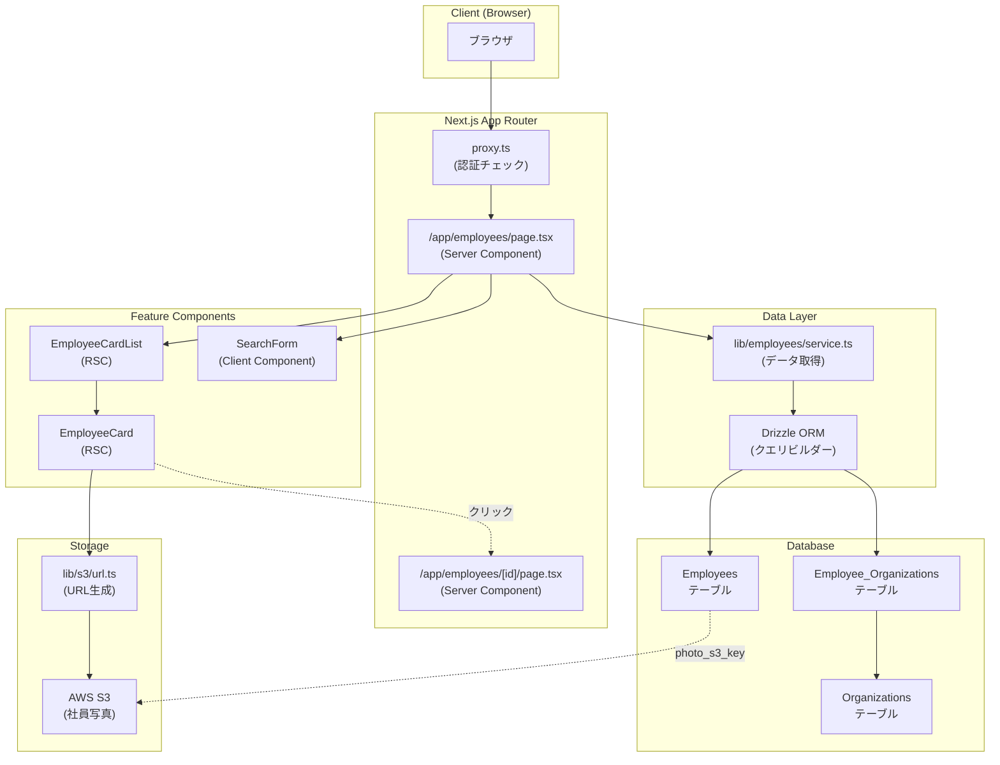
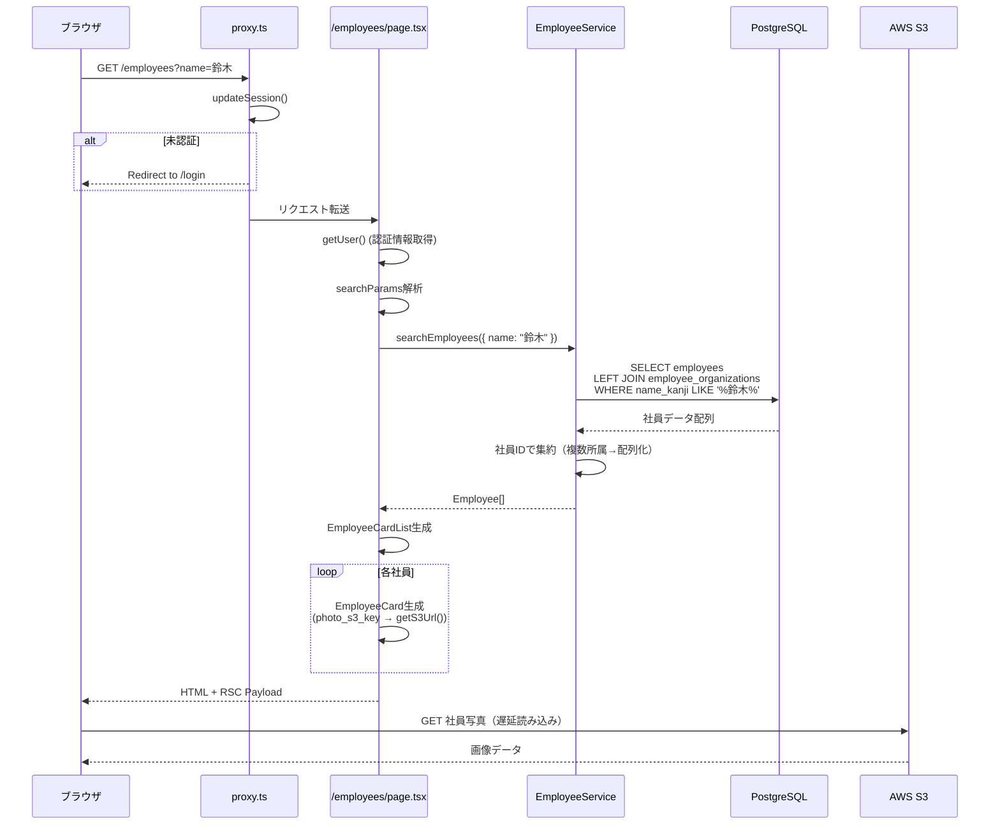
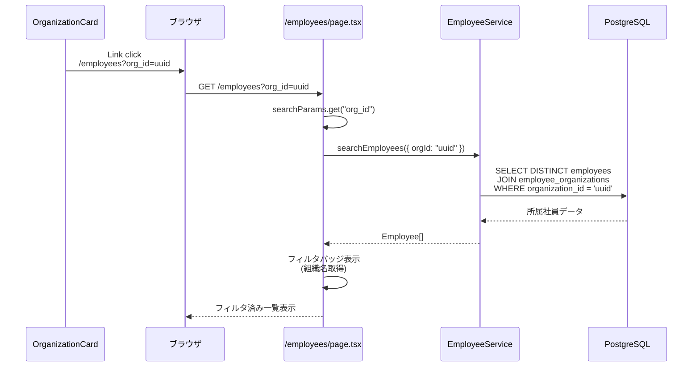
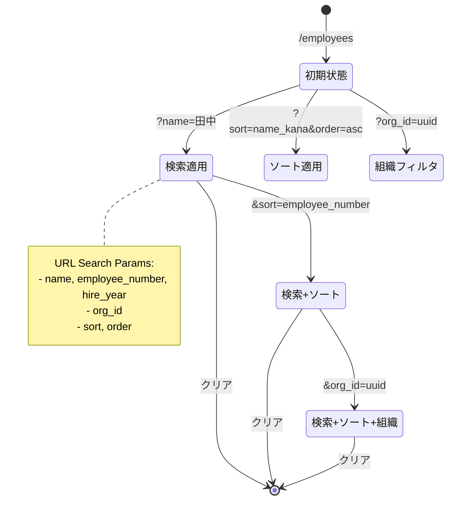
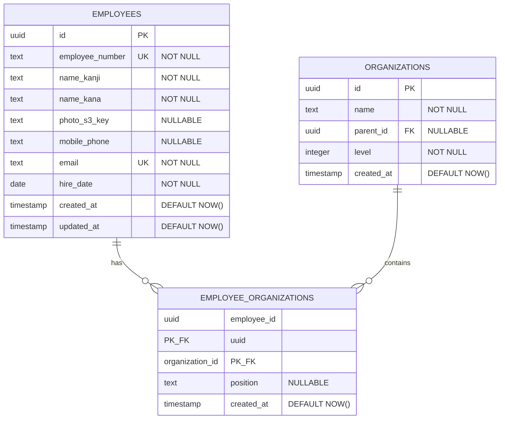

# 技術設計書: 社員一覧画面

## Overview

社員一覧画面は、組織内の社員情報を検索・閲覧するためのサーバーサイドレンダリング画面である。Next.js 16のReact Server Componentsを活用し、Supabase認証と統合された社員データを提供する。氏名・社員番号・入社年による検索、組織階層画面からの部署フィルタリング、ソート機能を実装し、社員詳細画面へのシームレスな遷移を可能にする。

**Users**: 全認証済みユーザー（社員、管理者、人事担当）が社員検索・閲覧に利用する。

**Impact**: 既存の組織階層画面と統合し、組織カードから社員一覧への遷移フローを確立する。Employeesテーブルと Employee_Organizationsテーブルを新規作成し、多対多リレーションで複数所属を管理する。

### Goals
- 高速な社員検索体験を提供（FCP 2秒以内、DBクエリ500ms以内）
- 組織階層画面との統合により部署単位での社員確認を実現
- 複数所属を持つ社員情報を適切に集約・表示
- Server Componentsによるクライアントバンドルサイズ最小化

### Non-Goals
- 社員情報の編集・削除機能（別機能として実装）
- 社員写真のアップロード機能（別機能として実装）
- リアルタイム更新・通知機能
- 詳細な権限管理（全認証済みユーザーに同等のアクセス権）

## Architecture

### Existing Architecture Analysis

本機能は既存のNext.js 16 + React Server Componentsアーキテクチャを拡張する。

**現在のアーキテクチャパターン**:
- **認証**: Supabase SSR + proxy.ts（Next.js 16）による全ルート認証チェック
- **データレイヤー**: Drizzle ORM + PostgreSQL（Organizationsテーブル既存）
- **UIコンポーネント**: shadcn/ui + Tailwind CSS 4
- **静的ファイル**: S3直接統合（オブジェクトキーをDB保存、URL動的生成）

**統合ポイント**:
- `Organizations`テーブル: Employee_Organizations.organization_idで参照（既存）
- `OrganizationCard`: `/employees?org_id={id}`へのリンク既存（要件4.1対応済み）
- `getUser()`: Server Componentでの認証情報取得パターン確立

**技術的制約**:
- Next.js 16のproxy.ts認証パターンを遵守
- Drizzle ORMのマイグレーション管理規約に従う（drizzle/ディレクトリ）
- shadcn/uiコンポーネントのカスタマイズパターンを踏襲

### Architecture Pattern & Boundary Map

**選択パターン**: Server Components First + Feature-Based Organization



**Domain/Feature Boundaries**:
- **認証境界**: proxy.ts → 全ルートで認証チェック（Next.js 16パターン）
- **データ境界**: lib/employees/ → 社員関連ビジネスロジックとデータアクセス
- **UI境界**: components/employee/ → 社員表示専用コンポーネント
- **統合境界**: Employee_Organizations → Employees↔Organizations間の多対多リレーション

**既存パターン維持**:
- Server Components優先（クライアントバンドル最小化）
- Drizzle ORMによるTypeScript型安全なDB操作
- shadcn/ui Cardコンポーネントの再利用
- S3オブジェクトキー管理パターン

**新規コンポーネント配置理由**:
- `lib/employees/service.ts`: 検索・フィルタリングロジックを集約（テスト容易性）
- `lib/s3/url.ts`: S3 URL生成を共通化（環境変更への柔軟性）
- `components/employee/`: UI層として社員表示ロジックを分離

**Steering準拠**:
- Server-First Pattern（tech.md）
- Feature-Based Organization（structure.md）
- S3 Direct Integration（static-files.md）

### Technology Stack

| Layer | Choice / Version | Role in Feature | Notes |
|-------|------------------|-----------------|-------|
| Frontend / UI | React 19.2 (Server Components) | 社員一覧・カード表示 | Server Componentsでバンドルサイズ最小化 |
| Frontend / UI | Next.js 16.0.1 (App Router) | ルーティング・SSR | proxy.ts認証パターン使用 |
| Frontend / UI | shadcn/ui | UIコンポーネントライブラリ | Card, Button, Sheetコンポーネント利用 |
| Frontend / UI | Tailwind CSS 4 | スタイリング | レスポンシブグリッド（1/2/3カラム） |
| Backend / Data | Drizzle ORM 0.40.0+ | DB操作・型生成 | 動的クエリビルダーで検索実装 |
| Backend / Auth | Supabase SSR (@supabase/ssr) | 認証・セッション管理 | getUser()でRSC内認証情報取得 |
| Data / Storage | PostgreSQL (Supabase) | データベース | Employees/Employee_Organizationsテーブル追加 |
| Storage | AWS S3 + SDK v3 | 社員写真保管 | オブジェクトキーのみDB保存、URL動的生成 |
| Testing | Vitest 4.0.12 | ユニット・コンポーネントテスト | React Testing Library統合 |
| Testing | React Testing Library 16.3.0 | コンポーネントテスト | ユーザー視点のインタラクションテスト |

**技術選定理由**:
- **React Server Components**: 要件1.5、11.4によるServer-First設計、初回ロード高速化
- **Drizzle ORM**: TypeScript strict mode準拠、既存パターン（tech.md）に一致
- **shadcn/ui Card**: 要件2.4、既存OrganizationCardパターン踏襲
- **S3 SDK v3**: static-files.md準拠、写真表示機能（要件9）対応

## System Flows

### 社員一覧表示フロー



**フロー設計判断**:
- **認証ゲート**: proxy.tsで全リクエストを認証チェック（要件14.2）
- **Server-Side Data Fetch**: ページコンポーネントでデータ取得完了（要件1.5）
- **クエリ最適化**: LEFT JOINで1回のクエリで社員+所属情報取得
- **遅延読み込み**: 写真はクライアント側で遅延ロード（要件9.6、11.5）

### 組織フィルタリングフロー



**フロー設計判断**:
- **URL State Management**: Search Paramsで組織フィルタ状態管理（要件4.1）
- **既存統合**: OrganizationCardのLinkが既に実装済み
- **視覚的フィードバック**: フィルタ適用中バッジで明示（要件4.2）

### 検索・ソート状態管理フロー



**状態管理判断**:
- **URL-Based State**: ブラウザバック/フォワードで状態復元（要件3.5、5.4）
- **サーバーサイド解析**: Server ComponentでsearchParams受け取り
- **動的クエリ**: Drizzle ORMで条件分岐クエリ構築

## Requirements Traceability

| Requirement | Summary | Components | Interfaces | Flows |
|-------------|---------|------------|------------|-------|
| 1.1, 1.2, 1.3, 1.4, 1.5 | 社員一覧表示・ローディング | EmployeesPage, EmployeeCardList, EmployeeService | EmployeeService.searchEmployees() | 社員一覧表示フロー |
| 2.1, 2.2, 2.3, 2.4, 2.5, 2.6 | 社員カード表示・インタラクション | EmployeeCard | EmployeeCardProps | 社員一覧表示フロー |
| 3.1, 3.2, 3.3, 3.4, 3.5, 3.6 | 検索機能 | SearchForm (Client), EmployeeService | SearchEmployeesParams | 検索・ソート状態管理フロー |
| 4.1, 4.2, 4.3, 4.4 | 組織フィルタ | OrganizationCard (既存), EmployeesPage, EmployeeService | SearchEmployeesParams.orgId | 組織フィルタリングフロー |
| 5.1, 5.2, 5.3, 5.4, 5.5 | ソート機能 | SortControls (Client), EmployeeService | SearchEmployeesParams.sort/order | 検索・ソート状態管理フロー |
| 6.1, 6.2, 6.3, 6.4 | 詳細画面遷移 | EmployeeCard | Link href="/employees/[id]" | 社員一覧表示フロー |
| 7.1, 7.2, 7.3, 7.4, 7.5 | Employeesテーブル | db/schema.ts | Drizzle schema定義 | - |
| 8.1, 8.2, 8.3, 8.4, 8.5, 8.6 | Employee_Organizationsテーブル | db/schema.ts | Drizzle schema定義 | - |
| 9.1, 9.2, 9.3, 9.4, 9.5, 9.6 | S3写真表示 | lib/s3/url.ts, EmployeeCard | getS3Url(key: string) | 社員一覧表示フロー |
| 10.1, 10.2, 10.3, 10.4, 10.5 | レスポンシブデザイン | EmployeesPage (grid), SearchForm (Sheet) | Tailwind responsive classes | - |
| 11.1, 11.2, 11.3, 11.4, 11.5 | パフォーマンス | EmployeeService (クエリ最適化), Next.js Image | - | 社員一覧表示フロー |
| 12.1, 12.2, 12.3, 12.4, 12.5, 12.6 | アクセシビリティ | EmployeeCard, SearchForm, SortControls | ARIA属性 | - |
| 13.1, 13.2, 13.3, 13.4, 13.5 | エラーハンドリング | EmployeesPage (error.tsx), EmployeeService | Error boundaries | - |
| 14.1, 14.2, 14.3, 14.4, 14.5 | セキュリティ | proxy.ts, getUser(), Drizzle ORM | - | 社員一覧表示フロー |
| 15.1, 15.2, 15.3, 15.4, 15.5 | テスト可能性 | すべてのコンポーネント | Vitest + React Testing Library | - |

## Components and Interfaces

### 概要テーブル

| Component | Domain/Layer | Intent | Req Coverage | Key Dependencies (P0/P1) | Contracts |
|-----------|--------------|--------|--------------|--------------------------|-----------|
| EmployeesPage | App Router / Page | 社員一覧ページ表示・検索状態管理 | 1, 3, 4, 5, 10, 13 | EmployeeService (P0), getUser (P0) | State |
| EmployeeCardList | UI / Presentation | 社員カード配列表示 | 1, 10 | EmployeeCard (P0) | - |
| EmployeeCard | UI / Feature | 単一社員情報カード表示 | 2, 6, 9, 12 | getS3Url (P0), Link (P0) | - |
| SearchForm | UI / Client Component | 検索フォーム入力 | 3, 12 | useRouter (P0) | Event |
| SortControls | UI / Client Component | ソートUI表示・切替 | 5, 12 | useRouter (P0) | Event |
| EmployeeService | Data Layer / Service | 社員データ取得・検索ロジック | 1, 3, 4, 5, 11 | Drizzle ORM (P0), employees/employee_organizations (P0) | Service |
| getS3Url | Utility / S3 | S3オブジェクトキーからURL生成 | 9 | process.env (P0) | Service |
| employees (schema) | Data Model / Drizzle | Employeesテーブル定義 | 7 | - | - |
| employee_organizations (schema) | Data Model / Drizzle | Employee_Organizationsテーブル定義 | 8 | employees (P0), organizations (P0) | - |

### App Router / Page Layer

#### EmployeesPage

| Field | Detail |
|-------|--------|
| Intent | 社員一覧ページの表示とSearch Params解析によるデータフェッチの調整 |
| Requirements | 1.1, 1.2, 1.3, 1.4, 1.5, 3.5, 4.1, 4.2, 5.4, 10.1-10.3, 13.1, 14.1 |

**Responsibilities & Constraints**
- Server ComponentとしてサーバーサイドでのデータフェッチとHTML生成
- Search Paramsの解析と検索条件オブジェクトへの変換
- 認証状態確認（getUser()）と未認証時のリダイレクト（proxy.ts処理済み）
- ローディング・エラー状態の適切な表示

**Dependencies**
- Inbound: なし（App Routerエントリーポイント） (P0)
- Outbound: EmployeeService.searchEmployees() — 社員データ取得 (P0)
- Outbound: getUser() — 認証情報取得 (P0)
- Outbound: EmployeeCardList — 社員カード配列レンダリング (P0)
- Outbound: SearchForm (Client) — 検索UI (P1)
- Outbound: SortControls (Client) — ソートUI (P1)

**Contracts**: State [x]

##### State Management

```typescript
// Search Params型定義
interface EmployeesPageSearchParams {
  name?: string;           // 氏名検索
  employee_number?: string; // 社員番号検索
  hire_year?: string;       // 入社年検索
  org_id?: string;          // 組織フィルタ
  sort?: "name_kana" | "employee_number" | "hire_date"; // ソート項目
  order?: "asc" | "desc";   // ソート順
}
```

- **State model**: URL Search Paramsで検索・フィルタ・ソート状態を管理
- **Persistence & consistency**: URL変更でページ再レンダリング、ブラウザ履歴で状態復元
- **Concurrency strategy**: Server Componentのため並行制御不要

**Implementation Notes**
- **Integration**: `/app/employees/page.tsx`に実装、App Routerの`searchParams` propを受け取る
- **Validation**: Search Paramsのバリデーション（org_id: UUID形式、hire_year: 数値、sort/order: enum値）
- **Risks**: 不正なSearch Params値による例外処理漏れ → バリデーション関数で安全な値のみ渡す

---

#### EmployeeDetailPage (参照のみ)

| Field | Detail |
|-------|--------|
| Intent | 社員詳細情報の表示（本設計書のスコープ外、将来実装） |
| Requirements | 6.1 |

**Implementation Notes**
- `/app/employees/[id]/page.tsx`に実装予定
- EmployeeCardからのリンク先として参照される

### UI / Feature Components

#### EmployeeCard

| Field | Detail |
|-------|--------|
| Intent | 単一社員の基本情報をカード形式で表示し、詳細画面への遷移を提供 |
| Requirements | 2.1, 2.2, 2.3, 2.4, 2.5, 2.6, 6.1, 6.2, 6.3, 6.4, 9.1, 9.2, 9.5, 12.1, 12.2 |

**Responsibilities & Constraints**
- 社員の写真、氏名、社員番号、携帯電話、メール、所属一覧の表示
- 複数所属の場合は所属情報を複数行で表示（会社 本部 部署 課/チーム（役職）形式）
- shadcn/ui Cardコンポーネントの使用とホバー/フォーカススタイル
- Next.js Linkによるクライアントサイドナビゲーション
- ARIA属性によるアクセシビリティ確保

**Dependencies**
- Inbound: EmployeeCardList — 親コンポーネントからprops受け取り (P0)
- Outbound: getS3Url() — 写真URLの生成 (P0)
- Outbound: Next.js Link — 詳細画面への遷移 (P0)
- External: shadcn/ui Card — UIコンポーネント (P0)

**Contracts**: Service [ ] / API [ ] / Event [ ] / Batch [ ] / State [ ]

```typescript
interface EmployeeCardProps {
  employee: Employee; // 社員データ（所属配列含む）
}

interface Employee {
  id: string;
  employeeNumber: string;
  nameKanji: string;
  nameKana: string;
  photoS3Key: string | null;
  mobilePhone: string | null;
  email: string;
  hireDate: Date;
  organizations: EmployeeOrganization[]; // 所属配列
}

interface EmployeeOrganization {
  organizationId: string;
  organizationName: string;
  organizationPath: string; // "会社 > 本部 > 部署 > 課/チーム"
  position: string | null;  // 役職
}
```

**Implementation Notes**
- **Integration**: `/components/employee/employee-card.tsx`に実装、Server Component
- **Validation**: photoS3Keyがnullの場合はプレースホルダー画像表示、organizationsが空配列の場合は"所属なし"表示
- **Risks**: 複数所属が多い場合のカード高さ不揃い → max-heightとスクロール、または"他N件"折りたたみ表示

---

#### EmployeeCardList

| Field | Detail |
|-------|--------|
| Intent | 社員カードの配列をレスポンシブグリッドレイアウトで表示 |
| Requirements | 1.4, 10.1, 10.2, 10.3 |

**Responsibilities & Constraints**
- 社員データ配列を受け取りEmployeeCardをマッピング
- レスポンシブグリッド（デスクトップ3カラム、タブレット2カラム、モバイル1カラム）
- 空配列の場合は"社員が見つかりませんでした"メッセージ表示

**Dependencies**
- Inbound: EmployeesPage — 親ページからprops受け取り (P0)
- Outbound: EmployeeCard — 各社員カードレンダリング (P0)

**Contracts**: Service [ ] / API [ ] / Event [ ] / State [ ]

```typescript
interface EmployeeCardListProps {
  employees: Employee[];
}
```

**Implementation Notes**
- **Integration**: `/components/employee/employee-card-list.tsx`に実装、Server Component
- **Validation**: employeesが空配列の場合は早期リターンで空状態メッセージ表示
- **Risks**: なし（シンプルなプレゼンテーションコンポーネント）

---

#### SearchForm

| Field | Detail |
|-------|--------|
| Intent | 検索条件入力フォームとURL Search Paramsへの反映 |
| Requirements | 3.1, 3.2, 3.3, 3.4, 3.5, 3.6, 12.4 |

**Responsibilities & Constraints**
- 氏名、社員番号、入社年の入力フィールド提供
- フォーム送信時にURL Search Paramsを更新してページ遷移
- モバイル環境ではSheet（ドロワー）として表示
- labelタグによるアクセシビリティ確保

**Dependencies**
- Inbound: EmployeesPage — 親ページから現在の検索条件を受け取り (P0)
- Outbound: useRouter().push() — URL遷移 (P0)
- External: shadcn/ui Sheet — モバイルドロワーUI (P1)

**Contracts**: Event [x]

##### Event Contract

- **Published events**: `onSearch` — フォーム送信時にURL Search Paramsを構築して遷移
- **Subscribed events**: なし
- **Ordering / delivery guarantees**: 同期的なURL遷移、フォーム送信は1回のみ

```typescript
"use client";

interface SearchFormProps {
  defaultValues?: {
    name?: string;
    employeeNumber?: string;
    hireYear?: string;
  };
}

// 使用例
function handleSearch(values: SearchFormValues) {
  const params = new URLSearchParams();
  if (values.name) params.set("name", values.name);
  if (values.employeeNumber) params.set("employee_number", values.employeeNumber);
  if (values.hireYear) params.set("hire_year", values.hireYear);
  router.push(`/employees?${params.toString()}`);
}
```

**Implementation Notes**
- **Integration**: `/components/employee/search-form.tsx`に実装、Client Component（"use client"）
- **Validation**: hire_yearは数値のみ許可（input type="number"）、employee_numberは空白トリム
- **Risks**: 高頻度の検索送信によるサーバー負荷 → デバウンス処理（500ms）

---

#### SortControls

| Field | Detail |
|-------|--------|
| Intent | ソート項目と順序の選択UI提供 |
| Requirements | 5.1, 5.2, 5.3, 5.4, 5.5, 12.3 |

**Responsibilities & Constraints**
- ソート項目（氏名かな、社員番号、入社年）のボタン表示
- ボタンクリックで昇順→降順→ソート解除のトグル
- aria-sort属性で現在のソート状態を示す
- URL Search Paramsでソート状態管理

**Dependencies**
- Inbound: EmployeesPage — 親ページから現在のソート状態を受け取り (P0)
- Outbound: useRouter().push() — URL遷移 (P0)
- External: shadcn/ui Button — UIコンポーネント (P0)

**Contracts**: Event [x]

##### Event Contract

- **Published events**: `onSortChange` — ソート項目クリック時にURL Search Paramsを更新
- **Subscribed events**: なし
- **Ordering / delivery guarantees**: 同期的なURL遷移

```typescript
"use client";

interface SortControlsProps {
  currentSort?: "name_kana" | "employee_number" | "hire_date";
  currentOrder?: "asc" | "desc";
}

// 使用例
function handleSortClick(field: string) {
  const newOrder = currentSort === field && currentOrder === "asc" ? "desc" : "asc";
  const params = new URLSearchParams(window.location.search);
  params.set("sort", field);
  params.set("order", newOrder);
  router.push(`/employees?${params.toString()}`);
}
```

**Implementation Notes**
- **Integration**: `/components/employee/sort-controls.tsx`に実装、Client Component（"use client"）
- **Validation**: sort/order値はenum型でバリデーション
- **Risks**: なし（シンプルなUIコントロール）

### Data Layer / Service

#### EmployeeService

| Field | Detail |
|-------|--------|
| Intent | 社員データの検索・取得ロジックとビジネスルールの実装 |
| Requirements | 1.1, 1.4, 3.1, 3.2, 3.3, 4.3, 5.1, 11.2 |

**Responsibilities & Constraints**
- 検索条件に基づく動的なDrizzle ORMクエリ構築
- Employee_OrganizationsテーブルとのJOINによる所属情報取得
- 社員IDでの集約（1社員に対して複数所属を配列化）
- クエリ実行時間を500ms以内に抑える

**Dependencies**
- Inbound: EmployeesPage — サーバーコンポーネントから呼び出し (P0)
- Outbound: Drizzle ORM — データベースクエリ実行 (P0)
- Outbound: employees, employee_organizations, organizations テーブル (P0)

**Contracts**: Service [x]

##### Service Interface

```typescript
interface EmployeeService {
  searchEmployees(params: SearchEmployeesParams): Promise<Employee[]>;
}

interface SearchEmployeesParams {
  name?: string;           // 氏名検索（部分一致、漢字/かな対応）
  employeeNumber?: string; // 社員番号検索（完全一致）
  hireYear?: number;       // 入社年検索（年のみ）
  orgId?: string;          // 組織フィルタ（UUID）
  sort?: "name_kana" | "employee_number" | "hire_date";
  order?: "asc" | "desc";
}

interface Employee {
  id: string;
  employeeNumber: string;
  nameKanji: string;
  nameKana: string;
  photoS3Key: string | null;
  mobilePhone: string | null;
  email: string;
  hireDate: Date;
  organizations: EmployeeOrganization[];
}
```

**Preconditions**:
- データベース接続が確立されている
- employees, employee_organizations, organizationsテーブルが存在する

**Postconditions**:
- Employee配列を返す（空配列も許容）
- 各Employeeのorganizations配列が所属順でソートされている
- クエリ実行時間が500ms以内

**Invariants**:
- Employee.idは一意（重複なし）
- organizations配列内のorganizationIdも一意（同一組織に重複所属なし）

**Implementation Notes**
- **Integration**: `/lib/employees/service.ts`に実装、`searchEmployees()`関数をエクスポート
- **Validation**: UUID形式検証（orgId）、数値検証（hireYear）、enum検証（sort/order）
- **Risks**: 複雑なJOINクエリによるパフォーマンス劣化 → インデックス作成で対応（employee_organizations.employee_id/organization_id）

---

### Utility / S3

#### getS3Url

| Field | Detail |
|-------|--------|
| Intent | S3オブジェクトキーから表示用URLを生成 |
| Requirements | 9.1, 9.3, 9.4 |

**Responsibilities & Constraints**
- S3オブジェクトキーを受け取り、完全なHTTP(S) URLを返す
- CloudFront環境変数がある場合はCloudFront URLを生成
- CloudFront未設定の場合はS3直接URLを生成
- サーバーサイド専用（環境変数アクセス）

**Dependencies**
- Inbound: EmployeeCard, 写真表示コンポーネント (P0)
- Outbound: process.env (AWS_REGION, S3_BUCKET_NAME, CLOUDFRONT_DOMAIN) (P0)

**Contracts**: Service [x]

##### Service Interface

```typescript
function getS3Url(key: string): string;
```

**Preconditions**:
- keyが空文字列でない
- 環境変数が設定されている（AWS_REGION, S3_BUCKET_NAME）

**Postconditions**:
- 完全なHTTP(S) URLを返す
- CloudFront優先、未設定時はS3直接URL

**Invariants**:
- 同一keyに対しては常に同一URL（環境変数変更時を除く）

**Implementation Notes**
- **Integration**: `/lib/s3/url.ts`に実装、静的ファイル管理パターン（static-files.md）準拠
- **Validation**: keyが空文字列の場合はエラースロー、環境変数未設定時はエラースロー
- **Risks**: 環境変数変更時の挙動 → 環境変数はビルド時固定、変更時は再デプロイ必要

## Data Models

### Domain Model

**Aggregates & Boundaries**:
- **Employee Aggregate**: Employeesエンティティが集約ルート、Employee_Organizationsは関連エンティティ
- **Organization Aggregate**: Organizationsエンティティ（既存）、Employee_Organizationsから参照される

**Entities**:
- `Employee`: 社員の基本情報（氏名、社員番号、連絡先、入社日、写真キー）
- `EmployeeOrganization`: 社員と組織の紐付け（多対多中間テーブル）
- `Organization`: 組織情報（既存、参照のみ）

**Value Objects**:
- `EmployeeNumber`: 社員番号（一意識別子）
- `PhotoS3Key`: S3オブジェクトキー（nullable）

**Business Rules & Invariants**:
- 社員番号は組織全体で一意
- メールアドレスは組織全体で一意
- 社員は0個以上の組織に所属可能（複数所属許可）
- 同一社員が同一組織に重複して所属することは不可

**Domain Events**:
- 本機能では発行なし（将来拡張: EmployeeCreated, EmployeeUpdated）

### Logical Data Model

#### Structure Definition



**Entity Relationships**:
- `Employees` 1 : N `Employee_Organizations` (1社員が複数所属可能)
- `Organizations` 1 : N `Employee_Organizations` (1組織に複数社員が所属可能)

**Attributes & Types**:
- `id`: UUID型主キー（Drizzle: `uuid().primaryKey().defaultRandom()`）
- `employee_number`: TEXT型、NOT NULL、UNIQUE制約
- `name_kanji`, `name_kana`: TEXT型、NOT NULL
- `photo_s3_key`: TEXT型、NULLABLE（S3オブジェクトキー、例: "employees/photos/uuid.jpg"）
- `email`: TEXT型、NOT NULL、UNIQUE制約
- `hire_date`: DATE型、NOT NULL
- `position`: TEXT型、NULLABLE（役職、例: "課長"、"主任"）

**Natural Keys & Identifiers**:
- `Employees.employee_number`: 社員番号（ビジネスキー）
- `Employees.email`: メールアドレス（ビジネスキー）

**Referential Integrity**:
- `Employee_Organizations.employee_id` → `Employees.id` (ON DELETE CASCADE)
- `Employee_Organizations.organization_id` → `Organizations.id` (ON DELETE CASCADE)

**Consistency & Integrity**:

**Transaction Boundaries**:
- 社員作成: Employees INSERT + Employee_Organizations INSERT（複数所属の場合）を1トランザクション
- 社員削除: Employees DELETE → Employee_Organizations CASCADE DELETE

**Cascading Rules**:
- Employees削除時: 関連するEmployee_Organizationsを自動削除
- Organizations削除時: 関連するEmployee_Organizationsを自動削除

**Temporal Aspects**:
- `created_at`: レコード作成日時（変更不可）
- `updated_at`: レコード更新日時（更新時に自動更新、Drizzle ORM .$onUpdate()使用）

### Physical Data Model

#### Drizzle ORM Schema Definition

```typescript
// db/schema.ts

import { date, index, pgTable, primaryKey, text, timestamp, uuid } from "drizzle-orm/pg-core";

/**
 * Employees table - 社員情報
 */
export const employees = pgTable(
  "employees",
  {
    id: uuid("id").primaryKey().defaultRandom(),
    employeeNumber: text("employee_number").notNull().unique(),
    nameKanji: text("name_kanji").notNull(),
    nameKana: text("name_kana").notNull(),
    photoS3Key: text("photo_s3_key"), // NULLABLE
    mobilePhone: text("mobile_phone"), // NULLABLE
    email: text("email").notNull().unique(),
    hireDate: date("hire_date").notNull(),
    createdAt: timestamp("created_at").defaultNow().notNull(),
    updatedAt: timestamp("updated_at")
      .defaultNow()
      .notNull()
      .$onUpdate(() => new Date()),
  },
  (table) => [
    index("idx_employees_name_kana").on(table.nameKana), // 氏名検索最適化
    index("idx_employees_employee_number").on(table.employeeNumber), // 社員番号検索最適化
    index("idx_employees_hire_date").on(table.hireDate), // 入社年検索最適化
  ],
);

export type Employee = typeof employees.$inferSelect;
export type NewEmployee = typeof employees.$inferInsert;

/**
 * Employee_Organizations table - 社員と組織の多対多リレーション
 */
export const employeeOrganizations = pgTable(
  "employee_organizations",
  {
    employeeId: uuid("employee_id")
      .notNull()
      .references(() => employees.id, { onDelete: "cascade" }),
    organizationId: uuid("organization_id")
      .notNull()
      .references(() => organizations.id, { onDelete: "cascade" }),
    position: text("position"), // NULLABLE (役職)
    createdAt: timestamp("created_at").defaultNow().notNull(),
  },
  (table) => ({
    // 複合主キー
    pk: primaryKey({ columns: [table.employeeId, table.organizationId] }),
    // 社員IDで検索最適化
    employeeIdIdx: index("idx_employee_organizations_employee_id").on(table.employeeId),
    // 組織IDで検索最適化
    organizationIdIdx: index("idx_employee_organizations_organization_id").on(table.organizationId),
  }),
);

export type EmployeeOrganization = typeof employeeOrganizations.$inferSelect;
export type NewEmployeeOrganization = typeof employeeOrganizations.$inferInsert;
```

**Indexes & Performance**:
- `employees.name_kana`: 氏名検索（部分一致LIKE）の高速化
- `employees.employee_number`: 社員番号検索（完全一致）の高速化（UNIQUE制約でも暗黙的インデックス）
- `employees.hire_date`: 入社年検索（EXTRACT(YEAR FROM hire_date)）の高速化
- `employee_organizations.employee_id`: 社員の所属一覧取得の高速化
- `employee_organizations.organization_id`: 組織の所属社員一覧取得の高速化

**Migration Strategy**:
- Drizzle Kitで`pnpm db:generate`実行後、生成されたマイグレーションファイルを確認
- 必要に応じてCHECK制約（例: email形式検証）やコメントを手動追加
- `pnpm db:migrate`で本番環境にマイグレーション適用

### Data Contracts & Integration

#### API Data Transfer

本機能ではREST APIを提供しないため省略。

#### Event Schemas

本機能ではイベント発行しないため省略。

#### Cross-Service Data Management

**Supabase → Drizzle ORM Integration**:
- Supabase PostgreSQLをDrizzle ORMで直接操作
- Supabase Client経由ではなく、Drizzle ORMの`db`インスタンスを使用
- トランザクション管理はDrizzle ORMの`db.transaction()`を使用

**Organization Data Dependency**:
- Organizationsテーブル（既存）は変更しない
- Employee_Organizations.organization_idでForeign Key参照
- 組織情報取得時はDrizzle ORMのJOINまたは別クエリで取得

## Error Handling

### Error Strategy

**階層的エラーハンドリング**:
1. **データベース層**: Drizzle ORMがPostgreSQLエラーをスロー
2. **サービス層**: EmployeeServiceが例外をキャッチ、Result型でラップ（将来拡張）
3. **ページ層**: EmployeesPageがエラーをキャッチ、error.tsxへ委譲
4. **UI層**: Next.js error.tsxがユーザーフレンドリーなエラー表示

**Error Categories and Responses**:

**User Errors (4xx)**:
- **Invalid Search Params**: 不正なorg_id（UUID形式エラー）→ "指定された組織が見つかりませんでした"
- **Invalid Hire Year**: 数値以外の入社年 → バリデーションエラー、フォーム再入力促進
- **Empty Results**: 検索条件に一致なし → "検索条件に一致する社員が見つかりませんでした"

**System Errors (5xx)**:
- **Database Connection Error**: Supabase接続失敗 → "データの取得に失敗しました。しばらくしてから再度お試しください"
- **Query Timeout**: クエリが500ms超過 → 同上、アラート送信
- **S3 Access Error**: 写真取得失敗 → プレースホルダー画像表示、エラーログ記録

**Business Logic Errors (422)**:
- 本機能では該当なし（検索・閲覧のみ、データ更新なし）

### Error Flow Visualization

```mermaid
flowchart TD
    Start[ページリクエスト] --> Auth{認証状態確認}
    Auth -->|未認証| Redirect[/loginへリダイレクト]
    Auth -->|認証済み| ParseParams[Search Params解析]

    ParseParams --> Validate{バリデーション}
    Validate -->|不正なUUID| InvalidOrg[組織IDエラー]
    Validate -->|不正な入社年| InvalidYear[入社年エラー]
    Validate -->|OK| QueryDB[DBクエリ実行]

    QueryDB --> QueryResult{クエリ結果}
    QueryResult -->|接続エラー| DBError[データベースエラー]
    QueryResult -->|タイムアウト| Timeout[クエリタイムアウト]
    QueryResult -->|空配列| EmptyState[空状態表示]
    QueryResult -->|成功| RenderCards[カード表示]

    RenderCards --> LoadPhotos[S3写真読み込み]
    LoadPhotos -->|読み込み失敗| Placeholder[プレースホルダー表示]
    LoadPhotos -->|成功| Success[完了]

    InvalidOrg --> ErrorPage[error.tsx表示]
    InvalidYear --> ErrorPage
    DBError --> ErrorPage
    Timeout --> ErrorPage

    Placeholder --> Success
    EmptyState --> Success
```

### Monitoring

**Error Tracking**:
- Next.js error.tsx内で`console.error()`でエラーログ出力
- 将来的にSentry等のエラートラッキングツール統合

**Logging**:
- EmployeeService内でクエリ実行時間をログ出力
- 500ms超過時は警告ログ

**Health Monitoring**:
- Supabase接続状態はSupabase Dashboardで監視
- Vercelデプロイ環境の標準ヘルスチェック

## Testing Strategy

### Unit Tests

- **lib/employees/service.ts**:
  - `searchEmployees()`: 検索条件に応じたクエリ構築とフィルタリングロジック
  - 氏名検索（部分一致）、社員番号検索（完全一致）、入社年検索のテストケース
  - 組織フィルタ適用時のJOINロジック
  - ソート条件適用のテストケース
- **lib/s3/url.ts**:
  - `getS3Url()`: CloudFront有無による分岐、URL生成正確性
  - 環境変数未設定時のエラーハンドリング
- **lib/employees/utils.ts** (補助関数):
  - Search Paramsのバリデーション関数
  - 社員データの集約ロジック（複数所属の配列化）

### Component Tests

- **components/employee/employee-card.tsx**:
  - 社員情報の表示（写真、氏名、社員番号、連絡先、所属）
  - 複数所属の表示ロジック
  - プレースホルダー画像の表示（photoS3Key null時）
  - Next.js Linkのhref正確性
  - ホバー/フォーカススタイルの適用
- **components/employee/search-form.tsx**:
  - フォーム入力とバリデーション
  - フォーム送信時のURL遷移
  - デフォルト値の復元
- **components/employee/sort-controls.tsx**:
  - ソートボタンのクリックとURL更新
  - aria-sort属性の正確性
  - アクティブ状態の視覚的フィードバック

### Integration Tests (将来拡張)

- **E2Eフロー**: Playwrightで組織カードクリック→社員一覧表示→社員カードクリック→詳細画面遷移
- **検索フロー**: 検索フォーム入力→URL更新→フィルタ済み結果表示
- **認証フロー**: 未認証状態でアクセス→/loginリダイレクト

### Performance Tests

- **データベースクエリ**: 1000件の社員データで500ms以内
- **ページロード**: FCP 2秒以内（Lighthouse計測）
- **写真読み込み**: 6枚同時読み込み、その後キューイング
- **複雑な検索**: 氏名+組織フィルタ+ソートの複合条件で500ms以内

## Security Considerations

**Authentication & Authorization**:
- proxy.ts（Next.js 16）が全ルートで認証チェック実行
- getUser()でサーバーサイド認証情報取得、未認証時はnull
- 社員一覧画面は認証必須（proxy.tsが/loginへリダイレクト）
- 全認証済みユーザーに同等のアクセス権（詳細な権限管理なし）

**Data Protection**:
- 社員情報（氏名、メール、電話番号）は個人情報として取り扱い
- HTTPS通信必須（Vercelデプロイで自動適用）
- S3オブジェクトキーのみをDB保存、URLは動的生成（S3アクセス制御容易）

**SQL Injection Prevention**:
- Drizzle ORMのパラメータ化クエリで自動エスケープ
- ユーザー入力（name, employee_number, hire_year）は直接SQL文字列に埋め込まない

**XSS Prevention**:
- React 19の自動エスケープ機能（dangerouslySetInnerHTML不使用）
- ユーザー入力値（検索キーワード）はそのまま表示してもエスケープされる

## Performance & Scalability

**Target Metrics**:
- FCP（First Contentful Paint）: 2秒以内
- データベースクエリ実行時間: 500ms以内
- 社員写真読み込み: 遅延読み込み、最大6枚同時

**Scaling Approaches**:
- **Horizontal**: Vercelのオートスケール機能（サーバーレス関数）
- **Database**: Supabase Postgresのコネクションプール、インデックス最適化
- **Storage**: S3の無制限スケーラビリティ、CloudFront CDN（オプション）

**Caching Strategies**:
- React Server Componentsのデフォルトキャッシュ（Next.js 16 fetch cache）
- getUser()のReact cache（リクエストスコープ）
- S3写真のブラウザキャッシュ（Cache-Control: max-age=86400）

**Optimization Techniques**:
- Server Componentsでクライアントバンドルサイズ最小化
- Next.js Imageコンポーネントで自動画像最適化（WebP変換、サイズ調整）
- Drizzle ORMのSELECT文で必要なカラムのみ取得
- データベースインデックス（name_kana, employee_id, organization_id）

**将来的なスケーラビリティ対策**:
- 10,000人以上の社員データでページネーション導入
- 仮想スクロール（react-virtual等）で大量カード表示の最適化
- Redis等のキャッシュレイヤー導入

---

**Phase**: Design Generated
**Created**: 2025-01-22
**Language**: Japanese
