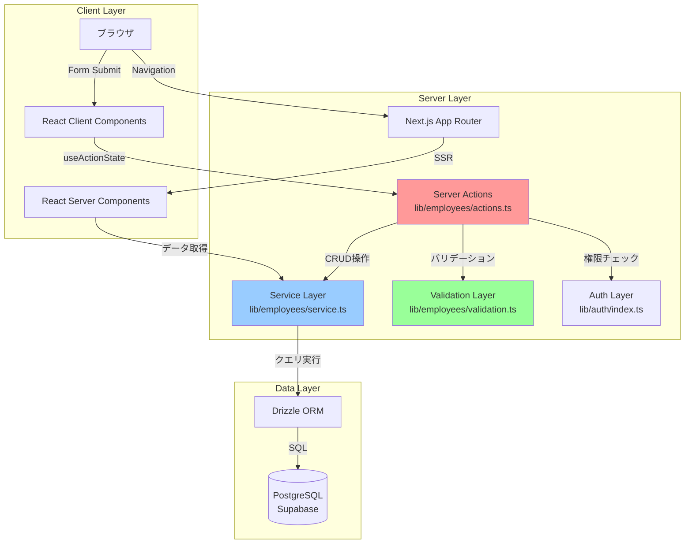
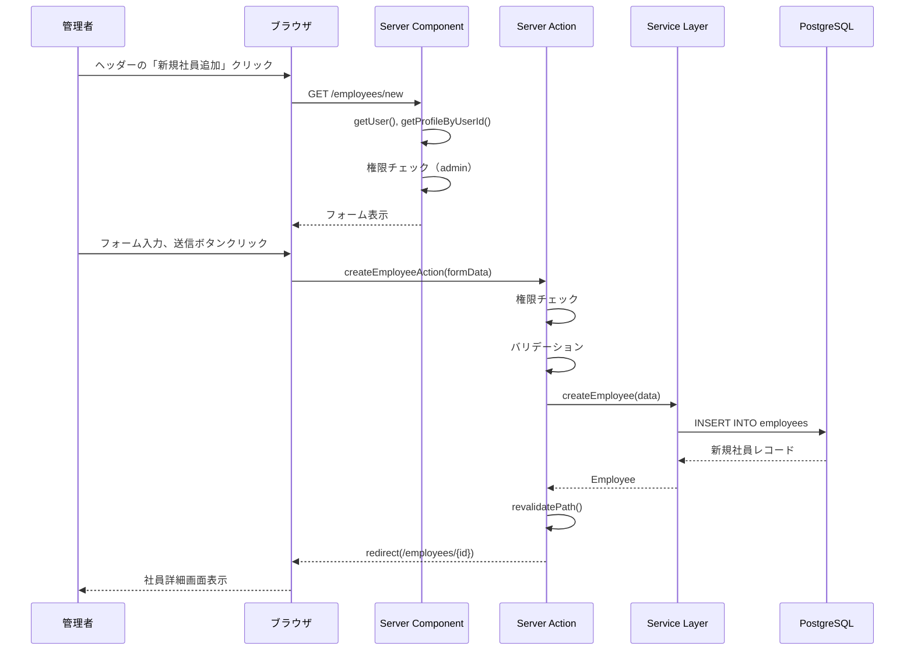
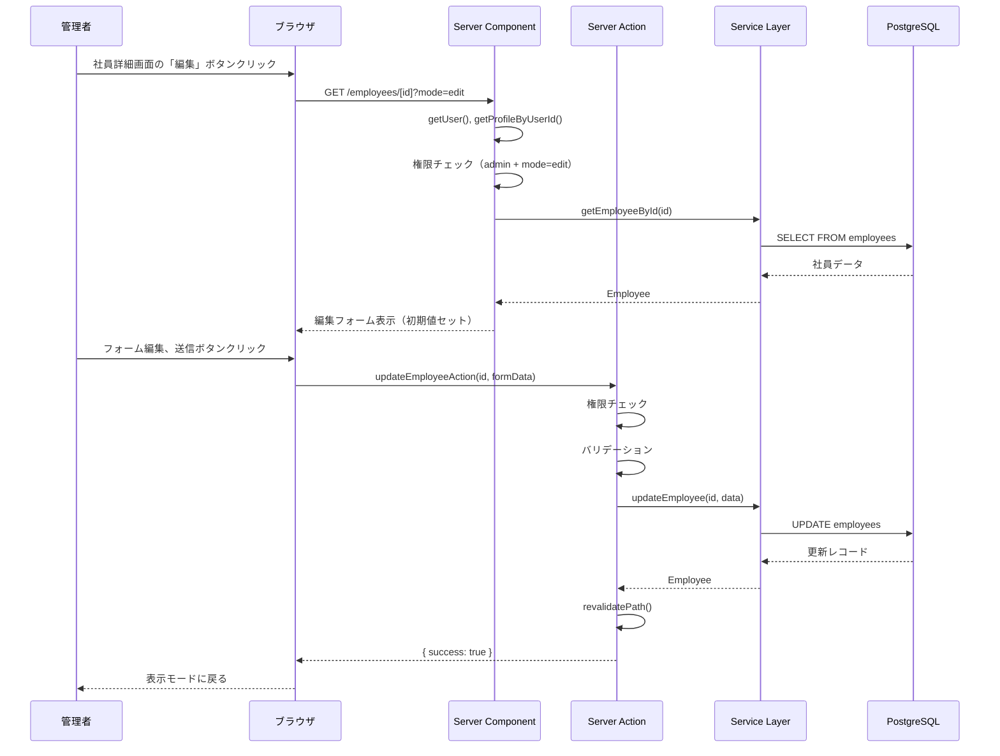
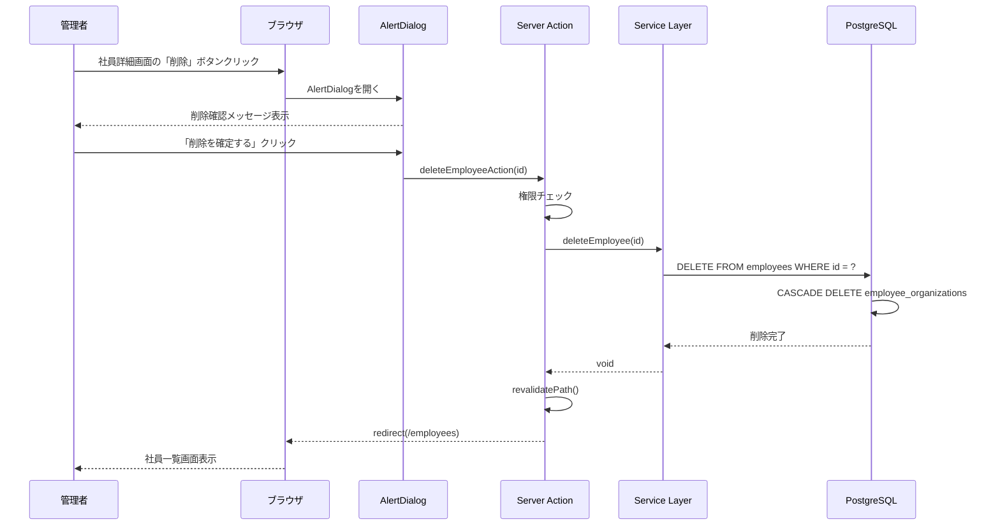
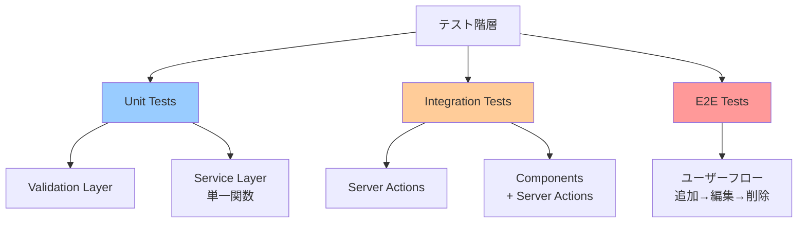

# 技術設計書: 社員管理機能（追加・編集・削除）

## 1. 設計概要

### 1.1 設計方針

本設計は、Gap分析で推奨されたハイブリッドアプローチ（オプションC）を採用します。3つのフェーズで段階的に実装し、技術的リスクを軽減しながら、コード品質を維持します。

**フェーズ1: MVP（最小限の拡張）**
- Server Actions実装（初回使用）
- 新規追加ページ作成
- 削除機能実装

**フェーズ2: コンポーネント共通化**
- フォームコンポーネント抽出
- 編集モード実装
- バリデーションロジック分離

**フェーズ3: UI最適化**
- エラーハンドリング改善
- ローディング状態の最適化
- アクセシビリティ強化

### 1.2 設計原則

1. **Server-First設計**: Server Componentsをデフォルトとし、クライアントコンポーネントは最小限
2. **関心の分離**: UI層、ビジネスロジック層、データ層を明確に分離
3. **型安全性**: TypeScript strict modeで全型定義を保証
4. **セキュリティ優先**: 全操作でサーバーサイド権限チェックを実施
5. **テスタビリティ**: 各レイヤーで独立したユニットテストを実装可能にする

### 1.3 技術スタック

| レイヤー | 技術 | 用途 |
|---------|------|------|
| **フレームワーク** | Next.js 16.0.1 (App Router) | ルーティング、SSR、Server Actions |
| **UI** | React 19.2 + shadcn/ui | コンポーネント、フォーム |
| **データベース** | PostgreSQL (Supabase) | データ永続化 |
| **ORM** | Drizzle ORM | 型安全なクエリビルダー |
| **認証** | Supabase Auth | SSRセッション管理 |
| **バリデーション** | カスタム関数 | クライアント・サーバー共通ロジック |
| **テスト** | Vitest 4 + React Testing Library 16 | ユニット・統合テスト |

---

## 2. アーキテクチャ設計

### 2.1 システムアーキテクチャ図



### 2.2 レイヤー責務

#### 2.2.1 UI Layer（`components/`, `app/`）

**責務**:
- ユーザー入力の受付
- 表示ロジック
- クライアントサイドステート管理
- Server Actionsの呼び出し

**主要コンポーネント**:
- `EmployeeForm`: 新規追加・編集共通フォーム
- `DeleteEmployeeDialog`: 削除確認ダイアログ
- `EmployeeDetailCard`: 社員情報表示カード

#### 2.2.2 Server Actions Layer（`lib/employees/actions.ts`）

**責務**:
- サーバーサイド権限チェック
- フォームデータ抽出
- バリデーション実行
- Service Layerの呼び出し
- エラーハンドリング
- キャッシュ再検証
- リダイレクト

**主要関数**:
- `createEmployeeAction()`
- `updateEmployeeAction()`
- `deleteEmployeeAction()`

#### 2.2.3 Service Layer（`lib/employees/service.ts`）

**責務**:
- ビジネスロジック実行
- データベースCRUD操作
- トランザクション管理
- データ変換

**主要関数**:
- `createEmployee()`（新規実装）
- `updateEmployee()`（新規実装）
- `deleteEmployee()`（新規実装）
- `getEmployeeById()`（既存）
- `searchEmployees()`（既存）

#### 2.2.4 Validation Layer（`lib/employees/validation.ts`）

**責務**:
- 入力値の検証
- エラーメッセージ生成
- クライアント・サーバー共通ロジック

**主要関数**:
- `validateEmployeeData()`
- `validateEmailFormat()`
- `validateHireDate()`

---

## 3. データモデル設計

### 3.1 データベーススキーマ

#### 3.1.1 employeesテーブル（既存）

```typescript
// db/schema.ts
export const employees = pgTable(
  "employees",
  {
    id: uuid("id").primaryKey().defaultRandom(),
    employeeNumber: text("employee_number").notNull().unique(), // UNIQUE制約
    nameKanji: text("name_kanji").notNull(),
    nameKana: text("name_kana").notNull(),
    photoS3Key: text("photo_s3_key"), // NULLABLE
    mobilePhone: text("mobile_phone"), // NULLABLE
    email: text("email").notNull().unique(), // UNIQUE制約
    hireDate: date("hire_date").notNull(),
    createdAt: timestamp("created_at").defaultNow().notNull(),
    updatedAt: timestamp("updated_at")
      .defaultNow()
      .notNull()
      .$onUpdate(() => new Date()), // 自動更新
  },
  (table) => ({
    employeeNumberIdx: index("employees_employee_number_idx").on(
      table.employeeNumber
    ),
    emailIdx: index("employees_email_idx").on(table.email),
  })
);
```

#### 3.1.2 employee_organizationsテーブル（既存）

```typescript
// db/schema.ts
export const employeeOrganizations = pgTable(
  "employee_organizations",
  {
    id: uuid("id").primaryKey().defaultRandom(),
    employeeId: uuid("employee_id")
      .notNull()
      .references(() => employees.id, { onDelete: "cascade" }), // CASCADE DELETE
    organizationId: uuid("organization_id")
      .notNull()
      .references(() => organizations.id, { onDelete: "cascade" }),
    position: text("position"), // NULLABLE（役職）
  }
);
```

### 3.2 TypeScript型定義

#### 3.2.1 入力データ型

```typescript
// lib/employees/types.ts

/**
 * 新規社員追加の入力データ
 */
export interface CreateEmployeeInput {
  employeeNumber: string; // 必須、UNIQUE
  nameKanji: string; // 必須
  nameKana: string; // 必須
  email: string; // 必須、UNIQUE
  hireDate: string; // 必須（ISO 8601形式: "YYYY-MM-DD"）
  mobilePhone?: string; // 任意
  organizationIds?: string[]; // 任意（所属組織UUIDの配列）
}

/**
 * 社員情報更新の入力データ
 */
export interface UpdateEmployeeInput {
  nameKanji?: string;
  nameKana?: string;
  email?: string; // UNIQUE制約チェック必要
  hireDate?: string;
  mobilePhone?: string | null; // nullで削除
}

/**
 * バリデーションエラー型
 */
export interface ValidationError {
  field: string;
  message: string;
}

/**
 * Server Actionの戻り値型
 */
export type ActionResult<T = void> = {
  success: boolean;
  data?: T;
  errors?: string[];
  fieldErrors?: Record<string, string[]>;
};
```

#### 3.2.2 出力データ型（既存）

```typescript
// lib/employees/service.ts（既存）
export interface Employee {
  id: string;
  employeeNumber: string;
  nameKanji: string;
  nameKana: string;
  photoS3Key: string | null;
  mobilePhone: string | null;
  email: string;
  hireDate: Date;
  organizations: EmployeeOrganization[];
}

export interface EmployeeOrganization {
  organizationId: string;
  organizationName: string;
  organizationPath: string; // "会社 > 本部 > 部署 > 課/チーム"
  position: string | null;
}
```

---

## 4. コンポーネント設計

### 4.1 コンポーネント構成図

```mermaid
graph TD
    subgraph "Pages (RSC)"
        A[app/employees/new/page.tsx<br/>新規追加ページ]
        B[app/employees/[employeeId]/page.tsx<br/>社員詳細ページ]
    end

    subgraph "Feature Components (Client)"
        C[EmployeeForm<br/>フォームコンポーネント]
        D[DeleteEmployeeDialog<br/>削除確認ダイアログ]
        E[EmployeeDetailCard<br/>情報表示カード]
    end

    subgraph "UI Components (shadcn/ui)"
        F[Input, Label, Button]
        G[Card, CardHeader, CardContent]
        H[AlertDialog]
    end

    A -->|編集時に使用| C
    B -->|表示モード| E
    B -->|編集モード| C
    B -->|削除ボタン| D
    C --> F
    E --> G
    D --> H

    style C fill:#ffcc99
    style D fill:#ff9999
    style E fill:#99ccff
```

### 4.2 コンポーネント詳細設計

#### 4.2.1 EmployeeForm（新規作成）

**ファイルパス**: `components/employee/employee-form.tsx`

**責務**:
- 新規追加・編集共通のフォームUI
- クライアントサイドバリデーション
- ローディング状態管理
- エラーメッセージ表示

**Props**:
```typescript
type EmployeeFormProps = {
  mode: "create" | "edit";
  initialData?: Employee; // editモード時のみ必須
  employeeId?: string; // editモード時のみ必須（キャンセル時のナビゲーションに使用）
};
```

**状態管理**:
```typescript
"use client";

import { useActionState } from "react";
import { useRouter } from "next/navigation";

const router = useRouter();
const [state, formAction, isPending] = useActionState(
  mode === "create" ? createEmployeeAction : updateEmployeeAction.bind(null, employeeId!),
  { success: false }
);

// キャンセルボタンのハンドラー
const handleCancel = () => {
  if (mode === "edit" && employeeId) {
    // 編集モードの場合、クエリパラメータを削除して表示モードに戻る
    router.push(`/employees/${employeeId}`);
  } else {
    // 新規追加モードの場合、一覧ページに戻る
    router.push("/employees");
  }
};
```

**UIレイアウト**:
```tsx
<form action={formAction} className="space-y-6">
  {/* 社員番号 */}
  <div>
    <Label htmlFor="employeeNumber">
      社員番号<span className="text-red-600">*</span>
    </Label>
    <Input
      id="employeeNumber"
      name="employeeNumber"
      defaultValue={initialData?.employeeNumber}
      disabled={mode === "edit"} // 編集時は読み取り専用
      required
    />
    {state.fieldErrors?.employeeNumber && (
      <p className="text-sm text-red-600 mt-1">
        {state.fieldErrors.employeeNumber[0]}
      </p>
    )}
  </div>

  {/* 氏名（漢字） */}
  <div>
    <Label htmlFor="nameKanji">
      氏名（漢字）<span className="text-red-600">*</span>
    </Label>
    <Input
      id="nameKanji"
      name="nameKanji"
      defaultValue={initialData?.nameKanji}
      required
    />
    {state.fieldErrors?.nameKanji && (
      <p className="text-sm text-red-600 mt-1">
        {state.fieldErrors.nameKanji[0]}
      </p>
    )}
  </div>

  {/* 氏名（カナ） */}
  <div>
    <Label htmlFor="nameKana">
      氏名（カナ）<span className="text-red-600">*</span>
    </Label>
    <Input
      id="nameKana"
      name="nameKana"
      defaultValue={initialData?.nameKana}
      required
    />
    {state.fieldErrors?.nameKana && (
      <p className="text-sm text-red-600 mt-1">
        {state.fieldErrors.nameKana[0]}
      </p>
    )}
  </div>

  {/* メールアドレス */}
  <div>
    <Label htmlFor="email">
      メールアドレス<span className="text-red-600">*</span>
    </Label>
    <Input
      id="email"
      name="email"
      type="email"
      defaultValue={initialData?.email}
      required
    />
    {state.fieldErrors?.email && (
      <p className="text-sm text-red-600 mt-1">
        {state.fieldErrors.email[0]}
      </p>
    )}
  </div>

  {/* 入社日 */}
  <div>
    <Label htmlFor="hireDate">
      入社日<span className="text-red-600">*</span>
    </Label>
    <Input
      id="hireDate"
      name="hireDate"
      type="date"
      defaultValue={
        initialData?.hireDate
          ? format(initialData.hireDate, "yyyy-MM-dd")
          : undefined
      }
      required
    />
    {state.fieldErrors?.hireDate && (
      <p className="text-sm text-red-600 mt-1">
        {state.fieldErrors.hireDate[0]}
      </p>
    )}
  </div>

  {/* 携帯電話 */}
  <div>
    <Label htmlFor="mobilePhone">携帯電話</Label>
    <Input
      id="mobilePhone"
      name="mobilePhone"
      type="tel"
      defaultValue={initialData?.mobilePhone || ""}
    />
  </div>

  {/* 全体エラー */}
  {state.errors && state.errors.length > 0 && (
    <div className="bg-red-50 border border-red-200 rounded-md p-3">
      <ul className="list-disc list-inside text-sm text-red-600">
        {state.errors.map((error, index) => (
          <li key={index}>{error}</li>
        ))}
      </ul>
    </div>
  )}

  {/* アクション */}
  <div className="flex gap-3">
    <Button type="submit" disabled={isPending}>
      {isPending ? "保存中..." : "保存"}
    </Button>
    <Button type="button" variant="outline" onClick={handleCancel}>
      キャンセル
    </Button>
  </div>
</form>
```

#### 4.2.2 DeleteEmployeeDialog（新規作成）

**ファイルパス**: `components/employee/delete-employee-dialog.tsx`

**責務**:
- 削除確認ダイアログの表示
- Server Actionの呼び出し
- ローディング状態管理

**Props**:
```typescript
type DeleteEmployeeDialogProps = {
  employeeId: string;
  employeeName: string;
  employeeNumber: string;
};
```

**実装**:
```tsx
"use client";

import {
  AlertDialog,
  AlertDialogAction,
  AlertDialogCancel,
  AlertDialogContent,
  AlertDialogDescription,
  AlertDialogFooter,
  AlertDialogHeader,
  AlertDialogTitle,
  AlertDialogTrigger,
} from "@/components/ui/alert-dialog";
import { Button } from "@/components/ui/button";
import { deleteEmployeeAction } from "@/lib/employees/actions";
import { useActionState } from "react";

export function DeleteEmployeeDialog({
  employeeId,
  employeeName,
  employeeNumber,
}: DeleteEmployeeDialogProps) {
  const [state, formAction, isPending] = useActionState(
    deleteEmployeeAction.bind(null, employeeId),
    { success: false }
  );

  return (
    <AlertDialog>
      <AlertDialogTrigger asChild>
        <Button variant="destructive">削除</Button>
      </AlertDialogTrigger>
      <AlertDialogContent>
        <AlertDialogHeader>
          <AlertDialogTitle>社員削除の確認</AlertDialogTitle>
          <AlertDialogDescription>
            以下の社員を削除してもよろしいですか？
            <br />
            <strong className="text-foreground">
              {employeeName}（{employeeNumber}）
            </strong>
            <br />
            この操作は取り消せません。
          </AlertDialogDescription>
        </AlertDialogHeader>
        <AlertDialogFooter>
          <AlertDialogCancel>キャンセル</AlertDialogCancel>
          <form action={formAction}>
            <AlertDialogAction
              type="submit"
              disabled={isPending}
              className="bg-red-600 hover:bg-red-700"
            >
              {isPending ? "削除中..." : "削除を確定する"}
            </AlertDialogAction>
          </form>
        </AlertDialogFooter>
      </AlertDialogContent>
    </AlertDialog>
  );
}
```

#### 4.2.3 EmployeeDetailCard（既存、拡張不要）

**ファイルパス**: `components/employee/employee-detail-card.tsx`

**責務**:
- 社員情報の表示のみ（編集機能は追加しない）

**変更点**: なし（既存のまま使用）

---

## 5. Server Actions設計

### 5.1 Server Actions構成

**ファイルパス**: `lib/employees/actions.ts`

```typescript
"use server";

import { revalidatePath } from "next/cache";
import { redirect } from "next/navigation";
import { getUser } from "@/lib/auth";
import { getProfileByUserId } from "@/lib/profiles/service";
import {
  createEmployee,
  updateEmployee,
  deleteEmployee,
} from "./service";
import { validateEmployeeData } from "./validation";
import type {
  ActionResult,
  CreateEmployeeInput,
  UpdateEmployeeInput,
} from "./types";

/**
 * 管理者権限チェック（共通ヘルパー）
 */
async function checkAdminPermission(): Promise<void> {
  const user = await getUser();
  if (!user) {
    throw new Error("Unauthorized");
  }

  const profile = await getProfileByUserId(user.id);
  if (profile?.role !== "admin") {
    throw new Error("Forbidden");
  }
}

/**
 * 新規社員追加 Server Action
 */
export async function createEmployeeAction(
  formData: FormData
): Promise<ActionResult<{ employeeId: string }>> {
  // 1. 権限チェック
  try {
    await checkAdminPermission();
  } catch (error) {
    return {
      success: false,
      errors: ["この操作を実行する権限がありません"],
    };
  }

  // 2. フォームデータ抽出
  const input: CreateEmployeeInput = {
    employeeNumber: formData.get("employeeNumber") as string,
    nameKanji: formData.get("nameKanji") as string,
    nameKana: formData.get("nameKana") as string,
    email: formData.get("email") as string,
    hireDate: formData.get("hireDate") as string,
    mobilePhone: (formData.get("mobilePhone") as string) || undefined,
  };

  // 3. バリデーション
  const validationResult = validateEmployeeData(input);
  if (!validationResult.success) {
    return {
      success: false,
      fieldErrors: validationResult.fieldErrors,
    };
  }

  // 4. データベース操作
  let employee;
  try {
    employee = await createEmployee(input);
  } catch (error) {
    console.error("Failed to create employee:", error);

    // UNIQUE制約違反の検出
    if (error.code === "23505") {
      if (error.constraint === "employees_employee_number_unique") {
        return {
          success: false,
          fieldErrors: {
            employeeNumber: ["この社員番号は既に使用されています"],
          },
        };
      }
      if (error.constraint === "employees_email_unique") {
        return {
          success: false,
          fieldErrors: {
            email: ["このメールアドレスは既に使用されています"],
          },
        };
      }
    }

    // その他のエラー
    return {
      success: false,
      errors: ["社員の作成に失敗しました。もう一度お試しください。"],
    };
  }

  // 5. キャッシュ再検証
  revalidatePath("/employees");
  revalidatePath(`/employees/${employee.id}`);

  // 6. リダイレクト（成功時）
  // redirect()は例外をスローするため、try-catchは不要
  // Next.js 16では、redirect()は内部的にREDIRECT errorをスローし、Routerがキャッチする
  redirect(`/employees/${employee.id}`);
}

/**
 * 社員情報更新 Server Action
 */
export async function updateEmployeeAction(
  employeeId: string,
  formData: FormData
): Promise<ActionResult> {
  // 1. 権限チェック
  try {
    await checkAdminPermission();
  } catch (error) {
    return {
      success: false,
      errors: ["この操作を実行する権限がありません"],
    };
  }

  // 2. フォームデータ抽出
  const input: UpdateEmployeeInput = {
    nameKanji: formData.get("nameKanji") as string,
    nameKana: formData.get("nameKana") as string,
    email: formData.get("email") as string,
    hireDate: formData.get("hireDate") as string,
    mobilePhone: (formData.get("mobilePhone") as string) || null,
  };

  // 3. バリデーション
  const validationResult = validateEmployeeData(input);
  if (!validationResult.success) {
    return {
      success: false,
      fieldErrors: validationResult.fieldErrors,
    };
  }

  // 4. データベース操作
  try {
    await updateEmployee(employeeId, input);

    // 5. キャッシュ再検証
    revalidatePath(`/employees/${employeeId}`);
    revalidatePath("/employees");

    return { success: true };
  } catch (error) {
    console.error("Failed to update employee:", error);

    // UNIQUE制約違反の検出
    if (error.code === "23505") {
      if (error.constraint === "employees_email_unique") {
        return {
          success: false,
          fieldErrors: {
            email: ["このメールアドレスは既に使用されています"],
          },
        };
      }
    }

    // その他のエラー
    return {
      success: false,
      errors: ["社員情報の更新に失敗しました。もう一度お試しください。"],
    };
  }
}

/**
 * 社員削除 Server Action
 */
export async function deleteEmployeeAction(
  employeeId: string
): Promise<ActionResult> {
  // 1. 権限チェック
  try {
    await checkAdminPermission();
  } catch (error) {
    throw new Error("Forbidden"); // 403エラーページへ
  }

  // 2. データベース操作
  try {
    await deleteEmployee(employeeId);
  } catch (error) {
    console.error("Failed to delete employee:", error);
    throw new Error("社員の削除に失敗しました"); // エラーページへ
  }

  // 3. キャッシュ再検証
  revalidatePath("/employees");

  // 4. リダイレクト
  redirect("/employees");
}
```

### 5.2 エラーハンドリング戦略

| エラータイプ | ハンドリング方法 | ユーザーへの表示 |
|-------------|----------------|----------------|
| **権限エラー** | `throw new Error("Forbidden")` | error.tsx（403ページ） |
| **バリデーションエラー** | `return { success: false, fieldErrors }` | フィールドごとのインラインエラー |
| **UNIQUE制約違反** | `catch`でPostgreSQLエラーコード検知 | 「社員番号が既に使用されています」 |
| **ネットワークエラー** | `throw`でエラーバウンダリへ | error.tsx（再試行ボタン付き） |
| **その他DBエラー** | `return { success: false, errors }` | 全体エラーメッセージ |

---

## 6. Service Layer設計

### 6.1 新規CRUD関数の実装

**ファイルパス**: `lib/employees/service.ts`（既存ファイルに追加）

#### 6.1.1 createEmployee()

```typescript
import { db } from "@/db";
import { employees } from "@/db/schema";
import type { CreateEmployeeInput } from "./types";

/**
 * 新規社員を作成
 * @param data - 社員データ
 * @returns 作成された社員情報
 * @throws データベースエラー（UNIQUE制約違反など）
 */
export async function createEmployee(
  data: CreateEmployeeInput
): Promise<Employee> {
  // フェーズ1: 単一テーブル操作のため非トランザクション実装
  // フェーズ2で所属組織追加機能を実装する際にトランザクション化
  const [employee] = await db
    .insert(employees)
    .values({
      employeeNumber: data.employeeNumber,
      nameKanji: data.nameKanji,
      nameKana: data.nameKana,
      email: data.email,
      hireDate: new Date(data.hireDate),
      mobilePhone: data.mobilePhone || null,
      photoS3Key: null, // 初期値はnull
    })
    .returning();

  // 作成した社員情報を返却（所属組織情報は空配列）
  return {
    ...employee,
    hireDate: new Date(employee.hireDate),
    organizations: [],
  };
}
```

#### 6.1.2 updateEmployee()

```typescript
import { eq } from "drizzle-orm";

/**
 * 社員情報を更新
 * @param employeeId - 社員UUID
 * @param data - 更新データ
 * @returns 更新された社員情報
 * @throws 社員が存在しない場合、データベースエラー
 */
export async function updateEmployee(
  employeeId: string,
  data: UpdateEmployeeInput
): Promise<Employee> {
  // 単一テーブル更新のためトランザクション不要
  const [employee] = await db
    .update(employees)
    .set({
      nameKanji: data.nameKanji,
      nameKana: data.nameKana,
      email: data.email,
      hireDate: data.hireDate ? new Date(data.hireDate) : undefined,
      mobilePhone: data.mobilePhone,
    })
    .where(eq(employees.id, employeeId))
    .returning();

  if (!employee) {
    throw new Error("Employee not found");
  }

  // 所属組織情報を再取得（getEmployeeByIdを再利用）
  const fullEmployee = await getEmployeeById(employeeId);
  if (!fullEmployee) {
    throw new Error("Employee not found");
  }

  return fullEmployee;
}
```

#### 6.1.3 deleteEmployee()

```typescript
/**
 * 社員を削除（物理削除）
 * @param employeeId - 社員UUID
 * @throws 社員が存在しない場合、データベースエラー
 */
export async function deleteEmployee(employeeId: string): Promise<void> {
  // CASCADE DELETE設定により、employee_organizationsも自動削除
  const result = await db
    .delete(employees)
    .where(eq(employees.id, employeeId))
    .returning({ id: employees.id });

  if (result.length === 0) {
    throw new Error("Employee not found");
  }
}
```

---

## 7. Validation Layer設計

### 7.1 バリデーション関数

**ファイルパス**: `lib/employees/validation.ts`（新規作成）

```typescript
import type { CreateEmployeeInput, UpdateEmployeeInput } from "./types";

/**
 * バリデーション結果型
 */
export type ValidationResult = {
  success: boolean;
  fieldErrors?: Record<string, string[]>;
};

/**
 * メールアドレス形式の正規表現
 */
const EMAIL_REGEX = /^[^\s@]+@[^\s@]+\.[^\s@]+$/;

/**
 * 社員データのバリデーション
 * @param data - 検証対象データ
 * @returns バリデーション結果
 */
export function validateEmployeeData(
  data: Partial<CreateEmployeeInput | UpdateEmployeeInput>
): ValidationResult {
  const fieldErrors: Record<string, string[]> = {};

  // 社員番号（新規追加時のみ必須）
  if ("employeeNumber" in data) {
    if (!data.employeeNumber || data.employeeNumber.trim() === "") {
      fieldErrors.employeeNumber = ["社員番号は必須です"];
    } else if (data.employeeNumber.length > 20) {
      fieldErrors.employeeNumber = ["社員番号は20文字以内で入力してください"];
    }
  }

  // 氏名（漢字）
  if ("nameKanji" in data) {
    if (!data.nameKanji || data.nameKanji.trim() === "") {
      fieldErrors.nameKanji = ["氏名（漢字）は必須です"];
    } else if (data.nameKanji.length > 100) {
      fieldErrors.nameKanji = ["氏名（漢字）は100文字以内で入力してください"];
    }
  }

  // 氏名（カナ）
  if ("nameKana" in data) {
    if (!data.nameKana || data.nameKana.trim() === "") {
      fieldErrors.nameKana = ["氏名（カナ）は必須です"];
    } else if (data.nameKana.length > 100) {
      fieldErrors.nameKana = ["氏名（カナ）は100文字以内で入力してください"];
    }
  }

  // メールアドレス
  if ("email" in data) {
    if (!data.email || data.email.trim() === "") {
      fieldErrors.email = ["メールアドレスは必須です"];
    } else if (!EMAIL_REGEX.test(data.email)) {
      fieldErrors.email = ["有効なメールアドレスを入力してください"];
    } else if (data.email.length > 255) {
      fieldErrors.email = ["メールアドレスは255文字以内で入力してください"];
    }
  }

  // 入社日
  if ("hireDate" in data) {
    if (!data.hireDate || data.hireDate.trim() === "") {
      fieldErrors.hireDate = ["入社日は必須です"];
    } else {
      const hireDate = new Date(data.hireDate);
      const today = new Date();
      today.setHours(0, 0, 0, 0); // 時刻をリセット

      if (Number.isNaN(hireDate.getTime())) {
        fieldErrors.hireDate = ["有効な日付を入力してください"];
      } else if (hireDate > today) {
        fieldErrors.hireDate = ["入社日は本日以前の日付を指定してください"];
      }
    }
  }

  // 携帯電話（任意、形式チェックのみ）
  if (data.mobilePhone && data.mobilePhone.trim() !== "") {
    if (data.mobilePhone.length > 20) {
      fieldErrors.mobilePhone = ["携帯電話は20文字以内で入力してください"];
    }
  }

  return {
    success: Object.keys(fieldErrors).length === 0,
    fieldErrors: Object.keys(fieldErrors).length > 0 ? fieldErrors : undefined,
  };
}
```

---

## 8. ページ設計

### 8.1 新規社員追加ページ

**ファイルパス**: `app/employees/new/page.tsx`（新規作成）

```typescript
import { getUser } from "@/lib/auth";
import { getProfileByUserId } from "@/lib/profiles/service";
import { redirect } from "next/navigation";
import { EmployeeForm } from "@/components/employee/employee-form";
import type { Metadata } from "next";

export const metadata: Metadata = {
  title: "新規社員追加 - peer-search",
};

export default async function NewEmployeePage() {
  // 認証チェック
  const user = await getUser();
  if (!user) {
    redirect("/login");
  }

  // 権限チェック
  const profile = await getProfileByUserId(user.id);
  if (profile?.role !== "admin") {
    throw new Error("Forbidden"); // 403エラーページへ
  }

  return (
    <div className="container mx-auto px-4 py-8 max-w-2xl">
      <h1 className="text-3xl font-bold mb-6">新規社員追加</h1>
      <EmployeeForm mode="create" />
    </div>
  );
}
```

### 8.2 社員詳細ページ（編集モード対応）

**ファイルパス**: `app/employees/[employeeId]/page.tsx`（既存ファイル拡張）

```typescript
import { getUser } from "@/lib/auth";
import { getProfileByUserId } from "@/lib/profiles/service";
import { getEmployeeById } from "@/lib/employees/service";
import { notFound } from "next/navigation";
import { EmployeeDetailPhoto } from "@/components/employee/employee-detail-photo";
import { EmployeeDetailCard } from "@/components/employee/employee-detail-card";
import { EmployeeForm } from "@/components/employee/employee-form";
import { DeleteEmployeeDialog } from "@/components/employee/delete-employee-dialog";
import { Button } from "@/components/ui/button";
import Link from "next/link";
import type { Metadata } from "next";

type Props = {
  params: Promise<{ employeeId: string }>;
  searchParams: Promise<{ mode?: string }>;
};

export async function generateMetadata({ params }: Props): Promise<Metadata> {
  const { employeeId } = await params;
  const employee = await getEmployeeById(employeeId);
  return {
    title: employee
      ? `${employee.nameKanji} - 社員詳細 - peer-search`
      : "社員詳細 - peer-search",
  };
}

export default async function EmployeeDetailPage({
  params,
  searchParams,
}: Props) {
  // 認証チェック
  const user = await getUser();
  if (!user) {
    throw new Error("Unauthorized");
  }

  // 権限チェック
  const profile = await getProfileByUserId(user.id);
  const isAdmin = profile?.role === "admin";

  // 社員データ取得
  const { employeeId } = await params;
  const employee = await getEmployeeById(employeeId);
  if (!employee) {
    notFound();
  }

  // 編集モードの判定
  const { mode } = await searchParams;
  const isEditMode = mode === "edit";

  // 編集モードは管理者のみ
  if (isEditMode && !isAdmin) {
    throw new Error("Forbidden");
  }

  return (
    <div className="container mx-auto px-4 py-8">
      {isEditMode ? (
        // 編集モード
        <div className="max-w-2xl mx-auto">
          <h1 className="text-3xl font-bold mb-6">社員情報編集</h1>
          <EmployeeForm
            mode="edit"
            initialData={employee}
            employeeId={employeeId}
          />
        </div>
      ) : (
        // 表示モード
        <div className="grid grid-cols-1 md:grid-cols-2 gap-8">
          <div>
            <EmployeeDetailPhoto s3Key={employee.photoS3Key} />
          </div>
          <div className="space-y-4">
            <EmployeeDetailCard employee={employee} />
            {isAdmin && (
              <div className="flex gap-3">
                <Link href={`/employees/${employeeId}?mode=edit`}>
                  <Button>編集</Button>
                </Link>
                <DeleteEmployeeDialog
                  employeeId={employee.id}
                  employeeName={employee.nameKanji}
                  employeeNumber={employee.employeeNumber}
                />
              </div>
            )}
          </div>
        </div>
      )}
    </div>
  );
}
```

### 8.3 PageHeader統合

**ファイルパス**: `components/layout/page-header.tsx`（既存ファイル拡張）

```typescript
// 既存のPageHeaderコンポーネントに「新規社員追加」リンクを追加
import Link from "next/link";

export function PageHeader({ user, isAdmin }: PageHeaderProps) {
  return (
    <header className="sticky top-0 z-50 w-full border-b bg-background/95 backdrop-blur">
      {/* 既存のヘッダーコンテンツ */}
      <nav>
        {isAdmin && (
          <Link
            href="/employees/new"
            className="text-sm font-medium hover:underline"
          >
            新規社員追加
          </Link>
        )}
      </nav>
    </header>
  );
}
```

---

## 9. データフロー設計

### 9.1 新規社員追加フロー



### 9.2 社員情報編集フロー



### 9.3 社員削除フロー



---

## 10. エラーハンドリング設計

### 10.1 エラーページ設計

#### 10.1.1 403 Forbiddenエラー

**ファイルパス**: `app/employees/error.tsx`（既存、拡張不要）

```typescript
"use client";

export default function Error({
  error,
  reset,
}: {
  error: Error & { digest?: string };
  reset: () => void;
}) {
  if (error.message === "Forbidden") {
    return (
      <div className="container mx-auto px-4 py-8 text-center">
        <h1 className="text-4xl font-bold mb-4">403 - アクセス禁止</h1>
        <p className="text-gray-600 mb-6">
          この操作を実行する権限がありません。
        </p>
        <a
          href="/employees"
          className="text-blue-600 hover:underline"
        >
          社員一覧へ戻る
        </a>
      </div>
    );
  }

  // その他のエラー
  return (
    <div className="container mx-auto px-4 py-8 text-center">
      <h1 className="text-4xl font-bold mb-4">エラーが発生しました</h1>
      <p className="text-gray-600 mb-6">
        予期しないエラーが発生しました。もう一度お試しください。
      </p>
      <button
        onClick={reset}
        className="bg-blue-600 text-white px-4 py-2 rounded hover:bg-blue-700"
      >
        再試行
      </button>
    </div>
  );
}
```

### 10.2 エラー処理マトリクス

| エラー発生箇所 | エラータイプ | ハンドリング方法 | ユーザー体験 |
|--------------|-------------|----------------|-------------|
| **Server Action（権限）** | `throw new Error("Forbidden")` | error.tsx（403） | 403ページ表示 |
| **Server Action（バリデーション）** | `return { fieldErrors }` | フォーム内表示 | フィールドごとの赤色エラー |
| **Server Action（UNIQUE違反）** | `catch`で検知、`return { fieldErrors }` | フォーム内表示 | 「社員番号が既に使用されています」 |
| **Server Action（DB一般エラー）** | `return { errors }` | フォーム上部表示 | 全体エラーメッセージ |
| **Service Layer（Not Found）** | `throw new Error("Not found")` | notFound() | 404ページ |
| **Service Layer（DB接続エラー）** | `throw`でバブルアップ | error.tsx | エラーページ（再試行ボタン） |

---

## 11. セキュリティ設計

### 11.1 セキュリティチェックリスト

| 項目 | 実装方法 | 対策内容 |
|------|---------|---------|
| **認証チェック** | `getUser()`をRSCで実行 | 未認証ユーザーはloginへリダイレクト |
| **権限チェック** | `getProfileByUserId()`で`role`確認 | 一般ユーザーは403エラー |
| **Server Actions権限** | 各Action冒頭で`checkAdminPermission()` | クライアント側バイパスを防止 |
| **SQLインジェクション** | Drizzle ORMプリペアドステートメント | 自動エスケープ |
| **CSRF保護** | Next.js 16自動実装 | CSRFトークン検証 |
| **XSS対策** | Reactの自動エスケープ | ユーザー入力の安全な表示 |
| **UNIQUE制約** | DB側制約 + バリデーション | 重複データ防止 |
| **入力サニタイゼーション** | `trim()`、長さ制限 | 不正入力の防止 |

### 11.2 権限チェックフロー

```mermaid
graph TD
    A[ユーザーリクエスト] --> B{認証チェック<br/>getUser}
    B -->|未認証| C[/login へリダイレクト]
    B -->|認証済み| D{権限チェック<br/>getProfileByUserId}
    D -->|role = user| E[403 Forbiddenエラー]
    D -->|role = admin| F[Server Action実行]
    F --> G{再度権限チェック<br/>checkAdminPermission}
    G -->|権限なし| H[エラー返却<br/>return fieldErrors]
    G -->|権限あり| I[DB操作実行]

    style C fill:#ff9999
    style E fill:#ff9999
    style H fill:#ffcc99
    style I fill:#99ff99
```

---

## 12. パフォーマンス設計

### 12.1 最適化戦略

| 項目 | 実装方法 | 期待効果 |
|------|---------|---------|
| **Server Components** | RSCでデータ取得 | クライアントJSバンドル削減 |
| **Server Actions** | フォーム送信をサーバーサイド処理 | クライアント負荷削減 |
| **returning()句** | Drizzle ORM `returning()` | 追加クエリ削減 |
| **トランザクション最小化** | 単一テーブル操作は非トランザクション | DB接続時間短縮 |
| **キャッシュ再検証** | `revalidatePath()`で必要範囲のみ | 無駄な再検証を削減 |
| **インデックス活用** | `employee_number`, `email`インデックス | 検索・UNIQUE チェック高速化 |

### 12.2 キャッシュ戦略

```typescript
// Server Action実行後のキャッシュ再検証パターン

// 新規追加時
revalidatePath("/employees"); // 一覧ページ
revalidatePath(`/employees/${employee.id}`); // 詳細ページ

// 更新時
revalidatePath(`/employees/${employeeId}`); // 詳細ページのみ
revalidatePath("/employees"); // 一覧ページ（名前変更時）

// 削除時
revalidatePath("/employees"); // 一覧ページのみ
```

---

## 13. テスト設計

### 13.1 テスト階層



### 13.2 テストケース一覧

#### 13.2.1 Validation Layer（`validation.test.ts`）

```typescript
describe("validateEmployeeData", () => {
  // 成功パターン
  it("有効なデータの場合は success: true を返す", () => {});

  // エラーパターン
  it("社員番号が空の場合はエラーを返す", () => {});
  it("氏名（漢字）が空の場合はエラーを返す", () => {});
  it("氏名（カナ）が空の場合はエラーを返す", () => {});
  it("メールアドレスが空の場合はエラーを返す", () => {});
  it("メールアドレスの形式が不正な場合はエラーを返す", () => {});
  it("入社日が空の場合はエラーを返す", () => {});
  it("入社日が未来の日付の場合はエラーを返す", () => {});
  it("入社日が不正な形式の場合はエラーを返す", () => {});
});
```

#### 13.2.2 Service Layer（`service.test.ts`）

```typescript
describe("createEmployee", () => {
  it("新規社員を正常に作成できる", async () => {});
  it("UNIQUE制約違反時にエラーをスローする", async () => {});
  it("トランザクションが正しくコミットされる", async () => {});
});

describe("updateEmployee", () => {
  it("社員情報を正常に更新できる", async () => {});
  it("存在しない社員IDの場合はエラーをスローする", async () => {});
  it("メールアドレスのUNIQUE制約違反時にエラーをスローする", async () => {});
});

describe("deleteEmployee", () => {
  it("社員を正常に削除できる", async () => {});
  it("関連するemployee_organizationsが自動削除される", async () => {});
  it("存在しない社員IDの場合はエラーをスローする", async () => {});
});
```

#### 13.2.3 Server Actions（`actions.test.ts`）

```typescript
describe("createEmployeeAction", () => {
  it("管理者権限がない場合はエラーを返す", async () => {});
  it("バリデーションエラーがある場合はfieldErrorsを返す", async () => {});
  it("UNIQUE制約違反時にfieldErrorsを返す", async () => {});
  it("正常に社員を作成し、リダイレクトする", async () => {});
});

describe("updateEmployeeAction", () => {
  it("管理者権限がない場合はエラーを返す", async () => {});
  it("バリデーションエラーがある場合はfieldErrorsを返す", async () => {});
  it("正常に社員情報を更新する", async () => {});
});

describe("deleteEmployeeAction", () => {
  it("管理者権限がない場合は例外をスローする", async () => {});
  it("正常に社員を削除し、リダイレクトする", async () => {});
});
```

#### 13.2.4 コンポーネント（`employee-form.test.tsx`）

```typescript
describe("EmployeeForm", () => {
  it("新規追加モードで空のフォームを表示する", () => {});
  it("編集モードで初期値がセットされる", () => {});
  it("社員番号が編集モードでdisabledになる", () => {});
  it("必須フィールドが空の場合はエラーを表示する", () => {});
  it("フォーム送信中はボタンがdisabledになる", () => {});
  it("キャンセルボタンをクリックするとonCancelが呼ばれる", () => {});
});

describe("DeleteEmployeeDialog", () => {
  it("削除ボタンをクリックするとダイアログが開く", () => {});
  it("ダイアログに社員名と社員番号が表示される", () => {});
  it("キャンセルボタンでダイアログが閉じる", () => {});
  it("削除確定ボタンでServer Actionが呼ばれる", () => {});
});
```

### 13.3 テストカバレッジ目標

| レイヤー | 目標カバレッジ | 優先度 |
|---------|---------------|--------|
| **Validation Layer** | 100% | 🔴 High |
| **Service Layer** | 90%+ | 🔴 High |
| **Server Actions** | 85%+ | 🟡 Medium |
| **Components** | 80%+ | 🟡 Medium |

---

## 14. 段階的実装計画

### 14.1 フェーズ1: MVP（最小限の拡張）

**目標**: Server Actionsの初回実装、基本的なCRUD操作

**成果物**:
- `lib/employees/types.ts`（型定義）
- `lib/employees/validation.ts`（バリデーション関数）
- `lib/employees/actions.ts`（Server Actions）
- `lib/employees/service.ts`（CRUD関数追加）
  - **トランザクション戦略**: `createEmployee()`は非トランザクション実装（単一テーブル操作）
  - `updateEmployee()`も非トランザクション実装
  - `deleteEmployee()`はCASCADE DELETE利用で非トランザクション
- `app/employees/new/page.tsx`（新規追加ページ）
- `components/employee/delete-employee-dialog.tsx`（削除ダイアログ）
- `app/employees/[employeeId]/page.tsx`（削除ボタン追加）
- shadcn/ui `dialog`、`alert-dialog`コンポーネント追加

**テスト**:
- Validation Layer: ユニットテスト
- Service Layer: CRUD関数のユニットテスト
- Server Actions: 権限チェック、バリデーション、UNIQUE制約のテスト

**工数見積もり**: 4日

### 14.2 フェーズ2: コンポーネント共通化

**目標**: フォームロジックの再利用、編集モード実装

**成果物**:
- `components/employee/employee-form.tsx`（共通フォームコンポーネント）
- `app/employees/new/page.tsx`（EmployeeForm使用にリファクタリング）
- `app/employees/[employeeId]/page.tsx`（編集モード実装）

**テスト**:
- EmployeeForm: コンポーネントテスト
- 編集フロー: 統合テスト

**工数見積もり**: 3日

### 14.3 フェーズ3: UI最適化

**目標**: エラーハンドリング改善、アクセシビリティ強化

**成果物**:
- エラーメッセージの改善（ユーザーフレンドリーな表現）
- ローディング状態の視覚的改善（Spinner追加）
- フォームフィールドのアクセシビリティ強化（aria-label、aria-describedby）
- キーボードナビゲーション検証

**テスト**:
- アクセシビリティテスト（axe-core）
- エラーハンドリングの統合テスト

**工数見積もり**: 2日

### 14.4 総工数

**合計**: 9日（テスト実装3日を含む）

---

## 15. 運用考慮事項

### 15.1 モニタリング

```typescript
// Server Actionsにロギング追加
console.log("[Employee Management] Action executed", {
  action: "createEmployee",
  userId: user.id,
  timestamp: new Date().toISOString(),
});
```

### 15.2 将来的な拡張

| 拡張機能 | 実装方法 | 優先度 |
|---------|---------|--------|
| **写真アップロード** | S3直接アップロード、photoS3Key更新 | 🟡 Medium |
| **所属組織編集** | employee_organizationsテーブル操作 | 🟡 Medium |
| **操作履歴** | audit_logsテーブル追加 | 🟢 Low |
| **論理削除** | deleted_atカラム追加、物理削除から移行 | 🟢 Low |
| **トースト通知** | shadcn/ui Toastコンポーネント | 🟢 Low |
| **楽観的UI更新** | React 19 useOptimistic | 🟢 Low |

---

## 16. まとめ

### 16.1 設計の要点

1. **Server-First設計**: React Server ComponentsとServer Actionsを中心としたアーキテクチャ
2. **関心の分離**: UI、Server Actions、Service、Validationの4層構造
3. **型安全性**: TypeScript strict modeで全レイヤーの型定義を保証
4. **セキュリティ優先**: 全操作でサーバーサイド権限チェック、SQLインジェクション対策
5. **段階的実装**: 3フェーズで技術的リスクを軽減、コード品質を維持

### 16.2 技術的課題と対策

| 課題 | 対策 |
|------|------|
| **Server Actions初回使用** | フェーズ1で小規模実装、パターン確立 |
| **UNIQUE制約エラー処理** | PostgreSQLエラーコード検知、ユーザーフレンドリーなメッセージ |
| **権限チェック漏れ** | 全Server Actionで`checkAdminPermission()`を共通化 |
| **トランザクション実装** | 必要最小限の使用、単一テーブル操作は非トランザクション |

### 16.3 次のステップ

設計フェーズ完了後、タスク生成フェーズ（`/kiro:spec-tasks employee-management`）で以下を実施してください:

1. フェーズ1のタスク細分化（TDD方式で実装）
2. 各タスクの受入条件定義
3. テストケースの詳細化
4. 工数の再見積もり

実装フェーズでは、`/kiro:spec-impl employee-management`で段階的に実装を進めます。
