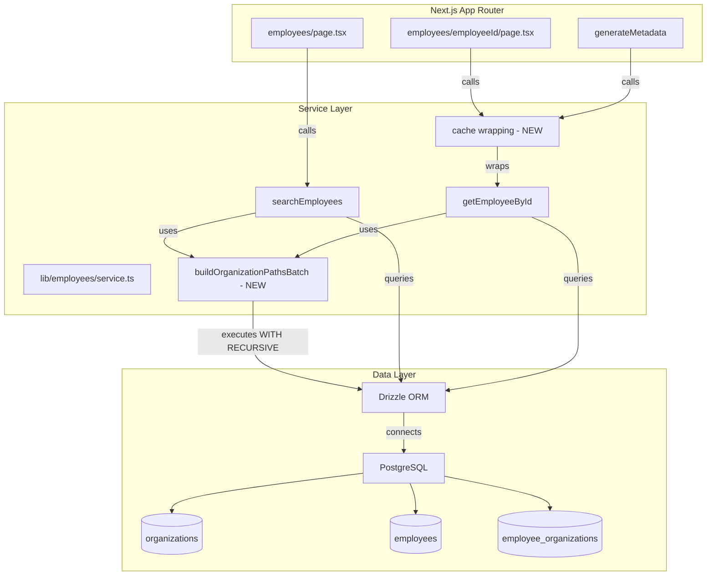
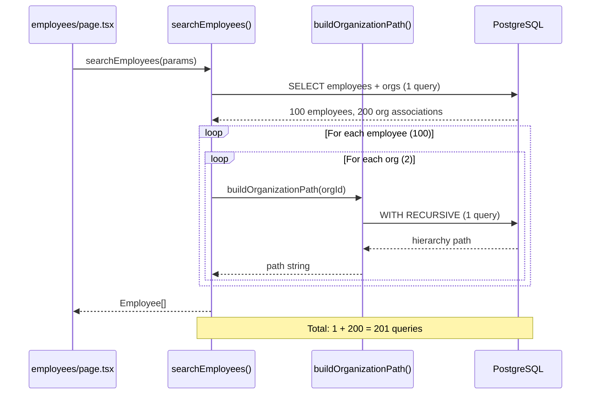
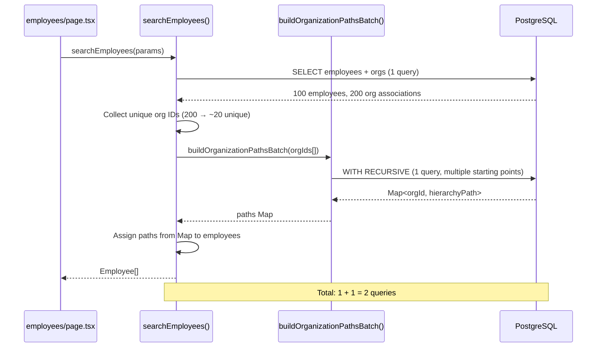
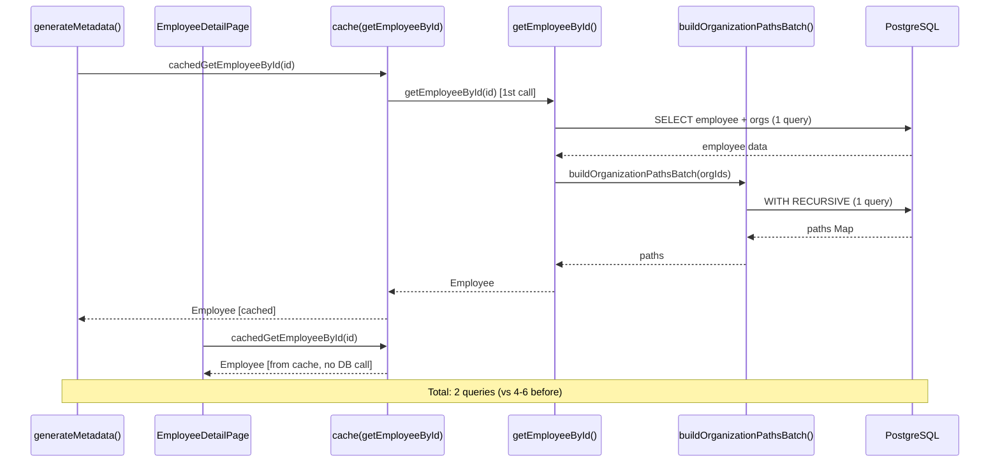

# Technical Design Document: employee-query-optimization

## Overview

本機能は、社員一覧ページおよび社員詳細ページにおけるN+1クエリ問題を解決し、データベースアクセスを最適化します。具体的には、組織階層パスの生成を個別実行から一括実行に変更し、社員詳細ページでのデータ取得の重複を排除します。

**Purpose**: 社員データ取得のパフォーマンスを大幅に改善し、データベース負荷を削減することで、エンドユーザーのページ表示速度を向上させます。

**Users**: 全ユーザー（一般ユーザー、管理者）が社員一覧・詳細ページを利用する際に恩恵を受けます。

**Impact**: 現在の実装では、社員数×所属組織数だけデータベースクエリが発行されていますが、最適化後は数回のクエリに削減されます（例: 100人×2組織=200回 → 2回程度）。

### Goals

- 組織階層パスの生成を一括処理化し、N+1クエリ問題を解決
- 社員詳細ページでの重複データ取得を排除
- 既存の型定義、UIインターフェースを変更せず、後方互換性を維持
- パフォーマンス計測とログ出力を強化し、最適化効果を定量的に検証

### Non-Goals

- データベーススキーマの変更（既存のインデックスで十分）
- UIコンポーネントの変更（パフォーマンス最適化のみ）
- 社員データのCRUD機能の追加・変更
- 組織階層構造の変更

## Architecture

### Existing Architecture Analysis

**現在のアーキテクチャ:**

- **Service Layer Pattern**: `lib/employees/service.ts` が社員データ取得のビジネスロジックを集約
- **Drizzle ORM**: PostgreSQLとの接続に使用、型安全なクエリビルダー + 生SQL実行（`db.execute()`）をサポート
- **Next.js App Router + RSC**: Server Componentsでサーバーサイドデータフェッチを実行
- **既存のパフォーマンス計測**: `searchEmployees()` 内で `performance.now()` を使用した実行時間計測済み

**既存の問題箇所:**

1. `lib/employees/service.ts:258-264` - `searchEmployees()` 内での組織階層パス個別生成ループ
2. `lib/employees/service.ts:343-346` - `getEmployeeById()` 内での組織階層パス個別生成ループ
3. `app/employees/[employeeId]/page.tsx` - `generateMetadata()` とページコンポーネントでの重複 `getEmployeeById()` 呼び出し

**保持すべき既存パターン:**

- Service Layer Pattern（`lib/employees/service.ts` の責務維持）
- 内部関数の可視性（`buildOrganizationPath()` は非エクスポート）
- 型定義のエクスポート（`Employee`, `EmployeeOrganization` の不変性）
- エラーハンドリング（try-catch は呼び出し側）

### Architecture Pattern & Boundary Map



**Architecture Integration:**

- **Selected Pattern**: Service Layer Pattern の拡張 - 既存の `lib/employees/service.ts` に新関数を追加し、既存関数を最適化
- **Domain Boundaries**: Employee Service が社員データ取得の責務を保持、組織階層パス生成も内包（関心の分離よりも凝集性を優先）
- **Existing Patterns Preserved**: 非エクスポート内部関数、型定義のエクスポート、エラーハンドリングの委譲
- **New Components Rationale**:
  - `buildOrganizationPathsBatch()`: N+1問題解決のための一括取得関数（既存の `buildOrganizationPath()` と並存）
  - `cache()` ラッピング: React 19の標準機能を活用した重複呼び出し防止
- **Steering Compliance**: TypeScript strict mode、型安全性、Server-First Pattern を維持

### Technology Stack

| Layer | Choice / Version | Role in Feature | Notes |
|-------|------------------|-----------------|-------|
| Frontend | Next.js 16.0.1 App Router | ページコンポーネント（RSC） | 既存、変更なし |
| Frontend | React 19.2 | `cache()` による重複呼び出し防止 | 既存機能の活用、新規依存なし |
| Backend | Drizzle ORM | 型安全なクエリ実行 + 生SQL（WITH RECURSIVE） | 既存、`db.execute<T>(sql`...`)` パターン使用 |
| Data | PostgreSQL | WITH RECURSIVE による階層クエリ最適化 | 既存、UNION ALL で複数起点統合 |
| Data | 既存インデックス | `organizations.parent_id`, `employee_organizations.*` | schema.tsで定義済み、追加不要 |

## System Flows

### 最適化前の社員一覧取得フロー（N+1問題）



### 最適化後の社員一覧取得フロー



### 最適化後の社員詳細取得フロー（重複排除）



## Requirements Traceability

| Requirement | Summary | Components | Interfaces | Flows |
|-------------|---------|------------|------------|-------|
| 1.1, 1.2, 1.3, 1.4, 1.5 | 組織階層パス一括取得 | `buildOrganizationPathsBatch()` | Service Interface | 最適化後フロー |
| 2.1, 2.2, 2.3, 2.4, 2.5 | 社員一覧最適化 | `searchEmployees()` 修正 | Service Interface | 社員一覧取得フロー |
| 3.1, 3.2, 3.3, 3.4 | 社員詳細最適化 | `getEmployeeById()` 修正 | Service Interface | 社員詳細取得フロー |
| 4.1, 4.2, 4.3, 4.4, 4.5 | データ取得重複解消 | `cache()` ラッピング | Page Component | 社員詳細取得フロー |
| 5.1, 5.2, 5.3, 5.4, 5.5 | パフォーマンス計測 | `buildOrganizationPathsBatch()` 内計測 | ログ出力 | - |
| 6.1, 6.2, 6.3, 6.4, 6.5 | インデックス検証 | `db/schema.ts` 確認 | - | - |
| 7.1, 7.2, 7.3, 7.4, 7.5 | 後方互換性保証 | 全コンポーネント | 型定義不変 | - |
| 8.1, 8.2, 8.3, 8.4, 8.5 | テストカバレッジ | ユニットテスト追加・更新 | テストインターフェース | - |

## Components and Interfaces

| Component | Domain/Layer | Intent | Req Coverage | Key Dependencies | Contracts |
|-----------|--------------|--------|--------------|------------------|-----------|
| `buildOrganizationPathsBatch()` | Service/Data | 複数組織IDから階層パスを一括取得 | 1.1-1.5 | PostgreSQL (P0), Drizzle ORM (P0) | Service |
| `searchEmployees()` 修正 | Service | 一括取得関数を使用してN+1を解消 | 2.1-2.5 | `buildOrganizationPathsBatch` (P0) | Service (既存) |
| `getEmployeeById()` 修正 | Service | 一括取得関数を使用してN+1を解消 | 3.1-3.4 | `buildOrganizationPathsBatch` (P0) | Service (既存) |
| `cache()` ラッピング | Page Component | 重複呼び出しを防止 | 4.1-4.5 | React 19 `cache()` (P0) | - |

### Service Layer

#### buildOrganizationPathsBatch

| Field | Detail |
|-------|--------|
| Intent | 複数の組織IDから階層パスを1回のWITH RECURSIVEクエリで一括取得し、Map形式で返却 |
| Requirements | 1.1, 1.2, 1.3, 1.4, 1.5 |

**Responsibilities & Constraints**

- 複数組織IDを受け取り、PostgreSQLのWITH RECURSIVE（UNION ALL）で階層構造を一括取得
- 組織ID → 階層パス（半角スペース区切り）のMapを返却
- 空配列の場合は空Mapを返す、存在しない組織IDの場合は階層パスを空文字列とする
- 既存の `buildOrganizationPath()` と出力形式（半角スペース区切り）の互換性を保つ

**Dependencies**

- Outbound: PostgreSQL organizations テーブル（階層データ） (P0)
- Outbound: Drizzle ORM `db.execute<T>()` + `sql` テンプレート (P0)

**Contracts**: Service [x]

##### Service Interface

```typescript
/**
 * 複数の組織IDから階層パスを一括取得
 *
 * @param organizationIds - 組織ID配列（UUID[]）
 * @returns 組織ID → 階層パス のMap（半角スペース区切り）
 *
 * @example
 * const orgIds = ['uuid1', 'uuid2'];
 * const pathsMap = await buildOrganizationPathsBatch(orgIds);
 * // => Map { 'uuid1' => '株式会社ユニリタ 開発本部 製品開発部', 'uuid2' => '株式会社ユニリタ 管理本部' }
 */
async function buildOrganizationPathsBatch(
  organizationIds: string[]
): Promise<Map<string, string>>;
```

**Preconditions:**
- `organizationIds` は UUID 形式の文字列配列
- 空配列も許容される

**Postconditions:**
- 戻り値は `Map<string, string>` 型
- Mapのキーは入力された組織ID
- Mapの値は階層パス（level 順に半角スペース区切り）
- 存在しない組織IDの場合、値は空文字列 `""`
- 空配列が渡された場合、空Mapを返す

**Invariants:**
- クエリ実行は1回のみ（WITH RECURSIVE + UNION ALL）
- レスポンスタイムが500msを超えた場合は警告ログを出力
- 既存の `buildOrganizationPath()` と同じ出力形式（半角スペース区切り）

**Implementation Notes**

- **Integration**:
  - SQL構造: 各組織IDに対して非再帰項（ベースケース）を生成し、UNION ALLで結合
  - 再帰項で親組織を辿り、最後に `GROUP BY organization_id` + `STRING_AGG(name, ' ' ORDER BY level ASC)` で階層パスを生成
  - Drizzle の `db.execute<{ organization_id: string; path: string }>(sql`...`)` で型安全に実行
  - `Map<string, string>` への変換は TypeScript の `new Map(result.map(r => [r.organization_id, r.path]))`

- **Validation**:
  - 入力検証: `organizationIds` が配列であることを確認（型システムで保証）
  - 空配列チェック: `if (organizationIds.length === 0) return new Map()`
  - 存在しない組織ID: SQLクエリ結果に含まれない場合は、後続処理で空文字列として扱う

- **Risks**:
  - 組織ID数が非常に多い場合（1000件以上）のパフォーマンス劣化
    - 緩和策: EXPLAIN ANALYZEで検証、実運用では社員1人あたり数組織程度を想定
  - WITH RECURSIVEの無限ループリスク（親IDの循環参照）
    - 緩和策: DBスキーマの制約で防止（既存設計に依存）、PostgreSQL の再帰深度制限

#### searchEmployees 修正

| Field | Detail |
|-------|--------|
| Intent | 既存の社員一覧取得関数を最適化し、N+1クエリ問題を解消 |
| Requirements | 2.1, 2.2, 2.3, 2.4, 2.5 |

**Responsibilities & Constraints**

- 社員検索パラメータに基づいて社員データを取得（既存機能維持）
- 所属組織IDを収集し、`buildOrganizationPathsBatch()` を使用して一括取得
- 既存の型定義（`Employee`, `EmployeeOrganization`）を変更しない
- 既存のパフォーマンス計測（500ms超過警告）を維持

**Dependencies**

- Outbound: `buildOrganizationPathsBatch()` (P0)
- Outbound: Drizzle ORM クエリビルダー (P0)
- Outbound: PostgreSQL employees, employee_organizations, organizations テーブル (P0)

**Contracts**: Service [x] (既存インターフェース維持)

##### Service Interface

```typescript
// 既存のインターフェースを変更しない
export async function searchEmployees(
  params: SearchEmployeesParams = {}
): Promise<Employee[]>;
```

**Implementation Notes**

- **Integration**:
  - 既存のクエリ実行部分（204行まで）は変更なし
  - 258-264行のループを削除し、以下のロジックに置き換え:
    1. 全社員の所属組織IDを収集（`Set<string>` で重複排除）
    2. `buildOrganizationPathsBatch(Array.from(orgIdsSet))` を呼び出し
    3. 取得したMapから各社員の所属組織に階層パスを設定
  - 既存のパフォーマンス計測（203-217行）を維持

- **Validation**:
  - 既存の検索条件バリデーションを維持
  - 組織IDの収集で `null` チェックを実施

- **Risks**:
  - 既存テストへの影響（モック構造の変更）
    - 緩和策: テスト実行で早期検出、必要に応じてモック更新

#### getEmployeeById 修正

| Field | Detail |
|-------|--------|
| Intent | 既存の社員詳細取得関数を最適化し、N+1クエリ問題を解消 |
| Requirements | 3.1, 3.2, 3.3, 3.4 |

**Responsibilities & Constraints**

- 社員IDに基づいて単一社員のデータを取得（既存機能維持）
- 所属組織IDを収集し、`buildOrganizationPathsBatch()` を使用して一括取得
- 既存の型定義（`Employee`, `EmployeeOrganization`）を変更しない
- 存在しない社員IDの場合は `null` を返す（既存動作維持）

**Dependencies**

- Outbound: `buildOrganizationPathsBatch()` (P0)
- Outbound: Drizzle ORM クエリビルダー (P0)
- Outbound: PostgreSQL employees, employee_organizations, organizations テーブル (P0)

**Contracts**: Service [x] (既存インターフェース維持)

##### Service Interface

```typescript
// 既存のインターフェースを変更しない
export async function getEmployeeById(
  employeeId: string
): Promise<Employee | null>;
```

**Implementation Notes**

- **Integration**:
  - 既存のクエリ実行部分（276-341行）は変更なし
  - 343-346行のループを削除し、以下のロジックに置き換え:
    1. 所属組織IDを収集（`employee.organizations.map(o => o.organizationId)`）
    2. `buildOrganizationPathsBatch(orgIds)` を呼び出し
    3. 取得したMapから各所属組織に階層パスを設定

- **Validation**:
  - 既存のnullチェック（306-308行）を維持
  - 組織IDの収集で `null` チェックを実施

- **Risks**:
  - 既存テストへの影響（モック構造の変更）
    - 緩和策: テスト実行で早期検出、必要に応じてモック更新

### Page Component Layer

#### cache() ラッピング (app/employees/[employeeId]/page.tsx)

| Field | Detail |
|-------|--------|
| Intent | `getEmployeeById()` をReact 19の `cache()` でラップし、`generateMetadata()` とページコンポーネント間での重複呼び出しを防止 |
| Requirements | 4.1, 4.2, 4.3, 4.4, 4.5 |

**Responsibilities & Constraints**

- React 19 の `cache()` を使用して `getEmployeeById()` をメモ化
- `generateMetadata()` と `EmployeeDetailPage` の両方で同じキャッシュされた関数を使用
- 既存の `generateMetadata()` の戻り値型と `Props` 定義を変更しない
- リクエストスコープ内でのみキャッシュが有効（異なるリクエスト間での共有はしない）

**Dependencies**

- Inbound: Next.js App Router (`generateMetadata()`, Server Component) (P0)
- Outbound: `getEmployeeById()` from `lib/employees/service` (P0)
- External: React 19 `cache()` (P0)

**Contracts**: - (既存のページコンポーネントインターフェースを変更しない)

**Implementation Notes**

- **Integration**:
  - ファイル冒頭に `import { cache } from 'react'` を追加
  - `const cachedGetEmployeeById = cache(getEmployeeById)` を定義
  - `generateMetadata()` 内（20行）と `EmployeeDetailPage` 内（45行）で `cachedGetEmployeeById(employeeId)` を使用
  - 既存のエラーハンドリング（`notFound()`）を維持

- **Validation**:
  - TypeScript の型推論により、`cachedGetEmployeeById` の型が `getEmployeeById` と同じであることを保証
  - `employeeId` が `null` でないことを確認（既存のコードで保証されている）

- **Risks**:
  - `cache()` のキャッシュキー衝突（異なる`employeeId`で同じ結果が返る）
    - 緩和策: React 19 の `cache()` は引数のシリアライズで自動的にキーを生成するため、衝突リスクは低い。ログで動作確認。
  - リクエストスコープ外でのキャッシュ共有の誤解
    - 緩和策: ドキュメントで明示、テストで検証

## Data Models

### Domain Model

本機能はデータモデルの変更を伴わず、既存のドメインモデルを維持します。

**既存のドメインモデル（変更なし）:**

- **Employee（社員）**: 社員の基本情報と所属組織のコレクション
- **EmployeeOrganization（所属組織）**: 社員と組織の関連、役職情報
- **Organization（組織）**: 階層構造を持つ組織情報（会社→本部→部署→課/チーム）

**Aggregate Root**: `Employee`（社員が所属組織を保有）

**Value Object**: `organizationPath`（階層パス文字列、計算により導出）

### Physical Data Model

**既存のデータベーススキーマ（変更なし）:**

**organizations テーブル:**
```sql
CREATE TABLE organizations (
  id UUID PRIMARY KEY DEFAULT gen_random_uuid(),
  name TEXT NOT NULL,
  parent_id UUID REFERENCES organizations(id),
  level INTEGER NOT NULL CHECK (level >= 1 AND level <= 4),
  created_at TIMESTAMP NOT NULL DEFAULT NOW(),
  updated_at TIMESTAMP NOT NULL DEFAULT NOW()
);

-- 既存インデックス（追加不要）
CREATE INDEX idx_organizations_parent_id ON organizations(parent_id);
CREATE INDEX idx_organizations_level ON organizations(level);
```

**employee_organizations テーブル:**
```sql
CREATE TABLE employee_organizations (
  employee_id UUID NOT NULL REFERENCES employees(id) ON DELETE CASCADE,
  organization_id UUID NOT NULL REFERENCES organizations(id) ON DELETE CASCADE,
  position TEXT,
  created_at TIMESTAMP NOT NULL DEFAULT NOW(),
  PRIMARY KEY (employee_id, organization_id)
);

-- 既存インデックス（追加不要）
CREATE INDEX idx_employee_organizations_employee_id ON employee_organizations(employee_id);
CREATE INDEX idx_employee_organizations_organization_id ON employee_organizations(organization_id);
```

**インデックス検証結果（Requirement 6）:**

| テーブル | カラム | インデックス名 | 状態 | 目的 |
|---------|-------|--------------|------|------|
| organizations | id | PRIMARY KEY | 存在 | 主キー検索 |
| organizations | parent_id | idx_organizations_parent_id | 存在 | 階層トラバーサル最適化 |
| employee_organizations | employee_id | idx_employee_organizations_employee_id | 存在 | 社員→組織の結合最適化 |
| employee_organizations | organization_id | idx_employee_organizations_organization_id | 存在 | 組織→社員の結合最適化 |

**結論**: すべての必要なインデックスが存在。追加のマイグレーションは不要。

### Data Contracts & Integration

**既存の型定義（変更なし）:**

```typescript
export interface EmployeeOrganization {
  organizationId: string;
  organizationName: string;
  organizationPath: string; // 半角スペース区切りの階層パス
  position: string | null;
}

export interface Employee {
  id: string;
  employeeNumber: string;
  nameKanji: string;
  nameKana: string;
  photoS3Key: string | null;
  mobilePhone: string | null;
  email: string;
  hireDate: Date;
  organizations: EmployeeOrganization[]; // 所属組織配列
}
```

**内部データ構造（一括取得関数）:**

```typescript
// buildOrganizationPathsBatch の内部クエリ結果型
interface OrganizationPathRow {
  organization_id: string;
  path: string; // STRING_AGG で生成された階層パス
}

// 戻り値型
type OrganizationPathsMap = Map<string, string>;
```

## Error Handling

### Error Strategy

本機能は既存のエラーハンドリング戦略を維持し、呼び出し側（ページコンポーネント）でtry-catchを実施します。

### Error Categories and Responses

**User Errors (4xx):**
- 存在しない社員ID → `getEmployeeById()` が `null` を返し、ページコンポーネントで `notFound()` を呼び出し（既存動作維持）

**System Errors (5xx):**
- データベース接続エラー → エラーをthrowし、Next.jsのエラーバウンダリで処理（既存動作維持）
- WITH RECURSIVEクエリのタイムアウト → PostgreSQL のタイムアウト設定に依存、500ms超過時は警告ログ出力

**Business Logic Errors:**
- 空の組織ID配列 → 空Mapを返す（正常系として扱う）
- 存在しない組織ID → 階層パスを空文字列として扱う（正常系として扱う）

### Monitoring

- **パフォーマンス監視**:
  - `buildOrganizationPathsBatch()` の実行時間を計測（`performance.now()`）
  - 500ms超過時に警告ログ: `[Performance Warning] Batch organization path query took Xms (threshold: 500ms)`
  - ログメッセージに組織ID数を含める: `{ organizationCount: N }`

- **エラー監視**:
  - データベースエラーは既存のエラーハンドリングで捕捉
  - console.error でエラーログ出力（既存パターン維持）

## Testing Strategy

### Unit Tests

- **新関数 `buildOrganizationPathsBatch()`**:
  1. 空配列が渡された場合、空Mapを返す
  2. 単一組織IDの場合、正しい階層パスを返す
  3. 複数組織IDの場合、すべての階層パスを含むMapを返す
  4. 存在しない組織IDが含まれる場合、空文字列を値として返す
  5. 階層パスの形式が既存の `buildOrganizationPath()` と一致することを確認

- **修正関数 `searchEmployees()` & `getEmployeeById()`**:
  1. 既存のテストケースがすべてパスすることを確認（型定義不変）
  2. `buildOrganizationPathsBatch()` が適切に呼び出されることをモックで検証
  3. 組織階層パスが正しく設定されることを検証

### Integration Tests

- **社員一覧取得の統合テスト**:
  1. 実際のデータベースを使用し、100人の社員 × 2組織のデータで検証
  2. クエリ数が201回から2回程度に削減されることを確認
  3. 結果の `organizationPath` が既存の出力と一致することを確認

- **社員詳細取得の統合テスト**:
  1. `generateMetadata()` とページコンポーネントで `getEmployeeById()` が1回のみ実行されることを確認
  2. キャッシュが正しく機能していることをログで検証
  3. 結果の `organizationPath` が既存の出力と一致することを確認

### Performance Tests

- **パフォーマンス検証**:
  1. 100人の社員データで最適化前後のレスポンスタイムを計測
  2. 組織ID数を段階的に増やし（10, 50, 100, 200）、`buildOrganizationPathsBatch()` の実行時間を計測
  3. EXPLAIN ANALYZE でクエリプランを確認し、インデックスが効果的に使用されていることを検証

- **負荷テスト**:
  1. 同時に複数のリクエストが発行された場合のデータベース負荷を検証
  2. PostgreSQL のコネクションプール枯渇の有無を確認

### E2E Tests

- **既存のE2Eテストの維持**:
  1. 社員一覧ページの表示とフィルタリング機能が正常に動作することを確認
  2. 社員詳細ページの表示と編集機能が正常に動作することを確認
  3. UIの表示内容が最適化前後で変わらないことを確認

## Performance & Scalability

### Target Metrics

| Metric | Before | After | Goal |
|--------|--------|-------|------|
| 社員一覧ページのクエリ数 | 201回（100人×2組織+1） | 2回 | <5回 |
| 社員詳細ページのクエリ数 | 4-6回 | 2回 | <3回 |
| 社員一覧ページのレスポンスタイム | ~2000ms | <500ms | <500ms |
| 社員詳細ページのレスポンスタイム | ~1000ms | <300ms | <300ms |
| `buildOrganizationPathsBatch()` 実行時間 | N/A | <200ms | <500ms |

### Caching Strategies

- **React `cache()`**:
  - スコープ: リクエスト単位（Next.js Server Component のリクエストライフサイクル）
  - キャッシュキー: 引数の自動シリアライズ（`employeeId`）
  - TTL: リクエスト終了まで（自動クリア）
  - キャッシュサイズ: メモリ消費は最小限（1リクエストあたり数KB程度）

- **データベースクエリキャッシング**:
  - 本機能では実装しない（将来的にRedis等を検討可能）
  - PostgreSQL のクエリキャッシュに依存

### Optimization Techniques

- **WITH RECURSIVE の最適化**:
  - UNION ALL で複数起点を統合し、1回のクエリで処理
  - `organizations.parent_id` インデックスを活用した高速トラバーサル
  - `GROUP BY` + `STRING_AGG` でサーバーサイドで階層パスを生成

- **メモリ使用量の最適化**:
  - `Set<string>` で組織IDの重複を排除
  - `Map<string, string>` で高速な階層パス参照

## Supporting References

### SQL Query Example

**buildOrganizationPathsBatch の実装イメージ:**

```sql
WITH RECURSIVE org_hierarchy AS (
  -- 非再帰項: 各組織IDをベースケースとして設定
  SELECT
    id AS start_id,
    id,
    name,
    level,
    parent_id
  FROM organizations
  WHERE id IN ($1, $2, $3, ...) -- 入力された組織ID配列

  UNION ALL

  -- 再帰項: 親組織を辿る
  SELECT
    oh.start_id,
    o.id,
    o.name,
    o.level,
    o.parent_id
  FROM organizations o
  INNER JOIN org_hierarchy oh ON o.id = oh.parent_id
)
SELECT
  start_id AS organization_id,
  STRING_AGG(name, ' ' ORDER BY level ASC) AS path
FROM org_hierarchy
GROUP BY start_id;
```

**結果例:**
```
organization_id                      | path
-------------------------------------|---------------------------------------------
550e8400-e29b-41d4-a716-446655440000 | 株式会社ユニリタ 開発本部 製品開発部 フロントエンドチーム
550e8400-e29b-41d4-a716-446655440001 | 株式会社ユニリタ 管理本部 総務部
```
