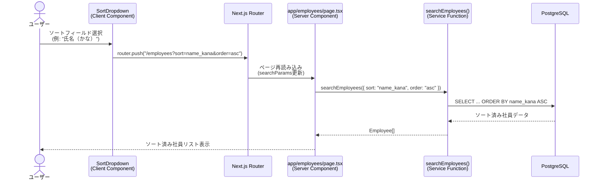
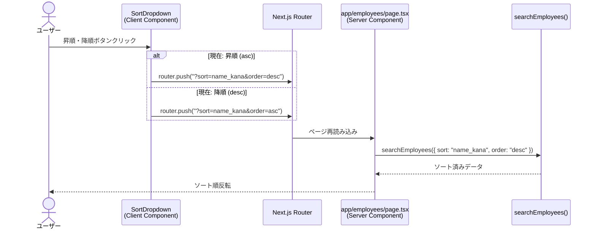

# Technical Design Document

## Overview

本機能は、社員一覧画面（`/employees`）に**ドロップダウンリスト形式のソートUI**を追加します。現在のボタン形式ソートコントロール（`SortControls`）に加えて、より省スペースで直感的なドロップダウン形式の選択UI（`SortDropdown`）を提供し、ユーザーが氏名（かな）、社員番号、入社年の3つのフィールドから選択してソートできるようにします。

**Purpose**: ユーザーフィードバックに基づき、社員一覧画面のソート機能をよりコンパクトで直感的なUIに改善し、限られた画面スペースを効率的に活用する。

**Users**: 社員情報を検索・閲覧する全てのユーザー（認証済みユーザー）が、検索結果を柔軟にソートして表示する。

**Impact**: 既存のボタン形式ソートコントロールと新しいドロップダウン形式が一時的に共存し、ユーザーフィードバックを収集した後に最終的な UI を決定する。バックエンド（`searchEmployees` サービス関数）は既にソート機能を実装しているため、フロントエンドコンポーネントの追加のみで完結する。

### Goals
- ドロップダウンリスト形式のソートUIコンポーネント（`SortDropdown`）を実装する
- 既存のボタン形式ソートコントロール（`SortControls`）と段階的に移行し、両UIを一時的に並行運用する
- URL クエリパラメータ（`sort`, `order`）を通じて既存の `searchEmployees` サービス関数と統合する
- WCAG 2.1 Level AA 基準に準拠したアクセシブルな UI を提供する
- shadcn/ui `Select` コンポーネントを使用してプロジェクト標準に準拠する

### Non-Goals
- 既存 `SortControls` コンポーネントの削除（ユーザーフィードバック後に判断）
- `searchEmployees` サービス関数のソートロジック変更（既に実装済み）
- 新しいソートフィールドの追加（氏名かな、社員番号、入社年の3つのみ）
- デフォルトソート順の変更（既存の動作を維持）
- カスタムソート順の保存機能（ユーザー設定の永続化）

## Architecture

### Existing Architecture Analysis

**現在のソート実装**:
- **バックエンド**: `lib/employees/service.ts` の `searchEmployees` 関数が `SearchEmployeesParams` 型で `sort` および `order` パラメータを受け取り、Drizzle ORM の `asc()` / `desc()` 関数でソート処理を実行
- **フロントエンド**: `components/employee/sort-controls.tsx` がボタン形式の UI で、`useRouter` と `useSearchParams` を使用して URL クエリパラメータ（`?sort=name_kana&order=asc`）を更新
- **ページコンポーネント**: `app/employees/page.tsx` が URL パラメータを読み取り、`searchEmployees` 関数に渡してサーバーサイドでデータ取得

**既存のドメイン境界**:
- **UIレイヤー**: `/components/employee/` - 社員関連のプレゼンテーションコンポーネント（クライアントコンポーネント）
- **サービスレイヤー**: `/lib/employees/` - 社員データのビジネスロジックとデータベースアクセス
- **ページレイヤー**: `/app/employees/` - Next.js App Router のサーバーコンポーネント

**既存の統合ポイント**:
- URL クエリパラメータ（`sort`, `order`）を介した状態管理
- `SearchEmployeesParams` 型を介したサービス関数との契約
- shadcn/ui コンポーネントライブラリの使用

### Architecture Pattern & Boundary Map

**選択パターン**: **プレゼンテーションレイヤー拡張**（Presentation Layer Extension）

新しい `SortDropdown` コンポーネントは、既存の `SortControls` と同じレイヤーに配置され、同じ URL 状態管理メカニズムを共有します。バックエンドロジックの変更は不要で、フロントエンドコンポーネントの追加のみで完結します。

```mermaid
graph TB
    subgraph "Presentation Layer (Client)"
        SearchForm["SearchForm<br/>(既存)"]
        SortControls["SortControls<br/>(既存・ボタン形式)"]
        SortDropdown["SortDropdown<br/>(新規・ドロップダウン形式)"]
        EmployeeCardList["EmployeeCardList<br/>(既存)"]
    end

    subgraph "Page Layer (Server)"
        EmployeesPage["app/employees/page.tsx<br/>(Server Component)"]
    end

    subgraph "Service Layer"
        searchEmployees["searchEmployees()<br/>(既存・変更なし)"]
    end

    subgraph "Data Layer"
        Database[(PostgreSQL)]
    end

    SearchForm -->|検索条件| EmployeesPage
    SortControls -->|URL更新| EmployeesPage
    SortDropdown -->|URL更新| EmployeesPage
    EmployeesPage -->|SearchEmployeesParams| searchEmployees
    searchEmployees -->|Drizzle ORM| Database
    searchEmployees -->|Employee[]| EmployeesPage
    EmployeesPage -->|社員データ| EmployeeCardList
```

**ドメイン/機能境界**:
- **UIコンポーネント境界**: `SortDropdown` と `SortControls` はそれぞれ独立したクライアントコンポーネントとして実装され、どちらも同じ URL パラメータを操作
- **データ取得境界**: サーバーコンポーネント（`EmployeesPage`）でデータ取得を行い、クライアントコンポーネントは UI のみを担当
- **状態管理境界**: URL クエリパラメータを Single Source of Truth として使用し、React State を使用しない

**既存パターンの維持**:
- **Server-First Pattern**: データ取得はサーバーコンポーネントで実行（steering: structure.md）
- **Client Component Isolation**: UI インタラクションのみをクライアントコンポーネント化（steering: structure.md）
- **shadcn/ui Component Usage**: プロジェクト標準 UI ライブラリの使用（steering: tech.md, structure.md）
- **Feature-based Directory Structure**: `/components/employee/` 配下に配置（steering: structure.md）

**新コンポーネントの妥当性**:
- `SortDropdown`: ドロップダウン形式のソート UI を提供する独立したクライアントコンポーネント。段階的移行のため既存 `SortControls` と並行運用。

**Steering準拠**:
- **structure.md**: `/components/employee/` 配下に `sort-dropdown.tsx` を配置
- **tech.md**: shadcn/ui `Select` コンポーネント使用、TypeScript strict mode、Vitest + React Testing Library によるテスト
- **product.md**: 社員検索システムの一部としてソート機能を拡張

### Technology Stack

| Layer | Choice / Version | Role in Feature | Notes |
|-------|------------------|-----------------|-------|
| Frontend | React 19.2 | UI レンダリングとインタラクション | Server Components + Client Components パターン |
| | Next.js 16.0.1 (App Router) | ページルーティング、URL パラメータ管理 | `useRouter`, `useSearchParams` フック使用 |
| | TypeScript 5 (strict mode) | 型安全性の確保 | `any` 型禁止、厳密な型チェック |
| | shadcn/ui (Select) | ドロップダウン UI コンポーネント | `@radix-ui/react-select v2.2.6` 基盤 |
| | Tailwind CSS 4 | スタイリング、レスポンシブデザイン | ユーティリティクラスによる一貫性確保 |
| | lucide-react | アイコン（ArrowUp, ArrowDown, ChevronDown） | 既存プロジェクトで使用中 |
| Backend | 変更なし | 既存 `searchEmployees` 関数を使用 | `lib/employees/service.ts` |
| Testing | Vitest 4.0.12 | ユニット・コンポーネントテスト | `sort-dropdown.test.tsx` |
| | React Testing Library 16.3.0 | コンポーネントインタラクションテスト | ユーザー視点のテスト |
| | @testing-library/user-event | ユーザーイベントシミュレーション | ドロップダウン選択、ボタンクリック |

**選定理由**:
- **shadcn/ui Select**: プロジェクト標準 UI ライブラリ。アクセシビリティ（WCAG 2.1 Level AA）を標準サポート。既存実装との一貫性を確保。
- **URL パラメータ管理**: Next.js App Router の推奨パターン。ブラウザ履歴・ブックマーク対応、SEO フレンドリー。
- **既存依存関係の再利用**: 新規ライブラリ追加なし。保守性とプロジェクト一貫性を維持。

詳細な技術選定の根拠は `research.md` の「Architecture Pattern Evaluation」および「Design Decisions」セクションを参照。

## System Flows

### ドロップダウンソート操作フロー



### 昇順・降順切り替えフロー



**Key Decisions**:
- URL パラメータを介した状態管理により、ブラウザの戻る/進むボタンでソート状態が復元される
- サーバーコンポーネントパターンを採用し、データ取得をサーバーサイドで完結
- クライアントコンポーネントは UI インタラクションのみを担当し、ビジネスロジックを持たない

## Requirements Traceability

| Requirement | Summary | Components | Interfaces | Flows |
|-------------|---------|------------|------------|-------|
| 1.1, 1.2, 1.3, 1.4, 1.5, 1.6 | ドロップダウンリストによるソートフィールド選択 | SortDropdown | SortDropdownProps, SortField | ドロップダウンソート操作フロー |
| 2.1, 2.2, 2.3, 2.4, 2.5, 2.6 | ソート順序（昇順・降順）の切り替え | SortDropdown | SortDropdownProps, SortOrder | 昇順・降順切り替えフロー |
| 3.1, 3.2, 3.3, 3.4, 3.5 | URL同期とブラウザ履歴対応 | SortDropdown, EmployeesPage | URL Query Parameters | ドロップダウンソート操作フロー |
| 4.1, 4.2, 4.3, 4.4 | 既存検索条件との統合 | EmployeesPage | SearchEmployeesParams | ドロップダウンソート操作フロー |
| 5.1, 5.2, 5.3, 5.4, 5.5, 5.6 | サーバーサイドソート処理 | searchEmployees (既存) | SearchEmployeesParams | ドロップダウンソート操作フロー |
| 6.1, 6.2, 6.3, 6.4, 6.5, 6.6, 6.7 | UIコンポーネント設計とアクセシビリティ | SortDropdown, Select (shadcn/ui) | Radix UI Select API | N/A |
| 7.1, 7.2, 7.3, 7.4, 7.5 | レスポンシブデザイン対応 | SortDropdown | Tailwind CSS Responsive Utilities | N/A |
| 8.1, 8.2, 8.3, 8.4, 8.5 | 既存UIとの共存と段階的移行 | SortDropdown, SortControls | 共通 URL Parameters | N/A |
| 9.1, 9.2, 9.3, 9.4, 9.5 | テストカバレッジとバリデーション | sort-dropdown.test.tsx, service.test.ts | Vitest, React Testing Library | N/A |
| 10.1, 10.2, 10.3, 10.4, 10.5 | エラーハンドリングと入力バリデーション | searchEmployees (既存) | SearchEmployeesParams型制約 | N/A |

## Components and Interfaces

### Component Summary

| Component | Domain/Layer | Intent | Req Coverage | Key Dependencies (Criticality) | Contracts |
|-----------|--------------|--------|--------------|-------------------------------|-----------|
| SortDropdown | UI / Client | ドロップダウン形式のソートUI提供 | 1, 2, 3, 6, 7, 8 | Select (P0), useRouter (P0), useSearchParams (P0) | State |
| EmployeesPage | Page / Server | URL パラメータ読み取り、データ取得、レンダリング | 3, 4, 5 | searchEmployees (P0) | API契約 (URL → Service) |
| searchEmployees | Service | 社員データ検索・ソート処理（既存・変更なし） | 5, 10 | Drizzle ORM (P0), Database (P0) | Service |
| SortControls | UI / Client | ボタン形式のソートUI（既存・維持） | 8 | useRouter (P0), useSearchParams (P0) | State |

### UI Layer

#### SortDropdown

| Field | Detail |
|-------|--------|
| Intent | ドロップダウンリスト形式のソートフィールド選択と昇順・降順切り替えを提供 |
| Requirements | 1.1, 1.2, 1.3, 1.4, 1.5, 1.6, 2.1, 2.2, 2.3, 2.4, 2.5, 2.6, 3.1, 3.2, 6.1, 6.2, 6.3, 6.4, 6.5, 6.6, 6.7, 7.1, 7.2, 7.3, 7.4, 7.5, 8.1, 8.2, 8.3 |

**Responsibilities & Constraints**
- ソートフィールド選択用のドロップダウンリストを表示
- 昇順・降順切り替えボタンを表示
- URL クエリパラメータ（`sort`, `order`）を更新してページ遷移を実行
- アクセシビリティ標準（WCAG 2.1 Level AA）に準拠
- ドメイン境界: プレゼンテーション層（UI のみ、ビジネスロジックなし）
- データ所有: なし（URL パラメータを Single Source of Truth として使用）

**Dependencies**
- Outbound: `next/navigation` — `useRouter`, `useSearchParams` フック（P0: URL 遷移に必須）
- Outbound: `@/components/ui/select` — shadcn/ui Select コンポーネント（P0: ドロップダウン UI）
- Outbound: `@/components/ui/button` — shadcn/ui Button コンポーネント（P0: 昇順・降順ボタン）
- Outbound: `lucide-react` — アイコンコンポーネント（ArrowUp, ArrowDown, ChevronDown）（P1: 視覚的フィードバック）

**Contracts**: State [x]

##### State Management

**Props Interface**:
```typescript
export interface SortDropdownProps {
  /** 現在のソートフィールド（URL から取得） */
  currentSort?: "name_kana" | "employee_number" | "hire_date";
  /** 現在のソート順序（URL から取得） */
  currentOrder?: "asc" | "desc";
}
```

**Internal State**:
- なし（URL パラメータを Single Source of Truth として使用）

**State Model**:
- ソートフィールド: `"name_kana" | "employee_number" | "hire_date" | undefined`
- ソート順序: `"asc" | "desc" | undefined`
- ソートフィールドが未選択の場合、昇順・降順ボタンは無効化（`disabled={!currentSort}`）

**Persistence & Consistency**:
- URL クエリパラメータ（`?sort=name_kana&order=asc`）にソート状態を保存
- ブラウザ履歴、ブックマーク、URL 共有により状態が永続化
- React State を使用しないため、コンポーネント間の状態同期が不要

**Concurrency Strategy**:
- N/A（単一ユーザー操作のみ）

**Implementation Notes**
- **Integration**:
  - `app/employees/page.tsx` の `searchParams` から `currentSort` と `currentOrder` を props として受け取る
  - `useRouter().push()` で URL を更新し、サーバーコンポーネントを再レンダリング
  - 既存 `SortControls` コンポーネントと同じ URL パラメータを共有し、どちらからの操作も同期される
- **Validation**:
  - ソートフィールドは TypeScript の型システム（ユニオン型）で制限
  - 無効な値は `searchEmployees` サービス関数でバリデーション（既存実装）
- **Risks**:
  - 既存 `SortControls` との UI 競合 → レイアウトで明確に区別（要件 8）
  - アクセシビリティ不足 → Radix UI Select が WAI-ARIA 準拠、テストで検証（要件 9）

### Page Layer

#### EmployeesPage (app/employees/page.tsx)

| Field | Detail |
|-------|--------|
| Intent | URL パラメータを読み取り、`searchEmployees` 関数を呼び出し、社員リストをレンダリング |
| Requirements | 3.1, 3.2, 3.3, 3.4, 4.1, 4.2, 4.3, 4.4, 5.1 |

**Responsibilities & Constraints**
- URL クエリパラメータ（`sort`, `order`）を読み取り、`SearchEmployeesParams` 型に変換
- `searchEmployees` サービス関数を呼び出してデータ取得（サーバーサイドレンダリング）
- `SortDropdown` と `SortControls` コンポーネントに `currentSort` と `currentOrder` を props として渡す
- ドメイン境界: ページ層（データ取得とレンダリングのオーケストレーション）
- トランザクションスコープ: なし（読み取り専用操作）
- データ所有: なし（Service 層から取得したデータを子コンポーネントに渡すのみ）

**Dependencies**
- Inbound: Next.js App Router — `searchParams` Promise（P0: URL パラメータ取得）
- Outbound: `@/lib/employees/service` — `searchEmployees` 関数（P0: データ取得）
- Outbound: `@/components/employee/sort-dropdown` — `SortDropdown` コンポーネント（P0: 新規ソート UI）
- Outbound: `@/components/employee/sort-controls` — `SortControls` コンポーネント（P1: 既存ソート UI、段階的移行中）
- Outbound: `@/components/employee/employee-card-list` — `EmployeeCardList` コンポーネント（P0: 社員リスト表示）

**Contracts**: API [x]

##### API Contract

**URL Query Parameters**:

| Parameter | Type | Required | Description | Example |
|-----------|------|----------|-------------|---------|
| `sort` | `"name_kana" \| "employee_number" \| "hire_date"` | No | ソートフィールド | `?sort=name_kana` |
| `order` | `"asc" \| "desc"` | No | ソート順序 | `?order=asc` |
| `name` | `string` | No | 氏名検索（部分一致） | `?name=田中` |
| `employee_number` | `string` | No | 社員番号検索（完全一致） | `?employee_number=E001` |
| `hire_year` | `string` | No | 入社年検索（年のみ） | `?hire_year=2020` |
| `org_id` | `string` (UUID) | No | 組織フィルタ | `?org_id=uuid` |

**Service Function Call**:
```typescript
const searchConditions: SearchEmployeesParams = {
  sort: params.sort,
  order: params.order,
  name: params.name,
  employeeNumber: params.employee_number,
  hireYear: params.hire_year ? Number.parseInt(params.hire_year, 10) : undefined,
  orgId: params.org_id,
};

const employees = await searchEmployees(searchConditions);
```

**Component Props**:
```typescript
<SortDropdown
  currentSort={params.sort}
  currentOrder={params.order}
/>

<SortControls
  currentSort={params.sort}
  currentOrder={params.order}
/>
```

**Implementation Notes**
- **Integration**:
  - 既存コードにソート条件の取得ロジックが実装済み（`app/employees/page.tsx:67-73`）
  - `SortDropdown` コンポーネントを追加するのみで、既存ロジックの変更は不要
- **Validation**:
  - URL パラメータのバリデーションは `searchEmployees` 関数に委譲
- **Risks**:
  - なし（既存実装の拡張のみ）

### Service Layer

#### searchEmployees (lib/employees/service.ts)

| Field | Detail |
|-------|--------|
| Intent | 社員データの検索・ソート処理（既存実装・変更なし） |
| Requirements | 5.1, 5.2, 5.3, 5.4, 5.5, 5.6, 10.1, 10.2, 10.3, 10.4, 10.5 |

**Responsibilities & Constraints**
- `SearchEmployeesParams` 型に基づいて社員データを検索・ソート
- Drizzle ORM を使用してデータベースクエリを構築（`asc()`, `desc()` 関数）
- 無効なソートパラメータを無視し、デフォルトソート順序で実行
- ドメイン境界: サービス層（ビジネスロジックとデータアクセス）
- トランザクションスコープ: なし（読み取り専用操作）
- データ所有: データベースから取得した社員データを返却

**Dependencies**
- Inbound: `EmployeesPage` — サーバーコンポーネントから呼び出し（P0）
- Outbound: `@/db` — Drizzle ORM データベース接続（P0）
- Outbound: `@/db/schema` — `employees`, `employee_organizations`, `organizations` テーブル定義（P0）
- External: PostgreSQL データベース — データストレージ（P0）

**Contracts**: Service [x]

##### Service Interface

```typescript
export interface SearchEmployeesParams {
  name?: string; // 氏名検索（部分一致、漢字/かな対応）
  employeeNumber?: string; // 社員番号検索（完全一致）
  hireYear?: number; // 入社年検索（年のみ）
  orgId?: string; // 組織フィルタ（UUID）
  sort?: "name_kana" | "employee_number" | "hire_date";
  order?: "asc" | "desc";
}

export interface Employee {
  id: string;
  employeeNumber: string;
  nameKanji: string;
  nameKana: string;
  photoS3Key: string | null;
  mobilePhone: string | null;
  email: string;
  hireDate: Date;
  organizations: EmployeeOrganization[];
}

export async function searchEmployees(
  params: SearchEmployeesParams = {}
): Promise<Employee[]>;
```

**Preconditions**:
- `sort` パラメータが指定される場合、`"name_kana" | "employee_number" | "hire_date"` のいずれかであること
- `order` パラメータが指定される場合、`"asc" | "desc"` のいずれかであること
- `orgId` が指定される場合、有効な UUID 形式であること

**Postconditions**:
- ソート条件に従って並び替えられた `Employee[]` を返却
- 無効なソートパラメータは無視され、デフォルトソート順序（または指定なし）で実行
- データベースエラー発生時は例外をスロー

**Invariants**:
- `sort` と `order` は独立して指定可能（`sort` のみ、`order` のみ、両方、どちらもなし）
- `order` が指定され `sort` が未指定の場合、`order` は無視される

**Implementation Notes**
- **Integration**:
  - **既存実装を変更しない**（要件 5 で明示）
  - 既に `SearchEmployeesParams` 型で `sort` および `order` パラメータをサポート済み
  - Drizzle ORM の `asc(employees.nameKana)` / `desc(employees.nameKana)` 関数でソート処理実装済み
- **Validation**:
  - TypeScript の型システムで `sort` および `order` の値を制限
  - 無効な値が渡された場合、Drizzle ORM がエラーをスローせず、無視される（現在の実装）
- **Risks**:
  - なし（既存実装をそのまま使用）

## Data Models

本機能は既存のデータモデルを変更しません。UI コンポーネントの追加のみで完結します。

### Domain Model

**既存エンティティ**:
- **Employee**: 社員情報（氏名、社員番号、入社日、メールアドレス、所属組織）
- **Organization**: 組織情報（組織名、階層レベル、親組織）
- **EmployeeOrganization**: 社員と組織の多対多関連（役職情報含む）

**本機能の影響**:
- なし（既存ドメインモデルをそのまま使用）

### Logical Data Model

**既存テーブル構造**:
- `employees` テーブル: 社員情報
  - `id` (UUID, PK)
  - `employee_number` (TEXT, UNIQUE)
  - `name_kanji` (TEXT)
  - `name_kana` (TEXT)
  - `hire_date` (DATE)
  - `email` (TEXT, UNIQUE)
  - `mobile_phone` (TEXT, NULLABLE)
  - `photo_s3_key` (TEXT, NULLABLE)
  - インデックス: `idx_employees_name_kana`, `idx_employees_employee_number`, `idx_employees_hire_date`

**本機能の影響**:
- なし（既存インデックスを活用してソート処理を高速化）

### Data Contracts & Integration

**API Data Transfer**:
- URL クエリパラメータ → `SearchEmployeesParams` 型への変換
- `Employee[]` 型 → React コンポーネントへのデータ渡し

**本機能の影響**:
- なし（既存契約をそのまま使用）

## Error Handling

### Error Strategy

本機能は UI コンポーネントの追加のみで完結し、新規エラーシナリオは導入されません。既存の `searchEmployees` 関数のエラーハンドリングをそのまま使用します。

### Error Categories and Responses

**User Errors (4xx)**:
- **無効な `sort` パラメータ** (例: `?sort=invalid_field`)
  - **Response**: パラメータを無視し、デフォルトソート順序で実行（要件 10.1）
  - **User Feedback**: なし（サイレントにフォールバック）

- **無効な `order` パラメータ** (例: `?order=invalid`)
  - **Response**: `asc` をデフォルトとして使用（要件 10.2）
  - **User Feedback**: なし（サイレントにフォールバック）

**System Errors (5xx)**:
- **データベースエラー**
  - **Response**: 例外をスローし、Next.js のエラーバウンダリで処理（`app/employees/error.tsx`）
  - **User Feedback**: エラーメッセージ表示とリトライボタン（要件 10.5）

**Business Logic Errors (422)**:
- なし（本機能では発生しない）

**Security Considerations**:
- **SQLインジェクション攻撃** (例: `?sort=name_kana; DROP TABLE employees;`)
  - **Response**: Drizzle ORM のパラメータ化クエリにより無効化（要件 10.3）
  - **User Feedback**: なし（攻撃は自動的にブロック）

### Monitoring

既存のエラー監視システムを使用します。新規監視項目の追加は不要です。

## Testing Strategy

### Unit Tests

**対象**: `SortDropdown` コンポーネント（`components/employee/sort-dropdown.test.tsx`）

1. **ドロップダウンリストの選択肢表示**
   - 3つのソートフィールド（氏名かな、社員番号、入社年）が表示されること
   - 現在のソートフィールドが選択状態として表示されること

2. **ソートフィールド選択時の URL 更新**
   - ドロップダウンから「氏名（かな）」を選択すると、`router.push("/employees?sort=name_kana&order=asc")` が呼ばれること
   - ドロップダウンから「社員番号」を選択すると、`router.push("/employees?sort=employee_number&order=asc")` が呼ばれること

3. **昇順・降順ボタンのクリック**
   - 昇順状態でボタンをクリックすると、`router.push("?sort=name_kana&order=desc")` が呼ばれること
   - 降順状態でボタンをクリックすると、`router.push("?sort=name_kana&order=asc")` が呼ばれること

4. **昇順・降順ボタンの無効化**
   - `currentSort` が `undefined` の場合、昇順・降順ボタンが `disabled` 状態であること

5. **アクセシビリティ属性の検証**
   - `aria-label` 属性が適切に設定されていること（例: "ソート項目を選択"）
   - `aria-sort` 属性が現在の状態を反映していること（"ascending" / "descending" / "none"）

### Integration Tests

**対象**: `searchEmployees` サービス関数（`lib/employees/service.test.ts`）

1. **ソートパラメータによるソート動作**
   - `sort: "name_kana", order: "asc"` で氏名かな昇順ソートされること
   - `sort: "employee_number", order: "desc"` で社員番号降順ソートされること
   - `sort: "hire_date", order: "asc"` で入社日昇順ソートされること

2. **無効なソートパラメータの処理**
   - 無効な `sort` 値（例: `"invalid_field"`）が渡された場合、エラーをスローせず、デフォルトソート順序で実行されること
   - 無効な `order` 値（例: `"invalid"`）が渡された場合、`asc` として扱われること

3. **検索条件との複合**
   - `name: "田中", sort: "hire_date", order: "desc"` で氏名検索結果が入社日降順でソートされること

### Component Tests

**対象**: `EmployeesPage` ページコンポーネント（`app/employees/page.test.tsx`）

1. **URL パラメータの読み取り**
   - `?sort=name_kana&order=asc` が `SortDropdown` コンポーネントに `currentSort="name_kana", currentOrder="asc"` として渡されること

2. **両ソートUIの共存**
   - `SortDropdown` と `SortControls` が両方表示されること
   - 両コンポーネントが同じ `currentSort` と `currentOrder` を受け取ること

### E2E Tests (Optional)

**対象**: 社員一覧画面の実際の動作（Playwright MCP 使用）

1. **ドロップダウンからソートフィールド選択**
   - ドロップダウンを開き、「氏名（かな）」を選択すると、社員リストが氏名順にソートされること

2. **昇順・降順切り替え**
   - 昇順・降順ボタンをクリックすると、ソート順が反転すること

3. **ブラウザの戻るボタン**
   - ソート条件を変更後、ブラウザの戻るボタンをクリックすると、以前のソート状態が復元されること

### Performance Tests

本機能は既存のソート処理を使用するため、新規パフォーマンステストは不要です。既存のインデックス（`idx_employees_name_kana`, `idx_employees_employee_number`, `idx_employees_hire_date`）により、10,000件以上のデータでも高速なソートを実現します（要件: 500ms以内）。

## Optional Sections

### Security Considerations

本機能は認証済みユーザーのみがアクセス可能な社員一覧画面の UI 拡張であり、新規セキュリティリスクは導入されません。

**既存セキュリティ対策の継続**:
- **認証**: `proxy.ts`（Next.js 16 Proxy パターン）で全ルートの認証チェック実施済み
- **SQLインジェクション対策**: Drizzle ORM のパラメータ化クエリにより自動的に無効化（要件 10.3）
- **入力バリデーション**: TypeScript の型システムで `sort` および `order` の値を制限（要件 10.4）

### Performance & Scalability

**パフォーマンス目標**（非機能要件より）:
- ソート操作は500ms以内にレスポンスを返す
- ドロップダウンリストの開閉アニメーションは100ms以内で完了
- 10,000件以上の社員データでも高速なソートを実現

**既存インデックスの活用**:
- `idx_employees_name_kana`: 氏名かなソート用
- `idx_employees_employee_number`: 社員番号ソート用
- `idx_employees_hire_date`: 入社日ソート用

**新規パフォーマンス対策**:
- なし（既存インデックスで要件を満たす）

**スケーラビリティ考慮事項**:
- データベースクエリはサーバーサイドで実行され、クライアントバンドルサイズに影響なし
- shadcn/ui Select コンポーネントは軽量（Radix UI Primitives は最適化済み）

### Migration Strategy

本機能は段階的移行アプローチを採用します（要件 8）。

**Phase 1: 両UI並行運用（初期リリース）**
- `SortDropdown` コンポーネントを `app/employees/page.tsx` に追加
- 既存 `SortControls` コンポーネントを維持
- 両コンポーネントが同じ URL パラメータを共有し、どちらからの操作も同期される
- ユーザーフィードバックメトリクス（使用率、クリック率）を収集

**Phase 2: ユーザーフィードバック収集と評価（2-4週間後）**
- ユーザーアンケートまたは使用率分析
- ドロップダウン形式の使用率が高い場合、Phase 3 へ進む
- ボタン形式の使用率が高い場合、`SortDropdown` を削除してロールバック

**Phase 3: 最終決定とクリーンアップ**
- 使用率の低い UI コンポーネントを削除
- 関連するテストコードとドキュメントを更新
- ユーザーへの移行通知（必要に応じて）

**ロールバック戦略**:
- `SortDropdown` コンポーネントの削除のみで完了（既存実装への影響なし）
- バックエンド（`searchEmployees` 関数）は変更していないため、ロールバック不要
