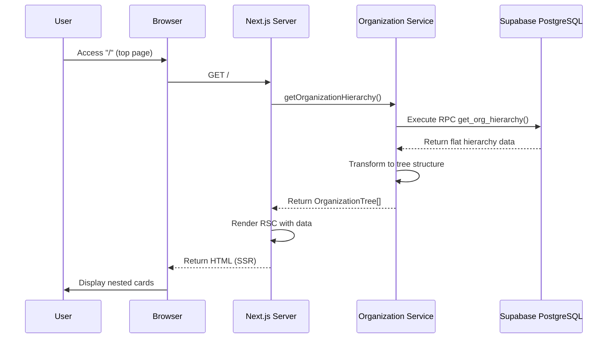
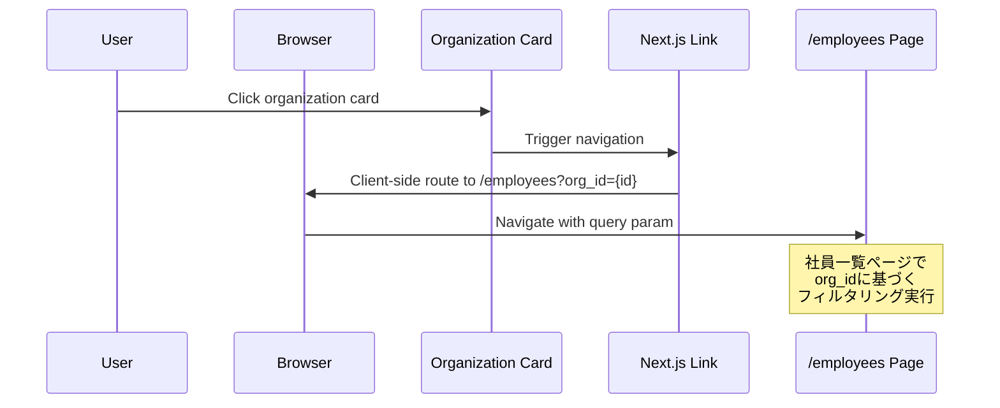

# Technical Design Document: Organization Hierarchy View

## Overview
本機能は、組織階層（会社 → 本部 → 部署 → 課／チーム）をカード内包レイアウトで視覚的に表示するトップページを提供します。ユーザーは階層ノードをクリックして特定の組織に所属する社員一覧画面へ遷移できます。Next.js 16 App RouterとReact 19 Server Componentsを活用し、サーバーサイドファーストの設計により初期表示の高速化とSEO最適化を実現します。

**Purpose**: 組織構造の直感的な把握と効率的な情報アクセスを提供する。
**Users**: 全社員が組織階層を閲覧し、特定部署の社員情報にアクセスする。
**Impact**: 既存のトップページ（`/app/page.tsx`）を置き換え、新たに`organizations`テーブルをデータベースに追加する。

### Goals
- 4階層の組織構造をカード内包レイアウトで視覚的に表示
- 階層ノードから社員一覧画面への直接遷移を実現
- React Server Componentsによる高速な初期レンダリング
- モバイル・タブレット・デスクトップ対応のレスポンシブデザイン

### Non-Goals
- 社員一覧画面（`/employees`）の実装は本機能の範囲外
- 組織階層データの編集・管理機能（将来的な拡張として検討）
- 検索機能の統合（別機能として実装予定）

## Architecture

### Existing Architecture Analysis
本プロジェクトは既にNext.js 16 App RouterとReact 19 Server Componentsを採用しており、以下のパターンが確立されています：
- **Server-First Pattern**: デフォルトでServer Componentsを使用し、データフェッチをサーバーサイドで完結
- **Drizzle ORM**: PostgreSQLとのタイプセーフなDB操作（`/db/schema.ts`）
- **shadcn/ui Components**: 再利用可能なUIコンポーネントシステム（`/components/ui/`）
- **Supabase SSR**: `@supabase/ssr`による認証とデータベース接続（`/lib/supabase-auth/`）

既存のトップページ（`/app/page.tsx`）はServer Componentとして実装されており、`getUser()`関数でユーザー情報を取得しています。本機能は同じパターンを踏襲し、組織階層データをServer Component内で取得して表示します。

### Architecture Pattern & Boundary Map

**選択パターン**: **Server-First React Server Components**
**理由**: 初期レンダリングの高速化、SEO最適化、サーバーサイドでのデータフェッチによるセキュリティ向上

```mermaid
graph TB
    subgraph Browser
        PageRSC[Organization Hierarchy Page RSC]
        CardUI[Card Components shadcn/ui]
        LinkNav[Next.js Link Navigation]
    end

    subgraph Next.js Server
        PageRSC --> DataFetch[Data Fetching Layer]
        DataFetch --> OrgService[Organization Service]
        OrgService --> DrizzleORM[Drizzle ORM]
    end

    subgraph Supabase
        DrizzleORM --> PostgreSQL[PostgreSQL organizations table]
        PostgreSQL --> RPCFunc[RPC Function get_org_hierarchy]
    end

    PageRSC --> CardUI
    CardUI --> LinkNav
    LinkNav -.Navigate.-> EmployeesPage[/employees Page]
```

**Domain/Feature Boundaries**:
- **Presentation Layer** (`/app/page.tsx`): 組織階層の表示とルーティング
- **Data Access Layer** (`/lib/organizations/`): 組織データの取得・変換ロジック
- **Database Layer** (`/db/schema.ts`, Supabase RPC): 組織階層テーブルとクエリ関数

**Existing Patterns Preserved**:
- Server Components優先（Client Componentsは最小限）
- Drizzle ORMによるタイプセーフなDB操作
- shadcn/uiコンポーネントの再利用
- `@/`エイリアスによる絶対パスインポート

**New Components Rationale**:
- **Organization Service**: 階層データの取得・ツリー構造変換を担当（既存の認証サービスと同じレイヤー）
- **organizations テーブル**: 組織階層データの永続化（既存の`profiles`テーブルと並列）

**Steering Compliance**:
- TypeScript strictモード遵守（`any`型の禁止）
- Biomeによるコード品質維持
- Server-First Pattern準拠

### Technology Stack

| Layer | Choice / Version | Role in Feature | Notes |
|-------|------------------|-----------------|-------|
| **Frontend** | React 19.2 (Server Components) | 組織階層UIのレンダリング | 非同期データフェッチをサーバーサイドで実行 |
| **Framework** | Next.js 16.0.1 (App Router) | ルーティングとページ構造 | `/app/page.tsx`でトップページを実装 |
| **UI Library** | shadcn/ui (Card) | カード内包レイアウト | 既存Cardコンポーネントを再利用 |
| **Styling** | Tailwind CSS 4 | レスポンシブデザイン | `grid`, `gap`, レスポンシブユーティリティ |
| **Data / ORM** | Drizzle ORM + Supabase PostgreSQL | 組織階層データ取得 | `organizations`テーブル定義、RPC関数実行 |
| **Type Safety** | TypeScript 5 (strict) | 全レイヤーの型安全性 | インターフェース定義、型推論 |

## System Flows

### Organization Hierarchy Display Flow



**Key Decisions**:
- データフェッチはServer Component内で完結（Client Componentへのprops渡し不要）
- Supabase RPC関数で再帰クエリを実行し、1往復でデータ取得
- ツリー構造への変換はサーバーサイドで実施（ブラウザ負荷軽減）

### Card Click Navigation Flow



**Key Decisions**:
- Next.js `<Link>`コンポーネントによるクライアントサイドナビゲーション
- URLクエリパラメータで組織IDを渡す（`org_id={node_id}`）
- 遷移先ページの実装は本機能の範囲外

## Requirements Traceability

| Requirement | Summary | Components | Interfaces | Flows |
|-------------|---------|------------|------------|-------|
| 1.1, 1.2, 1.3 | ページルーティングと基本構造 | OrganizationHierarchyPage | - | Display Flow |
| 2.1, 2.2, 2.3, 2.4, 2.5 | 組織階層データの取得と表示 | OrganizationService, OrganizationHierarchyPage | getOrganizationHierarchy() | Display Flow |
| 3.1, 3.2, 3.3, 3.4, 3.5, 3.6 | カード内包レイアウトの実装 | OrganizationCardList, OrganizationCard | OrganizationCardProps | Display Flow |
| 4.1, 4.2, 4.3, 4.4, 4.5 | 階層ノードクリック挙動 | OrganizationCard | - | Navigation Flow |
| 5.1, 5.2, 5.3, 5.4 | UIインタラクション・アクセシビリティ | OrganizationCard | - | - |
| 6.1, 6.2, 6.3, 6.4, 6.5 | データモデル・DBスキーマ | organizations テーブル, get_org_hierarchy RPC | - | - |
| 7.1, 7.2, 7.3, 7.4 | エラーハンドリング・ローディング | loading.tsx, error.tsx | - | - |
| 8.1, 8.2, 8.3, 8.4 | レスポンシブデザイン | OrganizationCardList | - | - |
| 9.1, 9.2, 9.3, 9.4, 9.5 | パフォーマンス・SEO | OrganizationHierarchyPage, metadata | - | - |

## Components and Interfaces

### Components Summary

| Component | Domain/Layer | Intent | Req Coverage | Key Dependencies (P0/P1) | Contracts |
|-----------|--------------|--------|--------------|--------------------------|-----------|
| OrganizationHierarchyPage | Presentation (App Router) | トップページ: 組織階層の表示と遷移 | 1.1-1.3, 9.1-9.5 | OrganizationService (P0), OrganizationCardList (P0) | - |
| OrganizationService | Data Access | 組織階層データの取得・ツリー変換 | 2.1-2.5 | Supabase RPC (P0), Drizzle ORM (P0) | Service |
| OrganizationCardList | UI Component | カードリストのレンダリング | 3.1-3.6, 8.1-8.4 | OrganizationCard (P0), shadcn/ui Card (P0) | State |
| OrganizationCard | UI Component | 単一組織カードの表示とクリック | 3.1-3.6, 4.1-4.5, 5.1-5.4 | Next.js Link (P0), shadcn/ui Card (P0) | - |
| organizations (DB Table) | Database | 組織階層データの永続化 | 6.1-6.5 | PostgreSQL (P0) | - |
| get_org_hierarchy (RPC) | Database | 階層データの再帰取得 | 2.1, 6.4 | PostgreSQL Recursive CTE (P0) | - |
| loading.tsx | App Router | ローディングUI | 7.1, 7.3 | Next.js App Router (P0) | - |
| error.tsx | App Router | エラーUI | 7.2, 7.3, 7.4 | Next.js App Router (P0) | - |

### Presentation Layer

#### OrganizationHierarchyPage

| Field | Detail |
|-------|--------|
| Intent | トップページ（`/app/page.tsx`）: 組織階層を表示し、メタデータを設定 |
| Requirements | 1.1, 1.2, 1.3, 9.1, 9.2, 9.3, 9.4, 9.5 |

**Responsibilities & Constraints**
- Server Componentとして組織階層データを非同期で取得
- OrganizationCardListにツリー構造データを渡す
- ページメタデータ（title, description）を定義
- エラー・ローディング状態は`error.tsx`, `loading.tsx`に委譲

**Dependencies**
- Outbound: OrganizationService — 階層データ取得 (P0)
- Outbound: OrganizationCardList — UIレンダリング (P0)
- External: Next.js App Router — ルーティング・メタデータ (P0)

**Contracts**: State [✓]

##### State Management
- **State model**: Server Componentのため内部状態なし。データは関数スコープで管理。
- **Persistence & consistency**: データ取得は毎回サーバーサイドで実行（Next.jsキャッシング活用）
- **Concurrency strategy**: Server Componentsは並行リクエストに対して独立実行

**Implementation Notes**
- **Integration**: `getOrganizationHierarchy()`を`await`で呼び出し、結果を`<OrganizationCardList>`に渡す
- **Validation**: データ取得エラーは例外としてスロー（Next.js error boundaryでキャッチ）
- **Risks**: RPC関数が未定義の場合エラー → マイグレーションで確実に作成

#### OrganizationCardList

| Field | Detail |
|-------|--------|
| Intent | 組織階層ツリーを受け取り、カード内包レイアウトでレンダリング |
| Requirements | 3.1, 3.2, 3.3, 3.4, 3.5, 3.6, 8.1, 8.2, 8.3, 8.4 |

**Responsibilities & Constraints**
- ツリー構造データを再帰的にレンダリング
- Tailwind CSSでレスポンシブグリッドレイアウトを実装
- 各OrganizationCardコンポーネントにノードデータを渡す

**Dependencies**
- Inbound: OrganizationHierarchyPage — ツリーデータ受け取り (P0)
- Outbound: OrganizationCard — 個別カード表示 (P0)
- External: shadcn/ui Card — カードUI (P0)

**Contracts**: State [✓]

##### State Management
- **State model**: Server Componentのため内部状態なし。Propsでデータ受け取り。
- **Persistence & consistency**: なし（静的レンダリング）
- **Concurrency strategy**: なし

**Implementation Notes**
- **Integration**: `OrganizationTree[]`型のデータを受け取り、`map()`で各ノードを`<OrganizationCard>`としてレンダリング。子ノードがある場合は再帰的に`<OrganizationCardList>`を呼び出す
- **Validation**: 空配列の場合は「組織データがありません」メッセージを表示
- **Risks**: 深いネスト（4階層以上）の場合のDOM複雑化 → levelカラムで階層を制限

#### OrganizationCard

| Field | Detail |
|-------|--------|
| Intent | 単一の組織ノードをカードとして表示し、クリック時に社員一覧へ遷移 |
| Requirements | 3.1, 3.2, 3.3, 3.4, 3.5, 3.6, 4.1, 4.2, 4.3, 4.4, 4.5, 5.1, 5.2, 5.3, 5.4 |

**Responsibilities & Constraints**
- 組織名を表示
- Next.js `<Link>`でラップしてクリック可能に
- ホバー・フォーカスのスタイル適用
- ARIA属性でアクセシビリティ確保

**Dependencies**
- Inbound: OrganizationCardList — ノードデータ受け取り (P0)
- External: Next.js Link — ナビゲーション (P0)
- External: shadcn/ui Card — カードUI (P0)

**Contracts**: - (Presentational Component)

**Implementation Notes**
- **Integration**: `<Link href={`/employees?org_id=${node.id}`}>`で`<Card>`をラップ。`CardTitle`に組織名を表示。子ノードがある場合は`CardContent`内で`<OrganizationCardList>`を再帰的にレンダリング
- **Validation**: `node.id`と`node.name`が必須
- **Risks**: Linkコンポーネント内のCardがアクセシビリティエラーを引き起こす可能性 → `role`と`aria-label`で対応

### Data Access Layer

#### OrganizationService

| Field | Detail |
|-------|--------|
| Intent | 組織階層データをSupabaseから取得し、ツリー構造に変換 |
| Requirements | 2.1, 2.2, 2.3, 2.4, 2.5 |

**Responsibilities & Constraints**
- Supabase RPC関数`get_org_hierarchy()`を実行
- フラットな階層データをツリー構造（`OrganizationTree[]`）に変換
- エラーハンドリング（DB接続エラー、RPC実行エラー）

**Dependencies**
- Outbound: Supabase RPC — `get_org_hierarchy()` (P0)
- Outbound: Drizzle ORM — 型定義参照 (P1)
- External: Supabase Client — DB接続 (P0)

**Contracts**: Service [✓]

##### Service Interface
```typescript
interface OrganizationService {
  getOrganizationHierarchy(): Promise<Result<OrganizationTree[], OrganizationError>>;
}

type OrganizationTree = {
  id: string;
  name: string;
  level: number;
  children: OrganizationTree[];
};

type OrganizationError =
  | { type: 'DatabaseError'; message: string }
  | { type: 'TransformError'; message: string };

type Result<T, E> = { success: true; data: T } | { success: false; error: E };
```

**Preconditions**:
- Supabase RPC関数`get_org_hierarchy()`が存在すること
- `organizations`テーブルにデータが存在すること

**Postconditions**:
- ツリー構造データが正しく構築されていること（親子関係が保たれている）
- levelが1-4の範囲内であること

**Invariants**:
- ツリーのルートノード（level=1）は1つ以上存在すること

**Implementation Notes**
- **Integration**: `createServerClient()`でSupabaseクライアントを生成し、`.rpc('get_org_hierarchy')`を実行。戻り値をパースしてツリー構造に変換するヘルパー関数`buildTree()`を実装
- **Validation**: RPC実行時のエラーをキャッチし、`OrganizationError`として返す。データが空の場合は空配列を返す
- **Risks**: RPC関数のパフォーマンス（大規模データ） → インデックス最適化とキャッシング戦略

### Database Layer

#### organizations テーブル

| Field | Detail |
|-------|--------|
| Intent | 組織階層データ（会社、本部、部署、課／チーム）を永続化 |
| Requirements | 6.1, 6.2, 6.3 |

**Responsibilities & Constraints**
- 自己参照構造（`parent_id`）で階層関係を表現
- `level`カラムで階層レベルを明示（1:会社、2:本部、3:部署、4:課／チーム）
- 作成日時を記録

**Dependencies**
- External: PostgreSQL (P0)

**Contracts**: - (Database Schema)

**Implementation Notes**
- **Integration**: Drizzleスキーマ（`/db/schema.ts`）で`organizations`テーブルを定義。マイグレーション生成（`pnpm db:generate`）と実行（`pnpm db:migrate`）
- **Validation**: `level`は1-4の範囲、`parent_id`は自己参照制約
- **Risks**: `parent_id`の循環参照 → アプリケーションレイヤーまたはトリガーで検証

#### get_org_hierarchy (Supabase RPC Function)

| Field | Detail |
|-------|--------|
| Intent | 組織階層データを再帰的に取得し、フラット配列として返す |
| Requirements | 2.1, 6.4 |

**Responsibilities & Constraints**
- PostgreSQLのRecursive CTEを使用して全階層を1クエリで取得
- `id`, `name`, `parent_id`, `level`を含むレコードを返す
- 階層順（level ASC, parent_id ASC）でソート

**Dependencies**
- External: PostgreSQL Recursive CTE (P0)

**Contracts**: - (Database Function)

**Implementation Notes**
- **Integration**: Supabaseダッシュボードまたはマイグレーションで以下のSQL関数を作成:
  ```sql
  CREATE OR REPLACE FUNCTION get_org_hierarchy()
  RETURNS TABLE (id uuid, name text, parent_id uuid, level integer)
  LANGUAGE sql
  STABLE
  AS $$
    WITH RECURSIVE org_tree AS (
      SELECT id, name, parent_id, level, ARRAY[id] AS path
      FROM organizations
      WHERE parent_id IS NULL
      UNION ALL
      SELECT o.id, o.name, o.parent_id, o.level, ot.path || o.id
      FROM organizations o
      INNER JOIN org_tree ot ON o.parent_id = ot.id
      WHERE NOT o.id = ANY(ot.path)
    )
    SELECT id, name, parent_id, level FROM org_tree ORDER BY level, parent_id NULLS FIRST;
  $$;
  ```
- **Validation**: 循環参照を防ぐため`path`配列で既訪問ノードをチェック
- **Risks**: 大規模データでのパフォーマンス → `parent_id`, `level`のインデックス

## Data Models

### Domain Model
- **Aggregate**: Organization（組織）
- **Entity**: OrganizationNode（組織ノード） - `id`, `name`, `parent_id`, `level`
- **Business Rules**:
  - 会社（level=1）は`parent_id`が`NULL`
  - 各ノードは最大1つの親を持つ（自己参照制約）
  - levelは1-4の範囲内
  - 同一親の下で組織名は一意であることが望ましい（ビジネスルール）

### Logical Data Model

**Structure Definition**:
- **Entity**: Organization
- **Attributes**:
  - `id` (UUID): プライマリキー
  - `name` (text): 組織名
  - `parent_id` (UUID, nullable): 親組織のID（自己参照外部キー）
  - `level` (integer): 階層レベル（1:会社、2:本部、3:部署、4:課／チーム）
  - `created_at` (timestamp): 作成日時
- **Cardinality**: 1対多（1つの親が複数の子を持つ）
- **Referential Integrity**: `parent_id`は`organizations.id`を参照（CASCADE DELETE検討）

**Consistency & Integrity**:
- **Transaction Boundaries**: 単一組織の作成・更新は1トランザクション
- **Cascading Rules**: 親組織削除時の子組織処理（CASCADE DELETE or SET NULL）
- **Temporal Aspects**: `updated_at`カラムの追加を検討（将来的な拡張）

### Physical Data Model

**Relational Database (PostgreSQL)**:

```sql
CREATE TABLE organizations (
  id UUID PRIMARY KEY DEFAULT gen_random_uuid(),
  name TEXT NOT NULL,
  parent_id UUID REFERENCES organizations(id) ON DELETE CASCADE,
  level INTEGER NOT NULL CHECK (level BETWEEN 1 AND 4),
  created_at TIMESTAMPTZ NOT NULL DEFAULT NOW()
);

CREATE INDEX idx_organizations_parent_id ON organizations(parent_id);
CREATE INDEX idx_organizations_level ON organizations(level);
```

**Drizzle ORM Schema Definition**:
```typescript
import { pgTable, text, timestamp, uuid, integer } from "drizzle-orm/pg-core";

export const organizations = pgTable("organizations", {
  id: uuid("id").primaryKey().defaultRandom(),
  name: text("name").notNull(),
  parentId: uuid("parent_id").references(() => organizations.id, { onDelete: 'cascade' }),
  level: integer("level").notNull(),
  createdAt: timestamp("created_at").defaultNow().notNull(),
});
```

**Indexes and Performance Optimizations**:
- `idx_organizations_parent_id`: 親子関係の検索を高速化
- `idx_organizations_level`: レベル別フィルタリングを最適化
- Recursive CTEのパフォーマンス向上

**Partitioning Strategy**: 現時点では不要（将来的にlevelでパーティショニング検討）

## Error Handling

### Error Strategy
各レイヤーで明確なエラー型を定義し、上位レイヤーに伝播させる。ユーザー向けエラーメッセージは具体的かつ実行可能な指示を含める。

### Error Categories and Responses

**System Errors (5xx)**:
- **Database Connection Error**: Supabase接続失敗 → `error.tsx`でフォールバックUI表示（「データの取得に失敗しました。再読み込みしてください。」）
- **RPC Execution Error**: `get_org_hierarchy()`実行エラー → 同上
- **Timeout**: 長時間クエリ → Next.jsのタイムアウト設定（デフォルト）に従う

**Business Logic Errors (422)**:
- **Empty Organization Data**: データが存在しない → 「組織データがありません」メッセージ表示
- **Invalid Hierarchy Structure**: 循環参照や不正なlevel → データ整合性エラーとしてログ記録、ユーザーには汎用エラーメッセージ

### Monitoring
- **Error Tracking**: Next.jsのエラーログ出力（`console.error`）
- **Logging**: Supabase RPC実行時のクエリログ
- **Health Monitoring**: `/app/api/health`エンドポイント追加（将来的な拡張）

## Testing Strategy

### Unit Tests
- `OrganizationService.getOrganizationHierarchy()`: RPC実行とツリー変換ロジックのテスト
- `buildTree()` ヘルパー関数: フラット配列からツリー構造への変換ロジック
- `organizations` スキーマ: Drizzleスキーマ定義のバリデーション

### Integration Tests
- Supabase RPC関数 `get_org_hierarchy()`: Recursive CTEの動作検証（サンプルデータでテスト）
- OrganizationHierarchyPage: データフェッチからUI表示までの統合テスト（E2Eフレームワーク導入後）

### E2E/UI Tests
- トップページへのアクセスとカード表示確認
- 組織カードクリック時の`/employees`へのナビゲーション検証
- レスポンシブデザイン（モバイル・タブレット・デスクトップ）の表示確認

### Performance/Load
- 大規模組織データ（1000+ノード）での初期表示時間測定
- Recursive CTEのクエリパフォーマンス計測
- Server Componentsのキャッシング効果検証

## Optional Sections

### Performance & Scalability
- **Target Metrics**:
  - 初期表示: < 1秒（TTFBベース）
  - RPC実行時間: < 200ms（1000ノードまで）
- **Caching Strategies**:
  - Next.js Server Componentsの自動キャッシング活用
  - 静的コンテンツはCDNキャッシュ（Vercel Edge Network）
- **Scaling Approaches**:
  - 水平スケーリング: Vercelのオートスケーリング
  - データベース: Supabase Connection Poolingの活用

### Security Considerations
- **Authentication**: 本機能は認証不要（組織階層は全社員に公開）。将来的にアクセス制御が必要な場合はミドルウェアで実装
- **Data Protection**: 組織名は機密情報ではないが、将来的に組織メタデータを追加する場合は適切なRBACを検討
- **SQL Injection**: Drizzle ORMとSupabase RPCにより防止済み
