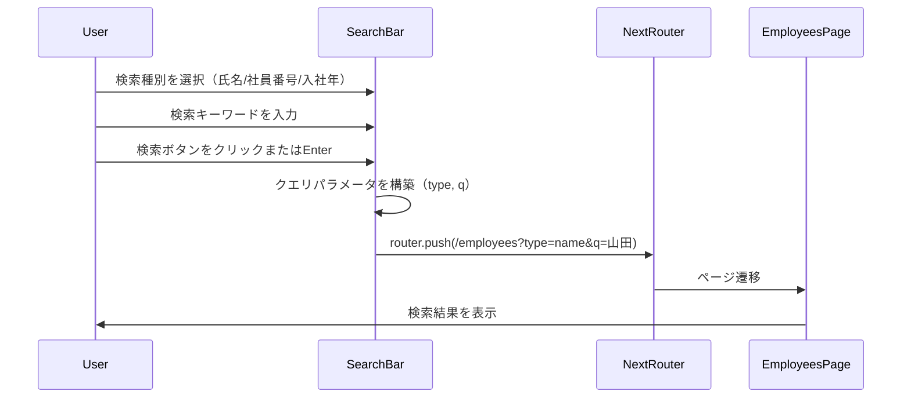
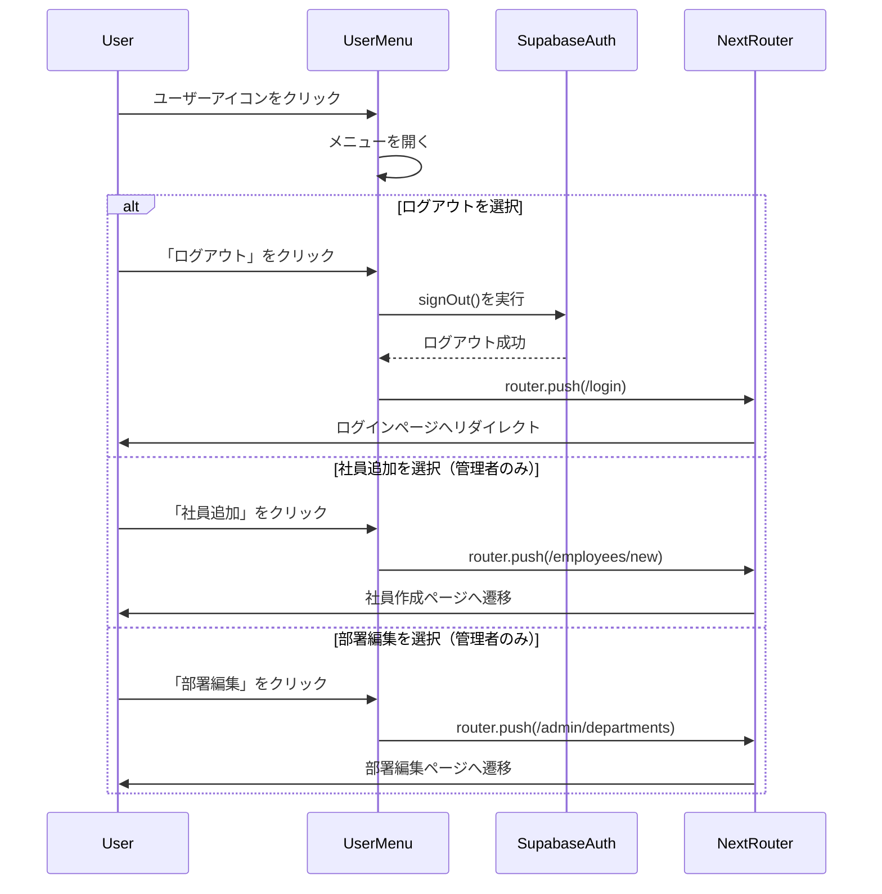
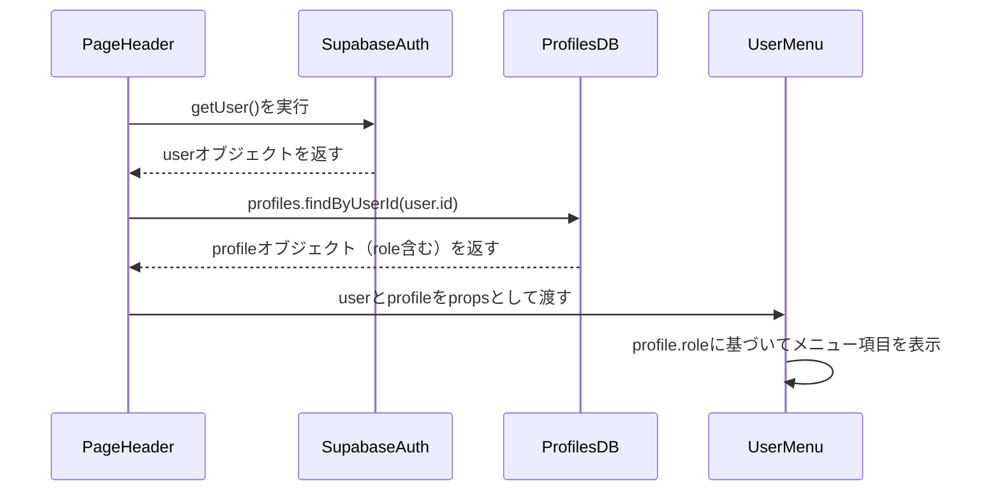
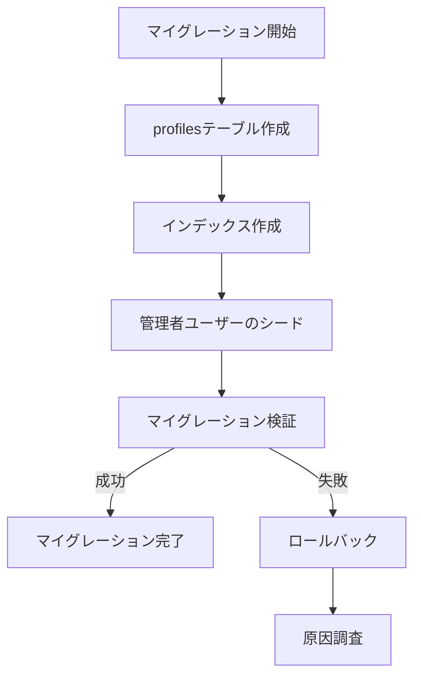

# 技術設計書

## Overview

本機能は、peer-search-reアプリケーションにおける共通ページヘッダーコンポーネントを提供します。ヘッダーは`/login`を除く全ページで表示され、3つの主要機能（ナビゲーション、検索、ユーザーメニュー）を統合します。React Server Componentsを活用したNext.js 16 App Router環境で実装され、Supabase認証システムと統合されます。

**Purpose**: ログイン画面以外の全ページで一貫したナビゲーション、検索、ユーザー管理機能を提供し、アプリケーション全体の操作体験を統一します。

**Users**: 認証済みの全システムユーザー（一般ユーザーおよび管理者）が本ヘッダーを通じて、トップページへの移動、社員検索、ログアウト、管理機能（管理者のみ）にアクセスします。

**Impact**: 既存のapp/layout.tsxを拡張し、新規コンポーネント（PageHeader, SearchBar, UserMenu）を追加します。また、profilesテーブルを新規作成し、ユーザー権限管理機構を導入します。

### Goals

- `/login`以外の全ページで共通表示されるヘッダーコンポーネントを実装
- 検索種別選択（氏名/社員番号/入社年）とクエリ入力による社員検索機能を提供
- ユーザーアイコンからドロップダウンメニューを開き、権限に応じたメニュー項目（ログアウト、社員追加、部署編集）を表示
- React Server Componentsを活用し、認証情報の取得をサーバーサイドで完結
- shadcn/uiコンポーネントを活用し、プロジェクトのデザインシステムに準拠

### Non-Goals

- 検索結果のソート処理（社員一覧画面の責務）
- 検索結果の表示とページネーション（/employeesページの責務）
- ユーザープロフィール編集機能（将来的な拡張として別仕様で実装）
- 多言語対応（現時点では日本語のみサポート）

## Architecture

### 既存アーキテクチャ分析

本プロジェクトは以下の既存パターンに従います：

- **Next.js App Router**: app/layout.tsxをRoot Layoutとし、全ページで共通レイアウトを提供
- **React Server Components (RSC) First**: デフォルトでServer Components、インタラクション部分のみClient Components（`"use client"`）
- **Supabase認証統合**: lib/supabase-auth/auth.tsの`getUser()`関数でキャッシュされた認証情報を取得
- **shadcn/uiコンポーネントシステム**: components/ui/に再利用可能なUIコンポーネントを配置
- **機能別コンポーネント分離**: components/{feature}/に機能固有のコンポーネントを配置し、テストとコロケーション

本機能は既存のarchitectureパターンを尊重し、新規コンポーネントを追加する形で実装します。

### Architecture Pattern & Boundary Map

**Architecture Integration**:
- **Selected pattern**: Server Component + Client Component分離パターン（既存のプロジェクトパターンと一致）
- **Domain/feature boundaries**:
  - **Layout Domain**: PageHeaderコンポーネント（Server Component）— 認証情報の取得とレイアウト制御
  - **Search Domain**: SearchBarコンポーネント（Client Component）— 検索条件の入力とナビゲーション
  - **Auth Domain**: UserMenuコンポーネント（Client Component）— ユーザーメニューの開閉とログアウト処理
  - **Database Layer**: profilesテーブル（新規）— ユーザー権限管理
- **Existing patterns preserved**:
  - Server ComponentsでデータフェッチとHTMLレンダリングを完結
  - Client Componentsはインタラクション部分のみに限定
  - shadcn/uiコンポーネントの活用
  - Drizzle ORMによる型安全なデータベースアクセス
- **New components rationale**:
  - **PageHeader**: 全ページで共通表示されるヘッダーレイアウトを提供
  - **SearchBar**: 検索種別選択とクエリ入力のUIを提供
  - **UserMenu**: ユーザーアイコンとドロップダウンメニューのインタラクションを提供
  - **profilesテーブル**: ユーザー権限管理を実現
- **Steering compliance**: Server-First Pattern、Auth Layer Separation、UI Component Isolation、Test Collocationの原則を維持

```mermaid
graph TB
    subgraph AppRouter[App Router Layer]
        RootLayout[app/layout.tsx RSC]
    end

    subgraph LayoutDomain[Layout Domain]
        PageHeader[PageHeader RSC]
    end

    subgraph SearchDomain[Search Domain]
        SearchBar[SearchBar Client]
    end

    subgraph AuthDomain[Auth Domain]
        UserMenu[UserMenu Client]
    end

    subgraph DataLayer[Data Layer]
        ProfilesTable[profiles table]
        SupabaseAuth[Supabase Auth]
    end

    RootLayout --> PageHeader
    PageHeader --> SearchBar
    PageHeader --> UserMenu
    PageHeader --> SupabaseAuth
    PageHeader --> ProfilesTable
    UserMenu --> SupabaseAuth
    SearchBar --> EmployeesPage[/employees page]
```

### Technology Stack

| Layer | Choice / Version | Role in Feature | Notes |
|-------|------------------|-----------------|-------|
| Frontend / UI | React 19.2 (Server Components) | PageHeaderコンポーネントのサーバーサイドレンダリング | 既存の技術スタック。RSCを活用してHTML生成を最適化 |
| Frontend / UI | Next.js 16.0.1 (App Router) | app/layout.tsxへのヘッダー統合 | Root Layoutで全ページに共通表示 |
| UI Library | shadcn/ui (Select, DropdownMenu, Avatar, Input, Button) | 検索バー、ユーザーメニュー、アイコンのUI | 既存のプロジェクトデザインシステム。新規コンポーネント追加不要 |
| Styling | Tailwind CSS 4 | レスポンシブデザインとスタイリング | 既存のプロジェクトスタイリング |
| Data / Storage | PostgreSQL (Supabase) | profilesテーブル（新規）の作成と管理 | 既存のデータベース環境 |
| Data / ORM | Drizzle ORM | profilesテーブルのスキーマ定義と型安全なクエリ | 既存のORM環境 |
| Auth | Supabase Auth | 認証情報の取得とログアウト処理 | 既存の認証システム |

## System Flows

### 検索実行フロー



### ユーザーメニュー操作フロー



### 認証情報と権限取得フロー



## Requirements Traceability

| Requirement | Summary | Components | Interfaces | Flows |
|-------------|---------|------------|------------|-------|
| 1.1, 1.2, 1.3, 1.4, 1.5 | ページヘッダーの共通表示とレイアウト | PageHeader | - | - |
| 2.1, 2.2, 2.3 | ロゴ/システム名によるホームナビゲーション | PageHeader | - | - |
| 3.1, 3.2, 3.3, 3.4, 3.5, 3.6 | 検索種別選択機能 | SearchBar | SearchBarProps | - |
| 4.1, 4.2, 4.3, 4.4, 4.5, 4.6, 4.7 | 検索クエリ入力と実行 | SearchBar | SearchBarProps | 検索実行フロー |
| 5.1, 5.2, 5.3, 5.4 | 検索種別ごとの解釈ルール | SearchBar | - | 検索実行フロー |
| 6.1, 6.2, 6.3, 6.4, 6.5 | ユーザーアイコン表示と認証情報取得 | UserMenu | UserMenuProps | 認証情報と権限取得フロー |
| 7.1, 7.2, 7.3, 7.4, 7.5, 7.6 | ユーザーメニューの開閉 | UserMenu | UserMenuProps | ユーザーメニュー操作フロー |
| 8.1, 8.2, 8.3, 8.4, 8.5, 8.6 | ユーザーメニューの項目表示と権限制御 | UserMenu | UserMenuProps, ProfilesService | 認証情報と権限取得フロー |
| 9.1, 9.2, 9.3 | 社員追加メニューの動作 | UserMenu | - | ユーザーメニュー操作フロー |
| 10.1, 10.2, 10.3 | 部署編集メニューの動作 | UserMenu | - | ユーザーメニュー操作フロー |
| 11.1, 11.2, 11.3, 11.4, 11.5 | ログアウト機能 | UserMenu | - | ユーザーメニュー操作フロー |
| 12.1, 12.2, 12.3, 12.4 | レスポンシブデザイン対応 | PageHeader, SearchBar | - | - |
| 13.1, 13.2, 13.3, 13.4, 13.5, 13.6 | コンポーネント構成とディレクトリ配置 | PageHeader, SearchBar, UserMenu | - | - |
| 14.1, 14.2, 14.3, 14.4, 14.5, 14.6 | アクセシビリティ対応 | PageHeader, SearchBar, UserMenu | - | - |
| 15.1, 15.2, 15.3, 15.4, 15.5 | パフォーマンス最適化 | PageHeader, SearchBar, UserMenu | - | - |

## Components and Interfaces

### Component Summary

| Component | Domain/Layer | Intent | Req Coverage | Key Dependencies (P0/P1) | Contracts |
|-----------|--------------|--------|--------------|--------------------------|-----------|
| PageHeader | Layout Domain | 全ページで共通表示されるヘッダーレイアウトとロゴナビゲーション | 1.1-1.5, 2.1-2.3, 12.1-12.4, 13.1, 14.1, 15.1-15.2 | getUser (P0), ProfilesService (P0), SearchBar (P0), UserMenu (P0) | State |
| SearchBar | Search Domain | 検索種別選択とクエリ入力のUI | 3.1-3.6, 4.1-4.7, 5.1-5.4, 14.2-14.3, 15.5 | Next.js useRouter (P0), shadcn/ui Select/Input/Button (P0) | State |
| UserMenu | Auth Domain | ユーザーアイコンとドロップダウンメニューのインタラクション | 6.1-6.5, 7.1-7.6, 8.1-8.6, 9.1-9.3, 10.1-10.3, 11.1-11.5, 14.4-14.5, 15.2 | Supabase signOut (P0), shadcn/ui DropdownMenu/Avatar (P0) | State |
| ProfilesService | Data Layer | ユーザー権限情報の取得 | 8.5-8.6 | Drizzle ORM (P0), Supabase createClient (P0) | Service |
| profiles table | Database Layer | ユーザー権限管理 | 8.5-8.6 | auth.users.id (P0) | Data Model |

### Layout Domain

#### PageHeader

| Field | Detail |
|-------|--------|
| Intent | 全ページで共通表示されるヘッダーレイアウトを提供し、ロゴナビゲーション、検索バー、ユーザーメニューを統合 |
| Requirements | 1.1, 1.2, 1.3, 1.4, 1.5, 2.1, 2.2, 2.3, 12.1, 12.2, 12.4, 13.1, 14.1, 15.1, 15.2 |

**Responsibilities & Constraints**
- React Server Componentとして実装し、サーバーサイドで認証情報とprofilesデータを取得
- 左側にロゴ/システム名、中央に検索バー、右側にユーザーアイコンの3要素を水平配置で表示
- レスポンシブデザインに対応し、モバイル画面では検索バーを2行目に配置
- `<header>`タグでラップし、`role="banner"`属性を持つ

**Dependencies**
- Inbound: app/layout.tsx — Root Layoutから呼び出される (P0)
- Outbound: SearchBar — 検索バーコンポーネントを子要素として配置 (P0)
- Outbound: UserMenu — ユーザーメニューコンポーネントを子要素として配置 (P0)
- Outbound: getUser() — Supabase認証情報の取得 (P0)
- Outbound: ProfilesService — ユーザー権限情報の取得 (P0)
- External: Next.js Link — ロゴクリック時のホームナビゲーション (P0)
- External: shadcn/ui — スタイリング (P1)

**Contracts**: State [x]

##### State Management

- State model: Server Componentとして実装し、認証情報とprofilesデータをサーバーサイドで取得。Client Componentsにpropsとして渡す。
- Persistence & consistency: 認証情報は`getUser()`でキャッシュ済み。profilesデータはサーバーサイドクエリで取得。
- Concurrency strategy: N/A（Server Component）

**Implementation Notes**

- **Integration**: app/layout.tsx内でchildren前に配置。`/login`ルートでは表示しないよう条件分岐。
- **Validation**: 認証情報が取得できない場合は`/login`へリダイレクト（proxy.tsで実装済み）。
- **Risks**: profilesテーブルが存在しない場合、権限判定が失敗する。マイグレーションの実行が必須。

### Search Domain

#### SearchBar

| Field | Detail |
|-------|--------|
| Intent | 検索種別選択（氏名/社員番号/入社年）とクエリ入力のUIを提供し、/employeesページへナビゲート |
| Requirements | 3.1, 3.2, 3.3, 3.4, 3.5, 3.6, 4.1, 4.2, 4.3, 4.4, 4.5, 4.6, 4.7, 5.1, 5.2, 5.3, 5.4, 14.2, 14.3, 15.5 |

**Responsibilities & Constraints**
- Client Componentとして実装し、検索種別の選択状態とクエリ入力状態を管理
- 検索種別ドロップダウン（氏名/社員番号/入社年）とテキスト入力フィールド、検索ボタンを表示
- 検索実行時、`/employees?type={検索種別}&q={検索クエリ}`形式のURLへナビゲート
- `<form>`タグでラップし、`role="search"`属性を持つ

**Dependencies**
- Inbound: PageHeader — ヘッダーレイアウトから呼び出される (P0)
- External: Next.js useRouter — ページ遷移 (P0)
- External: shadcn/ui Select, Input, Button — UI要素 (P0)
- External: lucide-react Search icon — 検索アイコン (P1)

**Contracts**: State [x]

##### State Management

- State model: Client Componentとして実装。検索種別（`searchType: 'name' | 'employeeNumber' | 'hireYear'`）とクエリ（`query: string`）をReact stateで管理。
- Persistence & consistency: 状態はコンポーネント内ローカル。ページ遷移後はURLクエリパラメータで状態を保持。
- Concurrency strategy: N/A（単一ユーザーの操作）

**Implementation Notes**

- **Integration**: PageHeaderコンポーネント内で中央配置。デスクトップでは水平配置、モバイルでは2行目に配置。
- **Validation**: クエリが空文字列の場合、`/employees`へナビゲート（クエリパラメータなし）。
- **Risks**: 検索種別とクエリパラメータの命名規則を/employeesページと統一する必要がある（`type`と`q`）。

### Auth Domain

#### UserMenu

| Field | Detail |
|-------|--------|
| Intent | ユーザーアイコンとドロップダウンメニューのインタラクションを提供し、ログアウトと管理機能へのアクセスを提供 |
| Requirements | 6.1, 6.2, 6.3, 6.4, 6.5, 7.1, 7.2, 7.3, 7.4, 7.5, 7.6, 8.1, 8.2, 8.3, 8.4, 8.5, 8.6, 9.1, 9.2, 9.3, 10.1, 10.2, 10.3, 11.1, 11.2, 11.3, 11.4, 11.5, 14.4, 14.5, 15.2 |

**Responsibilities & Constraints**
- Client Componentとして実装し、メニューの開閉状態とログアウト処理を管理
- Googleアカウントのアバター画像を表示（失敗時はイニシャル表示）
- ユーザーの権限に応じてメニュー項目（ログアウト、社員追加、部署編集）を表示
- ログアウト時はSupabase Authの`signOut()`を実行し、`/login`へリダイレクト

**Dependencies**
- Inbound: PageHeader — ヘッダーレイアウトから呼び出され、userとprofileをpropsとして受け取る (P0)
- External: Supabase signOut — ログアウト処理 (P0)
- External: Next.js useRouter — ページ遷移 (P0)
- External: shadcn/ui DropdownMenu, Avatar — UI要素 (P0)

**Contracts**: State [x]

##### State Management

- State model: Client Componentとして実装。メニューの開閉状態（`isOpen: boolean`）とローディング状態（`isLoading: boolean`）をReact stateで管理。
- Persistence & consistency: 状態はコンポーネント内ローカル。ログアウト後はSupabase Authのセッションがクリアされ、`/login`へリダイレクト。
- Concurrency strategy: N/A（単一ユーザーの操作）

**Implementation Notes**

- **Integration**: PageHeaderコンポーネント内で右側配置。userとprofileをpropsとして受け取る。
- **Validation**: ログアウト失敗時はエラーメッセージを表示し、再試行を促す。
- **Risks**: Googleアバター画像の取得に失敗した場合、AvatarFallbackでイニシャル表示を実装。

### Data Layer

#### ProfilesService

| Field | Detail |
|-------|--------|
| Intent | ユーザー権限情報の取得サービスを提供 |
| Requirements | 8.5, 8.6 |

**Responsibilities & Constraints**
- Drizzle ORMを使用してprofilesテーブルからユーザー権限情報を取得
- Supabase createClientでサーバーサイドクライアントを作成
- 型安全なクエリ実行

**Dependencies**
- Inbound: PageHeader — ユーザー権限情報の取得 (P0)
- External: Drizzle ORM — 型安全なクエリ実行 (P0)
- External: Supabase createClient — サーバーサイドクライアント (P0)

**Contracts**: Service [x]

##### Service Interface

```typescript
interface ProfilesService {
  getProfileByUserId(userId: string): Promise<Profile | null>;
}

type Profile = {
  id: string;
  userId: string;
  role: 'user' | 'admin';
  createdAt: Date;
};
```

- Preconditions: userIdは有効なUUID文字列
- Postconditions: profileオブジェクトまたはnullを返す
- Invariants: roleは'user'または'admin'のみ

**Implementation Notes**

- **Integration**: lib/profiles/service.tsに配置。PageHeaderコンポーネントから呼び出される。
- **Validation**: userIdの形式検証はDrizzle ORMで自動実行。
- **Risks**: profilesレコードが存在しない場合、nullを返す。デフォルト権限（'user'）の処理が必要。

## Data Models

### Domain Model

本機能では、以下のドメインエンティティを導入します：

- **Profile**: ユーザー権限管理エンティティ（auth.usersとの1:1リレーション）
  - **Aggregate Root**: Profile
  - **Entities**: なし
  - **Value Objects**: Role（'user' | 'admin'）
  - **Domain Events**: なし
  - **Business Rules**: roleは'user'または'admin'のみ。デフォルトは'user'。

### Logical Data Model

**Structure Definition**:
- **profiles table**:
  - `id`: UUID（主キー、自動生成）
  - `user_id`: UUID（外部キー、auth.users.idへの参照、UNIQUE制約）
  - `role`: TEXT（'user' | 'admin'、NOT NULL、デフォルト: 'user'）
  - `created_at`: TIMESTAMP（デフォルト: NOW()）
- **Relationships**:
  - profiles.user_id → auth.users.id（1:1リレーション、ON DELETE CASCADE）

**Consistency & Integrity**:
- Transaction boundaries: profilesレコードの作成はSupabase Auth callbackで自動実行
- Cascading rules: auth.usersレコード削除時、profilesレコードも削除（ON DELETE CASCADE）
- Temporal aspects: created_atで作成日時を記録

### Physical Data Model

**For Relational Databases**:

```sql
CREATE TABLE profiles (
  id UUID PRIMARY KEY DEFAULT gen_random_uuid(),
  user_id UUID NOT NULL UNIQUE REFERENCES auth.users(id) ON DELETE CASCADE,
  role TEXT NOT NULL DEFAULT 'user' CHECK (role IN ('user', 'admin')),
  created_at TIMESTAMP NOT NULL DEFAULT NOW()
);

CREATE INDEX idx_profiles_user_id ON profiles(user_id);
```

- **Indexes**: user_idにB-treeインデックスを作成し、検索を高速化
- **Constraints**:
  - user_id: UNIQUE制約（1ユーザーにつき1プロフィール）
  - role: CHECK制約（'user'または'admin'のみ）
  - user_id: 外部キー制約（auth.users.idへの参照、ON DELETE CASCADE）

## Error Handling

### Error Strategy

コンポーネントレベルでのエラーハンドリングとユーザーへのフィードバックを実施します。

### Error Categories and Responses

**User Errors** (4xx):
- **検索クエリが空**: クエリパラメータなしで/employeesへナビゲート（エラー扱いにしない）
- **ログアウト失敗**: エラーメッセージを表示し、再試行を促す（toast通知またはalert）

**System Errors** (5xx):
- **Googleアバター画像の取得失敗**: AvatarFallbackでイニシャル表示（graceful degradation）
- **profilesレコードが存在しない**: デフォルト権限（'user'）として扱い、管理者限定メニューを非表示

**Business Logic Errors** (422):
- **無効なロール値**: サーバーサイドでCHECK制約により防止（'user'または'admin'のみ許可）

### Monitoring

- **Error tracking**: ログアウト失敗時、console.errorでエラーログを出力
- **Logging**: 認証情報取得失敗時、サーバーサイドログに記録
- **Health monitoring**: profilesテーブルのクエリ失敗をモニタリング

## Testing Strategy

### Unit Tests

- `lib/profiles/service.ts`:
  - `getProfileByUserId`が正しいprofileオブジェクトを返すことを検証
  - user_idが存在しない場合、nullを返すことを検証
- `lib/profiles/service.test.ts`に配置

### Component Tests

- `components/layout/page-header.test.tsx`:
  - PageHeaderコンポーネントが3要素（ロゴ、検索バー、ユーザーアイコン）を表示することを検証
  - ロゴクリック時に`/`へナビゲートすることを検証
- `components/layout/search-bar.test.tsx`:
  - 検索種別ドロップダウンがデフォルトで「氏名」を選択していることを検証
  - 検索実行時に`/employees?type=name&q=山田`へナビゲートすることを検証
  - 空クエリの場合、`/employees`へナビゲートすることを検証
- `components/layout/user-menu.test.tsx`:
  - ユーザーアイコンクリック時にメニューが開くことを検証
  - 管理者ユーザーの場合、「社員追加」「部署編集」メニューが表示されることを検証
  - 一般ユーザーの場合、「ログアウト」メニューのみ表示されることを検証
  - ログアウトクリック時にsignOut()が実行され、`/login`へリダイレクトすることを検証

### E2E/UI Tests

- ヘッダーが全ページ（/login除く）で表示されることを検証
- 検索バーから社員検索を実行し、検索結果ページへ遷移することを検証
- ユーザーメニューからログアウトし、ログインページへリダイレクトされることを検証
- 管理者ユーザーで「社員追加」「部署編集」メニューが表示されることを検証

## Security Considerations

### 認証と認可

- **認証情報の取得**: サーバーサイドで`getUser()`を実行し、クライアントに認証情報を渡さない
- **権限判定**: サーバーサイドでprofilesテーブルからroleを取得し、Client Componentにbooleanフラグ（`isAdmin`）のみを渡す
- **セッション管理**: Supabase Authのセッション管理に依存（Cookieベース）

### データ保護

- **Googleアバター画像**: 公開URLなのでセキュリティリスクなし
- **ユーザーメールアドレス**: AvatarFallbackのイニシャル表示に使用（クライアントに露出）

### XSS対策

- **HTMLエスケープ**: React/Next.jsのデフォルト機能で自動エスケープ
- **dangerouslySetInnerHTML**: 使用しない

## Performance & Scalability

### Target Metrics

- **PageHeaderコンポーネントの初期レンダリング時間**: < 100ms（Server Component）
- **検索実行時のページ遷移時間**: < 300ms（Next.js Linkによるプリフェッチ）
- **ログアウト処理時間**: < 500ms（Supabase signOut API）

### Scaling Approaches

- **水平スケーリング**: Vercelのエッジネットワークでスケーリング（Next.js標準）
- **キャッシュ戦略**: `getUser()`をReact cacheでキャッシュし、複数コンポーネントでの呼び出しを最適化

### Optimization Techniques

- **Server Components活用**: PageHeaderをServer Componentとして実装し、HTML生成をサーバーサイドで完結
- **Client Component最小化**: UserMenuとSearchBarのみClient Component化し、JavaScriptバンドルサイズを最小化
- **画像最適化**: Googleアバター画像に`loading="lazy"`属性を設定（shadcn/ui Avatar標準機能）

## Migration Strategy

本機能はprofilesテーブルの新規作成を伴うため、以下のマイグレーション戦略を実施します：



### Phase Breakdown

1. **Phase 1: profilesテーブル作成**
   - Drizzle ORMでマイグレーションファイル生成（`pnpm db:generate`）
   - CREATE TABLE文とCHECK制約を含むマイグレーションファイルを生成
2. **Phase 2: インデックス作成**
   - user_idにB-treeインデックスを作成
3. **Phase 3: 管理者ユーザーのシード**
   - data/profiles-seed.csvで管理者ユーザーのprofilesレコードを定義
   - CSVフォーマット: `user_id,role` (ヘッダー行含む)
   - 既存のSupabase Authユーザーのuser_idをCSVに記載
   - scripts/seed-profiles.tsでCSVを読み込み、profilesテーブルに一括挿入
4. **Phase 4: マイグレーション検証**
   - SELECT文でprofilesレコードが作成されたことを確認
   - CHECK制約が有効であることを確認（無効なrole値の挿入を試行）

### Rollback Triggers

- CREATE TABLE文の実行失敗（テーブル名の重複など）
- CHECK制約の設定失敗
- シードデータの挿入失敗

### Validation Checkpoints

- マイグレーション実行後、`SELECT * FROM profiles;`でレコードを確認
- 無効なrole値（例: 'guest'）の挿入を試行し、CHECK制約が有効であることを確認
